# Connectivity

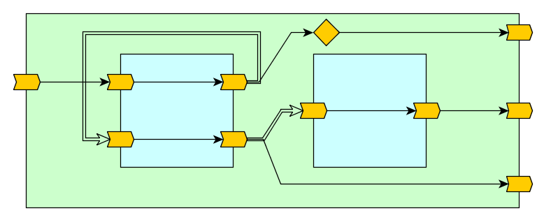

TODO: Add Legend


### Differences between `:=` and `<>`

| Criteria                            | 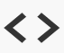 Connection      | 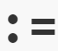 Assignment      |
| ----------------------------------- | :----------------------------------------------------------- | :----------------------------------------------------------- |
| Code                                | `trait IODesign {`<br />  `  val i = DFUInt[8] <> IN`<br />  `val o = DFUInt[8] <> OUT`<br />  `o <> i //i <> o is the same`<br />`}` | `trait IODesign {`<br />  ` val i = DFUInt[8] <> IN`<br />  `val o = DFUInt[8] <> OUT`<br />  `o := i`<br />`} ` |
| Functional<br />Diagram             | 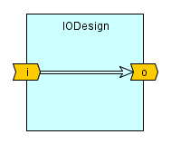                 | 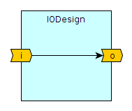                 |
| Directionality &<br />Commutativity | The operator is commutative, meaning `a <> b` is equivalent to b `b <> a`.  One argument is the *producer*, while the other *consumer*. The dataflow direction is sensitive to the context in which the operator is applied. | The operator is non-commutative, meaning `a := b` determines that `b` is the *producer*, transferring data to the *consumer* `a`. |
| Initialization                      | Modifies the consumer's initialization.                      |                                                              |
| Mutation                            |                                                              |                                                              |
| Statement Order                     |                                                              |                                                              |
|                                     |                                                              |                                                              |
| Associativity                       |                                                              |                                                              |
| Commutativity                       |                                                              |                                                              |
|                                     |                                                              |                                                              |


* Initialization is not copied to destination with `:=`, but it does with `<>`
* `<>` ordering does not matter! The ordering is determined by the dependency detected when the design is flattened.
* Input ports do not accept `:=` under any condition.
* Output ports can accept `:=` only at the design level, but not at owner level.
* All ports accept `<>`, but various restriction are applied, depending on the hierarchy difference, called scope and port directions.
* `<>` must have be between a port and a dataflow value or between two ports. Cannot be applied between dataflow variables.
* `:=` is directional (consumer := producer) while `<>` set the direction automatically.
* `:=` Mutability. Can be applied many times for. `<>` can be applied once for ???
* In the future `<>` will be used to connect mult-port-multi-directional interfaces.
* Opposed to VHDL/Verilog, we do not need to go through 'signals' to connect ports, but there are some limits to what is permitted.
* In many times it is possible to use the port directly, and `<>` shouldn't be used
* Each port has two sides: External and Internal. To access the external side we reference the port from outside of the design. To access the internal side we reference the port from inside the design.


---

```scala
trait IODesign extends DFDesign {
  val i = DFUInt[8] <> IN
  val o = DFUInt[8] <> OUT
  o := i
}
```


---

```scala
trait IODesign1 extends DFDesign {
  val i = DFUInt[8] <> IN
  val o = DFUInt[8] <> OUT
  val tmp = DFUInt[8]
  tmp := i
  o := tmp
}
```

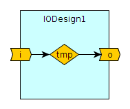

---

```scala
trait IODesign2 extends DFDesign {
  val i1 = DFUInt[8] <>  IN
  val o1 = DFUInt[8] <> OUT
  val i2 = DFUInt[8] <> IN
  val o2 = DFUInt[8] <> OUT
  o1 := i1
  o2 := i2
}
```

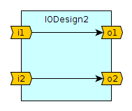

---

```scala
trait Container extends DFDesign {
  val i = DFUInt[8] <> IN
  val o = DFUInt[8] <> OUT
  val io = new IODesign {}
  i    <> io.i //Connecting between owner input and child input
  io.o <> o    //Connecting between child output and owner output
}
```

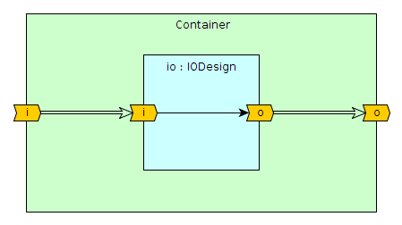

---

```scala
trait Container2 extends DFDesign {
  val i = DFUInt[8] <> IN
  val o = DFUInt[8] <> OUT
  val io1 = new IODesign {}
  val io2 = new IODesign {}
  i     <> io1.i //Connecting between owner input and child input
  io1.o <> io2.i //Connecting between siblings (output <> input)
  io2.o <> o     //Connecting between child output and owner output
}
```

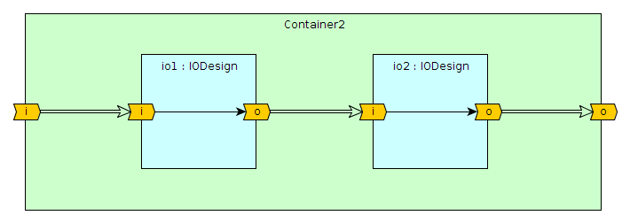

---

```scala
trait Container3 extends DFDesign {
  val i = DFUInt[8] <> IN
  val o = DFUInt[8] <> OUT
  val io = new IODesign2 {}
  i <> io.i1 //Connecting between owner input and child input
  i <> io.i2 //Connecting between owner input and child input
  o <> (io.o1 + io.o2)
}
```

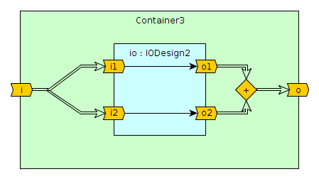

---

```scala
trait Container4 extends DFDesign {
  val i = DFUInt[8] <> IN
  val o = DFUInt[8] <> OUT
  val io = new IODesign2 {}
  i     <> io.i1 //Connecting between owner input and child input
  io.i2 <> 5     //Connecting between constant value and child input
  o     <> io.o2
}
```

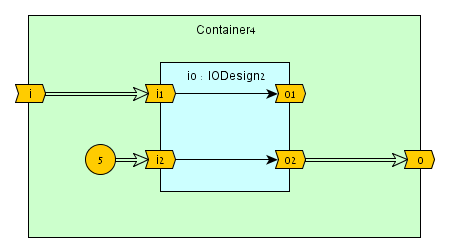

---

### Scope Sensitivity

```scala
trait Blank2 extends DFDesign {
  val i1 = DFUInt[8] <> IN
  val o1 = DFUInt[8] <> OUT
  val i2 = DFUInt[8] <> IN
  val o2 = DFUInt[8] <> OUT    
}
trait Container5 extends DFDesign {
  val i = DFUInt[8] <> IN
  val o = DFUInt[8] <> OUT
  val io = new Blank2 {
    o1 := i1 //Assignment
    o2 <> i2 //Internal connection   
  }
  i     <> io.i1 //Connecting between owner input and child input
  io.i2 <> io.o1 //External connection between child input/output
  o     <> io.o2
}
```

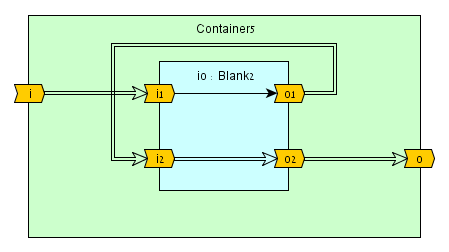

---

### Producer Collision


### No Producers (Open Inputs)


### Producer-Consumer Zero-Memory Loops


### Pruning (Open Outputs)


### Constant Propagation and Inlining


### Connect Directly to TOP