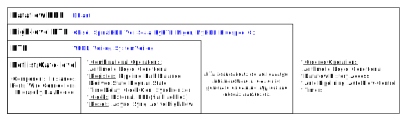

# A Dataflow Hardware Description Abstraction

	How dataflow abstractions help decouple the functionality from its constraints?  
  What dataflow HDL constructs are required to achieve maximum portable code? 

---

   
  <b>Fig.1: HDL abstraction layer summary (lowest=netlist, highest=dataflow)</b>  
  <b>Each layer subsumes the capabilities of the layer below it. Dataflow constructs replace RTL registers with their true functionality (e.g., state) or insert them implicitly (e.g., pipelining)</b> 

&nbsp;&nbsp;&nbsp;&nbsp; Fig. 1 summarizes the basic elements that make up HDLs at different abstraction layers, from a netlist up to the dataflow constructs presented in this paper. Each layer includes the expressive capabilities of the lowest layer (e.g., structural instance composition is possible in all HDLs). The layers are tagged with the relevant HDL names. Note that HLS languages and simulation constructs are not included in this summary. 

&nbsp;&nbsp;&nbsp;&nbsp; The basic notion of a dataflow abstraction is that instead of wires and registers we have dataflow token streams. This key difference between RTL and dataflow abstractions reveals why the former is coupled to device and timing constraints, while the latter is agnostic to them. Primarily, *the RTL model requires designers to express what operations take place in each cycle, whereas the dataflow model only require the designer to order the operations based on their data dependencies*. More specifically, the RTL model utilizes combinational operations that must complete (their propagation delay) within a given cycle if fed to a register, while the dataflow abstraction only assumes order and not on which cycle operations begin or complete. By decoupling operations from fixed clock cycles the dataflow model enables the compilation toolchain to map operations to cycles and thereby independently pipeline the design. Furthermore, the RTL model requires designers to use registers for a variety of uses and thus binds the design to specific timing conditions. Specifically, we find three main uses for registers in the RTL model: *synchronous technology backend*, *synchronous technology interface*, and *design functionality* (i.e., state). We now turn to discuss these different uses for registers and how the dataflow model can derive the first two uses without explicit user description.

---

## Synchronous Technology Backend Registers
&nbsp;&nbsp;&nbsp;&nbsp; Registers are often required in a low-level design due to the underlying synchronous technology. Since they are unrelated to the functional requirement, a dataflow HDL can derive them automatically based on the functional requirements and design constraints. 
We differentiate between the following backend uses of registers:

### Pipelining and Path-Balancing
&nbsp;&nbsp;&nbsp;&nbsp; Pipeline registers are inserted to split long combinational paths, and their placement is determined by designer-specified constraints, such as the maximum path cycle latency or the maximum propagation delay between registers. Pipelining increases the path cycle latency, and if the path converges with another path that requires no pipelining, then additional path-balancing registers are added to maintain correctness of the design. Because a balanced pipelining does not affect the design functionality, it can be automatically applied by the dataflow HDL compiler.   
### Synchronizers
&nbsp;&nbsp;&nbsp;&nbsp; Clock domain crossing (CDC) and asynchronous signals are exposed to metastability. Synchronizers, often composed of registers, are used to mitigate its effect and bring the design to the proper reliability. Since we wish to have a a clockless design frontend, we want the synchronizers to be implicit. A dataflow HDL compiler needs to infer synchronizers according to the design constraints without designer intervention. Note: our work currently focuses on single clock designs so the compiler we implemented does not yet support this feature.

---

## Synchronous Technology Interface Registers
&nbsp;&nbsp;&nbsp;&nbsp; Functional design requirements are often accompanied by synchronous input/output (IO) timing constraints such as clocked protocol interfaces or real-time restrictions. However, these constraints only affect the interface and are unrelated to the design itself. To maximize design portability, we apply timed or legacy constructs *solely in the periphery*, while coding the design core with only clockless dataflow constructs. We differentiate between the following synchronous signaling:
### External IO and Blackbox Interfaces
&nbsp;&nbsp;&nbsp;&nbsp; External IOs that are exposed to the top design hierarchy or blackboxes that are exposed to the internal design core may impose synchronous protocols (e.g., data is valid one clock cycle after address is set). A dataflow HDL supports legacy RTL constructs to synchronously interface external IOs and instantiate blackboxes. 
### Timers
&nbsp;&nbsp;&nbsp;&nbsp; Timers are design constructs for generating real-time signals or creating derivations of timed signal inputs. For example, a design using a 100MHz clock may drive a UART stream at 10Mbps or toggle a led at 1Hz. Rather than directly using registers as clock dividers or employing clock generation components (e.g., PLLs), one can create functional representation of their timed use-cases. A dataflow HDL has timer constructs that generate tokens at a given or derived rate. The compiler can take all clocks into consideration and generate the proper clock tree based on the available device resources and other design constraints. 

---

## Design Functionality (State) Registers
&nbsp;&nbsp;&nbsp;&nbsp; Functional registers, or state, are needed when a design must access (previous) values that are no longer available on an input signal (e.g., cumulative sum or a state-machine's state). RTL designs invoke registers (behaviorally) to store the state. But, registers not only store the state, but also enforce specific cycle latencies. Furthermore, typical RTL languages declare additional variables and place extra assignments just to save the state. A dataflow HDL overcomes all these issues by including a construct to reuse a token from the stream history. Additionally, a related construct should set a token history to be used at initialization time.
We differentiate between two kinds of state: *derived state*, and *feedback state*. 

### Derived State
&nbsp;&nbsp;&nbsp;&nbsp; A derived state is a state whose current output value is *independent* of its previous and can thereby be deduced by the compiler. For example, checking if a dataflow stream value has changed requires reusing the previous token and comparing to the current token. 

### Feedback State
&nbsp;&nbsp;&nbsp;&nbsp; A feedback state is a state whose current output value is *dependent* on its previous state value. For example, the current cumulative sum value is dependent on the previous sum value. Therefore, a dataflow HDL requires not only to fetch previous token values, but also set the future state value. Addressable memory pools also hold feedback state (e.g., a processor register-file, memory blocks) and can be expressed as a large selectable state array or available dedicated memory components.

&nbsp;&nbsp;&nbsp;&nbsp; The two kinds of state differ heavily in performance improvement when the design is pipelined. A derived state path can produce a token for every clock tick, and pipelining a combination operation to reduce its cycle time will also increase its throughput. In contrast, a feedback state path is circular and cannot be pipelined as-is. 

&nbsp;&nbsp;&nbsp;&nbsp; Feedback state causes bottlenecks in many systems. For instance, a RISC-V processor program counter (PC) register manifests as a feedback state. The processor pipeline can only be improved thanks to a speculative mechanism that predicts the next PC value to prefetch instructions (e.g., PC+4 for a branch-not-taken prediction). In case of a miss-prediction other mechanisms take place. Further work may expand on dataflow abstractions that solve such problems functionally.