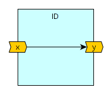

# DFiant: First Look

Your first encounter with the DFiant syntax, semantics and language features

---

In this section we provide a simple running example to demonstrate various DFiant syntax, semantics and languages features. If you wish to understand how to run these examples yourself, please refer to the <u>Getting Started</u> chapter of this documentation. 

## Feature Overview

* Strong type-safety
* Aliasing
* Context-sensitive port connections
* 


## Basic Example: An Identity Function

Let's begin with a basic example. The dataflow design `ID` has a signed 16-bit input port `x` and a signed 16-bit output port `y`. We implemented an identity function, meaning for an input series $x_k$, the output series shall be $y_k=x_k$. Fig. 1a depicts a functional drawing of the design and Fig. 1b the complete 

<p align="center">
  <br>
  <b>Fig. 1a: Functional drawing of the dataflow design 'ID' with an input port 'x' and an output port 'y'</b><br>
</p>

``` scala tab="ID.scala"
import DFiant._ //Required in any DFiant compilation program

trait ID extends DFDesign { //This our `ID` dataflow design
  val x = DFSInt[16] <> IN  //The input port is a signed 16-bit integer
  val y = DFSInt[16] <> OUT	//The output port is a signed 16-bit integer
  y := x //Trivial direct input-to-output assignment
}

object IDApp extends App { //The ID compilation program entry-point
  val id = new ID {} //Instantiate ID as a top-level entity
  id.compileToVHDL.toFolder("./") //Compile to VHDL and write the files locally.
}
```

``` vhdl tab="id.vhdl"
library ieee;
use ieee.std_logic_1164.all;
use ieee.numeric_std.all;
use work.id_pkg.all;

entity id is
port (
  X                    : in  signed(15 downto 0);
  Y                    : out signed(15 downto 0)
);
end id;

architecture id_arch of id is
begin

async_proc : process (all)
begin
  Y                    <= X;
end process async_proc;

end id_arch;
```

``` vhdl tab="id_pkg.vhdl"
library ieee;
use ieee.std_logic_1164.all;
use ieee.numeric_std.all;

package id_pkg is

function bit_reverse(s : std_logic_vector) return std_logic_vector;
         
function to_sl(b : boolean) return std_logic;
         
function to_sl(arg : std_logic_vector) return std_logic;
         
function to_slv(arg : std_logic) return std_logic_vector;
         
function to_slv(arg : unsigned) return std_logic_vector;
         
function to_slv(arg : signed) return std_logic_vector;
         

end package id_pkg;

package body id_pkg is

function bit_reverse(s : std_logic_vector) return std_logic_vector is
   variable v_s : std_logic_vector(s'high downto s'low);
begin
  for i in s'high downto s'low loop
    v_s(i) := s(s'high - i);
  end loop;
  return v_s;
end bit_reverse;
         
function to_sl(b : boolean) return std_logic is
begin
  if (b) then
    return '1';
  else
    return '0';
  end if;
end to_sl;
         
function to_sl(arg : std_logic_vector) return std_logic is
begin
  return arg(arg'low);
end to_sl;
         
function to_slv(arg : std_logic) return std_logic_vector is
begin
  if (arg = '1') then
    return "1";
  else
    return "0";
  end if;
end to_slv;
         
function to_slv(arg : unsigned) return std_logic_vector is
  variable slv : std_logic_vector(arg'length-1 downto 0);
begin
  slv := std_logic_vector(arg);
  return slv;
end to_slv;
         
function to_slv(arg : signed) return std_logic_vector is
  variable slv : std_logic_vector(arg'length-1 downto 0);
begin
  slv := std_logic_vector(arg);
  return slv;
end to_slv;
         
end package body id_pkg;
```

<p align="center">
  <b>Fig. 1b: A DFiant implementation of the identity function as a toplevel design and the generated VHDL files</b><br>
</p>

The Scala code in Fig. 1b describes a program that runs the DFiant compiler on an identity function dataflow design, `ID`. Since DFiant is a Scala library some if its compilation is done statically via the Scala compiler and some during the Scala runtime execution. 

<p align="center">
   <u>Table 1: ID.scala code line breakdown</u><br>
</p>

| Line # | Description                                                  |
| ------ | ------------------------------------------------------------ |
| 1      | This import statement summons all the DFiant classes, types and objects into the current scope. This is a must in every DFiant codebase. |
| 3-7    | This `ID` Scala `trait` is extended from a `DFDesign` (abstract) class and therefore declares it as a dataflow design. The reason why this is a `trait` and not a `class` is discussed [later]() in this documentation. Currently, the *rule of thumb* to describe dataflow designs is to use traits that extend `DFDesign`. |
| 4, 5   | Here we construct the input port `x` and output port `y`.  Both were set as a 16-bit signed integer dataflow variable via the `DFSInt[W]` constructor, where `W` is a width ***type*** argument that can accept any positive integer literal. It is also possible to use a width ***term*** argument via`DFSInt(width)`. The difference between type and term arguments will be discussed [later]() in this documentation. <br />The syntax `val <name> = <dataflow_variable_constructor>  <>  <direction>` is used to construct a port and give it a named Scala reference. The Scala reference name will affect the name of this port when compiled to the required backend representation. For example |
|        |                                                              |
|        |                                                              |
|        |                                                              |
|        |                                                              |

!!! summary "Every basic DFiant compilation program includes"

	* `import DFiant._` to import all the required namespace fields
	* `trait <design_name> extends DFDesign {}` to create a


---

## Hierarchy and Connection Example


``` scala tab="IDTop.scala" hl_lines="6"
import DFiant._ //Required in any DFiant compilation program

trait ID extends DFDesign { //This our `ID` dataflow design
  val x = DFSInt[16] <> IN  //The input port is a signed 16-bit integer
  val y = DFSInt[16] <> OUT	//The output port is a signed 16-bit integer
  y <> x //Trivial direct input-to-output connection
}

trait IDTop extends DFDesign { //This our `IDTop` dataflow design
  val x = DFSInt[16] <> IN  //The input port is a signed 16-bit integer
  val y = DFSInt[16] <> OUT	//The output port is a signed 16-bit integer
  val id1 = new ID {} //First instance of the `ID` design
  val id2 = new ID {} //Second instance of the `ID` design
  id1.x <> x      //Connecting parent input port to child input port
  id1.y <> id2.x  //Connecting sibling instance ports
  id2.y <> y      //Connecting parent output port to child output port
}

object IDTopApp extends App { //The IDTop compilation program entry-point
  val idTop = new IDTop {} //Instantiate IDTop as a top-level entity
  idTop.compileToVHDL.toFolder("./") //Compile to VHDL and write the files locally
}
```

``` vhdl tab="idtop.vhdl"
library ieee;
use ieee.std_logic_1164.all;
use ieee.numeric_std.all;
use work.idtop_pkg.all;

entity idtop is
port (
  CLK                  : in  std_logic;
  RSTn                 : in  std_logic;
  X                    : in  signed(15 downto 0);
  Y                    : out signed(15 downto 0)
);
end idtop;

architecture idtop_arch of idtop is
  signal id1_X         : signed(15 downto 0);
  signal id1_Y         : signed(15 downto 0);
  signal id2_X         : signed(15 downto 0);
  signal id2_Y         : signed(15 downto 0);
begin

id1 : entity work.id(id_arch) port map (
  X                    => id1_X,
  Y                    => id1_Y
);

id2 : entity work.id(id_arch) port map (
  X                    => id2_X,
  Y                    => id2_Y
);

async_proc : process (all)
begin
  id1_X                <= X;
  id2_X                <= id1_Y;
  Y                    <= id2_Y;
end process async_proc;

end idtop_arch;
```

``` vhdl tab="id.vhdl"
library ieee;
use ieee.std_logic_1164.all;
use ieee.numeric_std.all;
use work.id_pkg.all;

entity id is
port (
  X                    : in  signed(15 downto 0);
  Y                    : out signed(15 downto 0)
);
end id;

architecture id_arch of id is
begin

async_proc : process (all)
begin
  Y                    <= X;
end process async_proc;

end id_arch;
```

``` vhdl tab="idtop_pkg.vhdl"
library ieee;
use ieee.std_logic_1164.all;
use ieee.numeric_std.all;

package idtop_pkg is

function bit_reverse(s : std_logic_vector) return std_logic_vector;
         
function to_sl(b : boolean) return std_logic;
         
function to_sl(arg : std_logic_vector) return std_logic;
         
function to_slv(arg : std_logic) return std_logic_vector;
         
function to_slv(arg : unsigned) return std_logic_vector;
         
function to_slv(arg : signed) return std_logic_vector;
         

end package idtop_pkg;

package body idtop_pkg is

function bit_reverse(s : std_logic_vector) return std_logic_vector is
   variable v_s : std_logic_vector(s'high downto s'low);
begin
  for i in s'high downto s'low loop
    v_s(i) := s(s'high - i);
  end loop;
  return v_s;
end bit_reverse;
         
function to_sl(b : boolean) return std_logic is
begin
  if (b) then
    return '1';
  else
    return '0';
  end if;
end to_sl;
         
function to_sl(arg : std_logic_vector) return std_logic is
begin
  return arg(arg'low);
end to_sl;
         
function to_slv(arg : std_logic) return std_logic_vector is
begin
  if (arg = '1') then
    return "1";
  else
    return "0";
  end if;
end to_slv;
         
function to_slv(arg : unsigned) return std_logic_vector is
  variable slv : std_logic_vector(arg'length-1 downto 0);
begin
  slv := std_logic_vector(arg);
  return slv;
end to_slv;
         
function to_slv(arg : signed) return std_logic_vector is
  variable slv : std_logic_vector(arg'length-1 downto 0);
begin
  slv := std_logic_vector(arg);
  return slv;
end to_slv;
         
end package body idtop_pkg;
```


---

## Simple Moving Average

We begin with a [simple moving average](https://en.wikipedia.org/wiki/Moving_average) (SMA) example. In this example, the signed 16-bit  input, $x$ 

 $y_k=\left(x_k+x_{k-1}+x_{k-2}+x_{k-3}\right)/4$

```scala
trait SimpleMovingAverage extends DFDesign {
  val x   = DFSInt[16] <> IN  init 0 		//The signed 16-bit integer input stream
  val y   = DFSInt[16] <> OUT						//The signed 16-bit integer output stream
  val sum = ((x + x.prev).wc + (x.prev(2) + x.prev(3)).wc).wc
  y := (sum / 4).toWidth(16)
}
```

We begin with a [simple moving average](https://en.wikipedia.org/wiki/Moving_average) (SMA) example. In this example, the signed 16-bit  input, $x$ 

$ a_0 = 0 $
$ a_k = a_{k-1} - x_{k-4}+x_k $
$ y_k = a_k/4$

```scala
trait SimpleMovingAverage extends DFDesign {
  val x   = DFSInt[16] <> IN  init 0 		//The signed 16-bit integer input stream
  val y   = DFSInt[16] <> OUT						//The signed 16-bit integer output stream
  val acc = DFSInt[18] init 0						//The signed 18-bit accumulator state
  acc := acc - x.prev(4) + x						//Accumulation functionality construction
  y := (acc / 4).toWidth(16)
}
```


## Looks cool! I wish to know more

