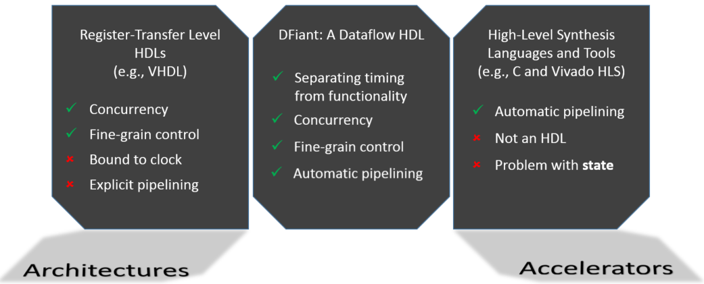

# Motivation

Why do we need yet another HDL? Why high-level synthesis is not enough?

---

&nbsp;&nbsp;&nbsp;&nbsp; The register-transfer level (RTL) programming model paved the road for Verilog and VHDL to flourish as the leading hardware description languages (HDLs). That road, however, is steadily nearing its end as both hardware designs and devices become increasingly more complex. While the software world is striving for a "write once, run anywhere" programmability, the complexity of an RTL design implementing a given functionality may vary greatly across different FPGA and ASIC devices that incorporate various technologies and core components. Moreover, minor requirement changes may lead to significant redesigns, since RTL abstraction tightly couples functionality with timing constraints. For example, registers serve various roles such as preserving a state, pipelining and balancing a data path, deriving timed signals from an input clock, and synchronizing an input signal. This coupling between functionality, timing constraints, and device constraints leads to verbose and unportable RTL designs. 

&nbsp;&nbsp;&nbsp;&nbsp; Ongoing efforts to bridge this hardware programmability gap [[1]][Kapre2016], [[2]][Nane2016], [[3]][Windh2015] can be largely split into two classes: high-level synthesis (HLS) tools and high-level RTL (HL-RTL) languages.
On the one hand, HLS tools (such as Vivado [[4]][Vivado2012], Catapult [[5]][graphics2008catapult], and others [[6]][Kavvadias2013], [[7]][synphony2015]) rely on programming languages like C and incorporate auto-pipelining and optimization mechanisms to make hardware accelerators accessible for non-hardware engineers. While this approach is successful in algorithmic acceleration domains, such languages carry von Neumann sequential semantics and thus hinder construction of parallel hardware, which is crucial for hardware design [[8]][Zhao2017]. Moreover, some trivial periodic hardware operations (like toggling a LED) are unbearably difficult to implement in HLS languages.
On the other hand, HL-RTL languages (such as Chisel [[9]][Bachrach2012], Bluespec [[10]][nikhil2004bluespec], PyRTL [[11]][Clow2017], and others [[12]][Charles2016], [[13]][Liu2017], [[14]][jiang2018mamba], [[15]][decaluwe2004myhdl], [[16]][CxLang2014], [[17]][Lockhart2014]) aim to enhance productivity by introducing new hardware generation constructs and semantics but do not abstract away register-level description (even Bluespec, which uses concurrent guarded atomic actions, assumes rules complete within a single clock cycle). Therefore, HL-RTL designs are still subjected to the "*tyranny of the clock*" [[18]][Sutherland2012] and are bound to specific timing and target constraints.

  <b>Fig. 1: RTL vs. Dataflow vs. HLS:</b> 

&nbsp;&nbsp;&nbsp;&nbsp; In our work we introduce dataflow-based HDL constructs that abstract away registers and clocks. We also introduce DFiant, a Scala-embedded HDL that utilizes these dataflow constructs to decouple functionality from implementation constraints. DFiant brings together constructs and semantics from dataflow [[19]][le1986signal], [[20]][Thuau1991], [[21]][gurd1985manchester], [[22]][arvind1992id], hardware, and software programming languages to enable truly portable and composable hardware designs. The dataflow model offers implicit concurrency between independent paths while freeing the designer from explicit register placement that binds the design to fixed pipelined paths and timing constraints.  

&nbsp;&nbsp;&nbsp;&nbsp; Recent related dataflow-for-hardware efforts are the Maxeler framework [[23]][Pell2011] and its MaxJ Java-based programming language, the OpenDF framework [[24]][bhattacharyya2008opendf] which is based on the CAL actor language [[25]][eker2003cal], and CAPH [[26]][serot2011implementing]. MaxJ indeed shares common traits with DFiant, but it is tailored for its target hardware framework and is not designed to be a general purpose HDL. Both OpenDF and CAPH share similar goals with our work, but they use actors and networks to describe hardware, which is completely different than a conventional HDL composition based on component instances and port connections.

&nbsp;&nbsp;&nbsp;&nbsp; This work focuses on applying dataflow principles through the DFiant language and compiler. DFiant is *not* an HLS language, nor is it an RTL language. Instead, DFiant is an HDL that provides abstractions beyond the RTL behavioral model, which reduce verbosity and maintain portable code. Since DFiant is implemented as a Scala library, it offers a rich type safe ecosystem alongside its own hardware-focused type system (e.g., bit-accurate dataflow types, input/output port types). The library performs two main tasks: first, the frontend compilation, which enforces the type-safe rule-system and constructs a dataflow dependency graph; and second, the backend compilation, which translates the graph into a pipelined RTL code and a TCL constraints file. The resulting code can be synthesized using commercial tools. 

[Kapre2016]: https://ieeexplore.ieee.org/document/7577380	"Kapre, Nachiket, and Samuel Bayliss. &quot;Survey of domain-specific languages for FPGA computing.&quot; 2016 26th International Conference on Field Programmable Logic and Applications (FPL). IEEE, 2016."
[Nane2016]: https://ieeexplore.ieee.org/abstract/document/7368920/	"Nane, Razvan, et al. &quot;A survey and evaluation of FPGA high-level synthesis tools.&quot; IEEE Transactions on Computer-Aided Design of Integrated Circuits and Systems 35.10 (2015): 1591-1604."
[Windh2015]: https://ieeexplore.ieee.org/abstract/document/7086410/	"Windh, Skyler, et al. &quot;High-level language tools for reconfigurable computing.&quot; Proceedings of the IEEE 103.3 (2015): 390-408."
[Vivado2012]: https://www.xilinx.com/support/documentation/sw_manuals/xilinx2019_1/ug902-vivado-high-level-synthesis.pdf	"Vivado Design Suite User Guide: High-Level Synthesis"
[graphics2008catapult]: https://www.mentor.com/hls-lp/catapult-high-level-synthesis/c-systemc-hls	"Catapult® High-Level Synthesis"
[Kavvadias2013]: https://dl.acm.org/citation.cfm?id=2491865	"Kavvadias, Nikolaos, and Kostas Masselos. &quot;Hardware design space exploration using HercuLeS HLS.&quot; Proceedings of the 17th Panhellenic Conference on Informatics. ACM, 2013."
[synphony2015]: https://www.microsemi.com/product-directory/dev-tools/4899-synphony	"Synphony Model Compiler ME"
[Zhao2017]: https://arxiv.org/abs/1710.10290	"Zhao, Zhipeng, and James C. Hoe. &quot;Using Vivado-HLS for Structural Design: a NoC Case Study.&quot; arXiv preprint arXiv:1710.10290 (2017)."
[Bachrach2012]: https://ieeexplore.ieee.org/abstract/document/6241660/	"Bachrach, Jonathan, et al. &quot;Chisel: constructing hardware in a scala embedded language.&quot; DAC Design Automation Conference 2012. IEEE, 2012."
[nikhil2004bluespec]: https://ieeexplore.ieee.org/abstract/document/1459818/	"Nikhil, Rishiyur. &quot;Bluespec System Verilog: efficient, correct RTL from high level specifications.&quot; Proceedings. Second ACM and IEEE International Conference on Formal Methods and Models for Co-Design, 2004. MEMOCODE&#39;04.. IEEE, 2004."
[Charles2016]: http://spinalhdl.github.io/SpinalDoc	"Papon, Charles. &quot;SpinalHDL. url: https://github. com/SpinalHDL.&quot; SpinalHDL, 2016"
[Liu2017]: https://dl.acm.org/citation.cfm?id=3021762	"Liu, Yanqiang, et al. &quot;Scala Based FPGA Design Flow.&quot; Proceedings of the 2017 ACM/SIGDA International Symposium on Field-Programmable Gate Arrays. ACM, 2017."
[Clow2017]: https://ieeexplore.ieee.org/abstract/document/8056860/	"Clow, John, et al. &quot;A pythonic approach for rapid hardware prototyping and instrumentation.&quot; 2017 27th International Conference on Field Programmable Logic and Applications (FPL). IEEE, 2017."
[jiang2018mamba]: https://ieeexplore.ieee.org/abstract/document/8465576/	"Jiang, Shunning, Berkin Ilbeyi, and Christopher Batten. &quot;Mamba: closing the performance gap in productive hardware development frameworks.&quot; 2018 55th ACM/ESDA/IEEE Design Automation Conference (DAC). IEEE, 2018."
[decaluwe2004myhdl]: https://elibrary.ru/item.asp?id=8388956	"Decaluwe, Jan. &quot;MyHDL: a Python-Based Hardware Description Language.&quot; Linux journal 127 (2004): 84-87."
[CxLang2014]: http://cx-lang.org/	"Synflow: Cx Language"
[Lockhart2014]: https://dl.acm.org/citation.cfm?id=2742183	"Lockhart, Derek, Gary Zibrat, and Christopher Batten. &quot;PyMTL: A unified framework for vertically integrated computer architecture research.&quot; Proceedings of the 47th Annual IEEE/ACM International Symposium on Microarchitecture. IEEE Computer Society, 2014."
[Sutherland2012]: https://cacm.acm.org/magazines/2012/10/155552-the-tyranny-of-the-clock/fulltext	"Sutherland, I. The tyranny of the clock. Commun. ACM 55, 10 (Oct. 2012), 35–36."
[le1986signal]: https://ieeexplore.ieee.org/abstract/document/1164809/	"Le Guernic, Paul, et al. &quot;Signal--A data flow-oriented language for signal processing.&quot; IEEE transactions on acoustics, speech, and signal processing 34.2 (1986): 362-374."
[Thuau1991]: https://link.springer.com/chapter/10.1007/978-1-4471-3544-9_17	"Thuau, Ghislaine, and Daniel Pilaud. &quot;Using the declarative language Lustre for circuit verification.&quot; Designing Correct Circuits. Springer, London, 1991. 313-331."
[gurd1985manchester]: http://citeseerx.ist.psu.edu/viewdoc/download?doi=10.1.1.587.5154&amp;rep=rep1&amp;type=pdf	"Gurd, John R., Chris C. Kirkham, and Ian Watson. &quot;The Manchester prototype dataflow computer.&quot; Communications of the ACM 28.1 (1985): 34-52."
[arvind1992id]: https://www.sciencedirect.com/science/article/pii/B9780444881359500103	"Arvind, Rishiyur S. Nikhil. &quot;Id: A language with implicit parallelism.&quot; A Comparative Study of Parallel Programming Languages. North-Holland, 1992. 169-215."
[Pell2011]: https://dl.acm.org/citation.cfm?id=2082172	"Pell, Oliver, and Oskar Mencer. &quot;Surviving the end of frequency scaling with reconfigurable dataflow computing.&quot; ACM SIGARCH Computer Architecture News 39.4 (2011): 60-65."
[bhattacharyya2008opendf]: https://dl.acm.org/citation.cfm?id=1556449	"Bhattacharyya, Shuvra S., et al. &quot;OpenDF: a dataflow toolset for reconfigurable hardware and multicore systems.&quot; ACM SIGARCH Computer Architecture News 36.5 (2008): 29-35."
[eker2003cal]: https://embedded.eecs.berkeley.edu/caltrop/docs/LanguageReport/CLR-1.0-r1.pdf	"Eker, Johan, and Jorn Janneck. CAL language report. Vol. 3. Tech. Rep. ERL Technical Memo UCB/ERL, 2003."
[serot2011implementing]: https://ieeexplore.ieee.org/abstract/document/6044796/	"Serot, Jocelyn, Francois Berry, and Sameer Ahmed. &quot;Implementing stream-processing applications on fpgas: A dsl-based approach.&quot; 2011 21st International Conference on Field Programmable Logic and Applications. IEEE, 2011."

