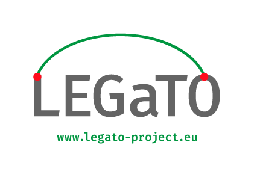

# Acknowledgements

&nbsp;

---

We would like to thank the opensource community, namely the Scala community, and great many others for their work and support!

???info "Previous version EU support"
    Previous version of this work (simply called "DFiant" at the time) has been supported by EU H2020 ICT project LEGaTO, contract #780681.

    

