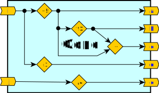
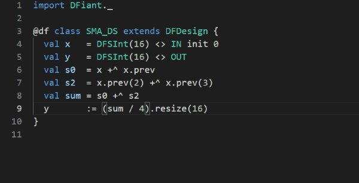
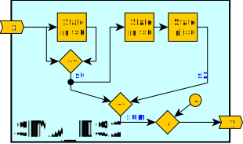

--8<-- "docs/include/abbr.md"

# DFHDL: First Look

Your first encounter with the DFHDL syntax, semantics and language features

---

In this section we provide simple examples to demonstrate various DFHDL syntax, semantics and languages features. If you wish to understand how to run these examples yourself, please refer to the [Getting Started][getting-started] chapter of this documentation. 

## Main Feature Overview

* **Concise** and simple syntax
* Write **portable** code: target and timing agnostic dataflow hardware description
* Strong **bit-accurate type-safety**
* Simplified port connections
* Automatic latency path balancing
* **Automatic**/manual **pipelining**
* Meta hardware description via rich Scala language constructs


## Basic Example: An Identity Function

Let's begin with a basic example. The dataflow design `ID` has a signed 16-bit input port `x` and a signed 16-bit output port `y`. We implemented an identity function between the input and output, meaning that for an input series $x_k$ the output series shall be $y_k=x_k$. Fig. 1a depicts a functional drawing of the design and Fig. 1b contains five tabs: the `ID.scala` DFHDL dataflow design `ID` class and its compiled RTL files in VHDL (v2008) and Verilog (v2001).

<p align="center">
  <br>
  <b>Fig. 1a: Functional drawing of the dataflow design 'ID' with an input port 'x' and an output port 'y'</b><br>
</p>


=== "ID.scala"

    ``` scala
    --8<-- "examples/first-look/src/main/scala/ID.scala"
    ```

=== "ID.sv"

    ``` verilog
    --8<-- "examples/first-look/src/test/resources/id/verilog2001/ID.v"
    ```

=== "ID_defs.sv"

    ``` verilog
    --8<-- "examples/first-look/src/test/resources/id/verilog2001/ID_defs.v"
    ```

=== "ID.vhdl"

    ``` vhdl
    --8<-- "examples/first-look/src/test/resources/id/vhdl2008/ID.vhdl"
    ```

=== "ID_pkg.vhdl"

    ``` vhdl
    --8<-- "examples/first-look/src/test/resources/id/vhdl2008/ID_pkg.vhdl"
    ```

<p align="center">
  <b>Fig. 1b: A DFHDL implementation of the identity function as a toplevel design and the generated VHDL/Verilog files</b><br>
</p>


The Scala code in Fig. 1b describes our ID design as a Scala class. To compile this further to RTL or simulate it we need to create a program that instantiates the class and invokes additional commands. See the [getting started][getting-started] guide for further details. 

!!! summary "Defining a new dataflow design"

	1. `#!scala import dfhdl.*` once per source file.
	2. `#!scala class _design_name_ extends DFDesign:` to define your dataflow design. Populate your design with the required dataflow functionality.

??? dfhdl "ID.scala line-by-line breakdown"
	* **Line 1**: The `#!scala import dfhdl.*` statement summons all the DFHDL classes, types and objects into the current scope. This is a must for every dataflow design source file.
	

	* **Lines 3-7**: The `ID` Scala `#!scala class` is extended from the `DFDesign` (abstract) class and therefore declares it as a dataflow design. Note: in these example we use braceless syntax of Scala 3. You can use braces instead if you choose to.   
	
		* **Lines 4-5**: Here we construct the input port `x` and output port `y`. Both were set as a 16-bit signed integer dataflow variable via the `SInt(width)` constructor, where `width` is any positive integer. DFHDL also support various types such as `Bits`, `UInt`, and `Boolean`. All these dataflow variable construction options and more are discussed [later][type-system] in this documentation. <br />The syntax `#!scala val _name_ = _dftype_ <> _modifier_` is used to construct a hardware port/variable and give it a named Scala reference. The Scala reference name will affect the name of this port when compiled to the required backend representation. 
	
		* **Line 6**: The assignment operator `:=` sets the dataflow output port to consume all input port tokens as they are.

??? rtl "ID RTL files observations"
	* The ID.vhdl/ID.sv files are readable and maintain the names set in the DFHDL design. The generated files follow various writing conventions such as lowercase keywords and proper code alignment.
	* The ID_pkg.vhdl is a package file that is shared between all VHDL files generated by DFHDL and contains common conversion functions that may be required. Additionally it may contain other definitions like enumeration types.

??? dfhdl "ID demo"
	```scastie
	--8<-- "examples/first-look/src/main/scala/ID.scala"
	

	--8<-- "examples/first-look/src/main/scala/IDApp.scala"
	```


---

## Hierarchy and Connection Example

One of the most qualifying characteristics of hardware design is the composition of modules/entities via hierarchies and IO port connections. DFHDL is no exception and easily enables dataflow design compositions. Fig. 2a demonstrates such a composition that creates yet another identity function, but this time as a chained composition of two identity function designs. The top-level design `IDTop` introduces two instances of `ID` we saw in the previous example and connects them accordingly.

<p align="center">
  <br>
  <b>Fig. 2a: Functional drawing of the dataflow design 'IDTop' with an input port 'x' and an output port 'y'</b><br>
</p>
=== "IDTop.scala"

    ``` scala
    --8<-- "examples/first-look/src/main/scala/IDTop.scala"
    ```

=== "IDTop.sv"

    ``` verilog
    --8<-- "examples/first-look/src/test/resources/idTop/verilog2001/IDTop.v"
    ```

=== "IDTop.vhdl"

    ``` vhdl
    --8<-- "examples/first-look/src/test/resources/idTop/vhdl2008/IDTop.vhdl"
    ```


<p align="center">
  <b>Fig. 2b: A DFHDL implementation of IDTop as a toplevel design and the generated VHDL/Verilog files</b><br>
</p>
??? dfhdl "IDTop.scala observations"
	* **Lines 6-7**: Instantiating and naming the two internal `ID` designs (by constructing a Scala class).
	* **Lines 8-10**: Connecting the design ports as can be seen in the functional diagram. The `<>` connection operator is different than the `:=` assignment operator we saw earlier in several ways:
		1. **Directionality and Commutativity**: The connection operation is commutative and the dataflow direction, from producer to consumer, is set according to the context in which it is used. Assignments always set the dataflow direction from right to left of the operator.
		2. **Number of Applications**: A connection to any bit can be made only once, while assignments are unlimited. Also, a bit cannot receive both a connection and an assignment.
		3. **Initialization**: A connection propagates initialization from the producer to the consumer if the consumer is not explicitly initialized (via `init`). Assignments have no effect over initialization.
	* Notice that connections can be made between sibling design ports as well as between parent ports to child ports.
	* For more information access the [connectivity section][connectivity].

??? rtl "IDTop RTL files observations"

	* Unlike DFHDL, RTLs do not support direct sibling module/component port connections and therefore require intermediate wires/signals to connect through. For consistency and brevity the DFHDL backend compiler always creates signals for all ports of all modules and connects them accordingly.

??? dfhdl "IDTop demo"
	```scastie
	--8<-- "examples/first-look/src/main/scala/IDTop.scala"

	class ID extends DFDesign:
	  val x = SInt(16) <> IN  
	  val y = SInt(16) <> OUT 
	  y := x 
	
	--8<-- "examples/first-look/src/main/scala/IDTopApp.scala"
	```

---

## Concurrency Abstraction

Concurrency and data scheduling abstractions rely heavily on language semantics. DFHDL code is expressed in a sequential manner yet employs an asynchronous dataflow programming model to enable implicit and intuitive concurrent hardware description. This is achieved by setting the data scheduling order, or *token-flow*, according to the *data dependency*: all independent dataflow expressions are scheduled concurrently, while dependent operations are synthesized into a guarded FIFO-styled pipeline. 

$$\begin{aligned}
	&f:(i_{k},j_{k})_{k\in \mathbb{N}}\rightarrow (a_k,b_k,c_k,d_k,e_k)_{k\in \mathbb{N}}\\ 
  &\triangleq\left\{
  \begin{split}
  a_k & = i_k + 5 \\
  b_k & = a_k * 3 \\
  c_k & = a_k + b_k \\
  d_k & = i_k - 1 \\
  e_k & = j_k / 4 \\
  \end{split}\right.~~~~~k\geq 0 \\
  \\
  \end{aligned}$$


<p align="center">
  <br>
  <b>Fig. 4a: Functional drawing of the dataflow design 'Conc' with an input port 'x' and an output port 'y'</b><br>
</p>

<p align="center">
```d2 pad="10" scale="0.5" layout="elk"
--8<-- "docs/include/d2_defaults.yml"

Conc: {
  IN.i -> +5 -> OUT.a: {class: conn}
  +5 -> '*3' -> OUT.b: {class: conn}
  IN.i -> -1 -> OUT.d: {class: conn}
  '*3' -> +: {class: conn}
  +5 -> + -> OUT.c: {class: conn}
  IN.j -> /4 -> OUT.e: {class: conn}

  IN: {
    style: {
      opacity: 1
    }
    i.class: IN
    j.class: IN
  }
  OUT: {
    style: {
      opacity: 1
    }
    a.class: OUT
    b.class: OUT
    c.class: OUT
    d.class: OUT
    e.class: OUT
  }
}
```
</p>

=== "Conc.scala"

    ``` scala
    --8<-- "examples/first-look/src/main/scala/Conc.scala"
    ```

=== "Conc.vhdl"

    ``` vhdl
    --8<-- "examples/first-look/src/test/resources/Conc/vhdl2008/Conc.vhdl"
    ```

=== "Conc.v"

    ``` verilog
    --8<-- "examples/first-look/src/test/resources/Conc/verilog2001/Conc.v"
    ```
<p align="center">
  <b>Fig. 4b: A DFHDL implementation of Conc as a toplevel design and the generated VHDL/Verilog files</b><br>
</p>

??? dfhdl "Conc.scala observations"
	* **Lines 6-7**: 
	* For more information access the [state section][state].

??? rtl "Conc RTL files observations"
	* Bla Bla

??? dfhdl "Conc demo"
	```scastie
	--8<-- "examples/first-look/src/main/scala/Conc.scala"
	
	--8<-- "examples/first-look/src/main/scala/ConcApp.scala"
	```


---

## State Abstraction

So far, all the examples were [pure (stateless) functions](https://en.wikipedia.org/wiki/Pure_function), whereas frequently in hardware we need to express a *state*. A state is needed when a design must access (previous) values that are no longer (or never were) available on its input. DFHDL assumes every dataflow variable is a token stream and provides constructs to initialize the token history via the `init` construct, reuse tokens via the `.prev` construct, and update the state via the assignment `:=` construct. 

Here we provide various implementations of a [simple moving average](https://en.wikipedia.org/wiki/Moving_average) (SMA); all have a 4-tap average window of a 16-bit integer input and output a 16-bit integer average. With regards to overflow avoidance and precision loss, DFHDL is no different than any other HDL, and we took those into account when we selected our operators and declared the variable widths. Via the SMA examples we can differentiate between two kinds of state: a *derived state*, and a *commit state*. 

### Derived State SMA

!!! info "Derived State"
    A derived (feedforward) state is a state whose current output value is *independent* of its previous value. For example, checking if a dataflow stream value has changed requires reusing the previous token and comparing to the current token. 

#### Trivial three-adder SMA implementation

The trivial derived state SMA implementation comes from the basic SMA formula:

$$
y_k=\left(x_k+x_{k-1}+x_{k-2}+x_{k-3}\right)/4~~~~x_{i<0}=0
$$


As can be seen from the formula, we need 3 state elements to match the maximum `x` history access. Fortunately, state creation is implicit in DFHDL. Just by calling `x.prev(_step_)` to access the history of `x` we construct  `_step_` number of states and chain them, as can be seen in Fig. 3 (DFHDL automatically merges the same states constructed from several calls). 


<p align="center">
  <br>
  <b>Fig. 3a: Functional drawing of the dataflow design 'SMA_DS' with an input port 'x' and an output port 'y'</b><br>
</p>
=== "SMA_DS.scala"

    ``` scala
    --8<-- "examples/first-look/src/main/scala/SMA_DS.scala"
    ```

=== "SMA_DS.vhdl"

    ``` vhdl
    --8<-- "examples/first-look/src/test/resources/SMA_DS/vhdl2008/SMA_DS.vhdl"
    ```

=== "SMA_DS.v"

    ``` verilog
    --8<-- "examples/first-look/src/test/resources/SMA_DS/verilog2001/SMA_DS.v"
    ```
<p align="center">
  <b>Fig. 3b: A DFHDL implementation of SMA_DS as a toplevel design and the generated VHDL/Verilog files</b><br>
</p>
??? dfhdl "SMA_DS.scala observations"
	* **Line 4**: The SMA forumla defines the history of `x` is at the start of the system (all values are considered to be `0`). We apply this information by initializing the `x` history via `init 0`. 
	* **Lines 6-7**: Accessing the history of `x` is done via `.prev(_step_)`, where `_step_` is a constant positive integer that defines the number of steps into history we require to retrieve the proper value.
	* **Lines 6-8**: To avoid overflow we chose the `+^` carry-addition operator, meaning that `s0` and `s2` are 17-bit wide, and `sum` is 18-bit wide.
	* **Line 9**: The `sum/4` division result keeps the LHS 18-bit width. To assign this value to the output `y` which is 16-bit wide, we must resize it first, via `.resize`. DFHDL has strong bit-accurate type-safety, and it does not allow assigning a wider value to a narrower value without explicit resizing. In the following animated figure we show what happens if we did not resize the value.   
	<br/>
	The Scala presentation compiler is able to interact with the editor and a custom message is presented due to the DFHDL type-safe checks.
	* The various dataflow type inference and operator safety rules are discussed at the [type-system section][type-system].
	* For more information on state and initialization access the [this section][state].

??? rtl "SMA_DS RTL files observations"

	* This is often where a language like verilog falls short and relies on external linting  

??? dfhdl "SMA_DS demo"
	```scastie
	--8<-- "examples/first-look/src/main/scala/SMA_DS.scala"
	
	--8<-- "examples/first-look/src/main/scala/SMA_DSApp.scala"
	```

#### Two-adder SMA implementation

The following algebraic manipulation reveals how we can achieve the same function with just two adders.

$$\begin{eqnarray} 
s_{0,k} &=& x_k+x_{k-1} \\
s_{2,k} &=& x_{k-2}+x_{k-3} = \left.\left (x_t+x_{t-1}  \right )\right|_{t=k-2} = s_{0,k-2} \\
y_k &=& \left(s_{0,k}+s_{2,k}\right)/4~~~~x_{i<0}=0
\end{eqnarray}$$

Instead of relying only on the history of `x`, we can utilize the history of `s0` to produce `s2`. DFHDL has [*time invariant*][time-invariance] history access through basic operators like addition, so `(x +^ x.prev).prev(2)` is equivalent to `x.prev(2) +^ x.prev(3)`. 


<p align="center">
  <br>
  <b>Fig. 4a: Functional drawing of the dataflow design 'SMA_DS2' with an input port 'x' and an output port 'y'</b><br>
</p>
=== "SMA_DS2.scala"

    ``` scala
    --8<-- "examples/first-look/src/main/scala/SMA_DS2.scala"
    ```

=== "SMA_DS2.vhdl"

    ``` vhdl
    --8<-- "examples/first-look/src/test/resources/SMA_DS2/vhdl2008/SMA_DS2.vhdl"
    ```

=== "SMA_DS2.v"

    ``` verilog
    --8<-- "examples/first-look/src/test/resources/SMA_DS2/verilog2001/SMA_DS2.v"
    ```
<p align="center">
  <b>Fig. 4b: A DFHDL implementation of SMA_DS2 as a toplevel design and the generated VHDL/Verilog files</b><br>
</p>

??? dfhdl "SMA_DS2.scala observations"
	* **Lines 6-7**: 
	* For more information access the [state section][state].

??? rtl "SMA_DS2 RTL files observations"
	* Bla Bla

??? dfhdl "SMA_DS2 demo"
	```scastie
	--8<-- "examples/first-look/src/main/scala/SMA_DS2.scala"
	
	--8<-- "examples/first-look/src/main/scala/SMA_DS2App.scala"
	```


### Commit State SMA

!!! info "Commit State"
    A commit (feedback) state is a state whose current output value is *dependent* on its previous state value. For example, a [cumulative sum](https://en.wikipedia.org/wiki/Prefix_sum) function output value is dependent on its previous sum output value. 

$$\begin{eqnarray} 
a_0 &=& 0 \\
a_k &=& a_{k-1} - x_{k-4}+x_k \\
y_k &=& a_k/4
\end{eqnarray}$$

=== "SMA_CS.scala"

    ``` scala
    --8<-- "examples/first-look/src/main/scala/SMA_CS.scala"
    ```

=== "SMA_CS.vhdl"

    ``` vhdl
    --8<-- "examples/first-look/src/test/resources/SMA_CS/vhdl2008/SMA_CS.vhdl"
    ```

=== "SMA_CS.v"

    ``` verilog
    --8<-- "examples/first-look/src/test/resources/SMA_CS/verilog2001/SMA_CS.v"
    ```


---

## Finite Step (State) Machine (FSM) Example

=== "SeqDet.scala"

    ``` scala
    --8<-- "examples/first-look/src/main/scala/SeqDet.scala"
    ```

=== "SeqDet.vhdl"

    ``` vhdl
    --8<-- "examples/first-look/src/test/resources/seqDet/vhdl2008/SeqDet.vhdl"
    ```

=== "SeqDet.v"

    ``` verilog
    --8<-- "examples/first-look/src/test/resources/seqDet/verilog2001/SeqDet.v"
    ```


---


## Looks cool! I wish to know more