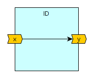
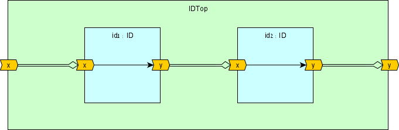

--8<-- "docs/include/abbr.md"

# DFiant: First Look

Your first encounter with the DFiant syntax, semantics and language features

---

In this section we provide simple examples to demonstrate various DFiant syntax, semantics and languages features. If you wish to understand how to run these examples yourself, please refer to the [Getting Started](/getting-started/) chapter of this documentation. 

## Main Feature Overview

* **Concise** and simple syntax
* Write **portable** code: target and timing agnostic dataflow hardware description
* Strong **bit-accurate type-safety**
* Simplified port connections
* Automatic latency path balancing
* **Automatic**/manual **pipelining**
* Meta hardware description via rich Scala language constructs


## Basic Example: An Identity Function

Let's begin with a basic example. The dataflow design `ID` has a signed 16-bit input port `x` and a signed 16-bit output port `y`. We implemented an identity function between the input and output, meaning that for an input series $x_k$ the output series shall be $y_k=x_k$. Fig. 1a depicts a functional drawing of the design and Fig. 1b contains five tabs: the `ID.scala` DFiant dataflow design `ID` class and its compiled RTL files in VHDL (v2008) and Verilog (v2001).

<p align="center">
  <br>
  <b>Fig. 1a: Functional drawing of the dataflow design 'ID' with an input port 'x' and an output port 'y'</b><br>
</p>


=== "ID.scala"

    ``` scala
    --8<-- "examples/first-look/src/main/scala/ID.scala"
    ```

=== "ID.vhdl"

    ``` vhdl
    --8<-- "examples/first-look/src/test/resources/id/vhdl2008/ID.vhdl"
    ```

=== "ID_pkg.vhdl"

    ``` vhdl
    --8<-- "examples/first-look/src/test/resources/id/vhdl2008/ID_pkg.vhdl"
    ```

=== "ID.v"

    ``` verilog
    --8<-- "examples/first-look/src/test/resources/id/verilog2001/ID.v"
    ```

=== "ID_defs.v"

    ``` verilog
    --8<-- "examples/first-look/src/test/resources/id/verilog2001/ID_defs.v"
    ```

<p align="center">
  <b>Fig. 1b: A DFiant implementation of the identity function as a toplevel design and the generated VHDL/Verilog files</b><br>
</p>


The Scala code in Fig. 1b describes our ID design as a Scala class. To compile this further to RTL or simulate it we need to create a program that instantiates the class and invokes additional commands. See the [getting started](/getting-started/) guide for further details. 

!!! summary "Defining a new dataflow design"

	1. `#!scala import DFiant._` once per source file.
	2. `#!scala @df class _design_name_ extends DFDesign {}` to define your dataflow design. Populate your design with the required dataflow functionality.

??? dfiant "ID.scala line-by-line breakdown"
	* **Line 1**: The `#!scala import DFiant._` statement summons all the DFiant classes, types and objects into the current scope. This is a must for every dataflow design source file.
	

	* **Lines 3-7**: The `ID` Scala `#!scala class` is extended from the `DFDesign` (abstract) class and therefore declares it as a dataflow design. In addition, we also need to annotate the class with the `@df` dataflow context annotation. This annotation provides an `#!scala implicit` context that is required for the DFiant compilation. In case this annotation is missing, you will get a [missing context](/user-guide/errors/#missing-context) error. Note: currently in Scala 2.xx we populate a class within braces `{}`. For those of you who dislike braces, a braceless syntax is expected to be available in Scala 3, where DFiant will migrate to in the future. 
	
		* **Lines 4-5**: Here we construct the input port `x` and output port `y`. Both were set as a 16-bit signed integer dataflow variable via the `DFSInt(width)` constructor, where `width` is any positive integer. DFiant also support various types such as `DFBits`, `DFUInt`, and `DFBool`. All these dataflow variable construction options and more are discussed [later](/user-guide/type-system) in this documentation. <br />The syntax `#!scala val _name_ = _dftype_ <> _direction_` is used to construct a port and give it a named Scala reference. The Scala reference name will affect the name of this port when compiled to the required backend representation. 
	
		* **Line 6**: The assignment operator `:=` sets the dataflow output port to consume all input port tokens as they are.

??? rtl "ID RTL files observations"
	* The ID.vhdl/ID.v files are readable and maintain the names set in the DFiant design. The generated files follow various writing conventions such as lowercase keywords and proper code alignment.
	* The ID_pkg.vhdl is a package file that is shared between all VHDL files generated by DFiant and  contains common conversion functions that may be required. Additionally it may contain other definitions like enumeration types.

??? dfiant "ID compilation demo"
	<pre class="ID">
	--8<-- "examples/first-look/src/main/scala/ID.scala"
	
	--8<-- "examples/first-look/src/main/scala/IDApp.scala"
	</pre>


---

## Hierarchy and Connection Example

One of the most qualifying characteristics of hardware design is the composition of modules/entities via hierarchies and IO port connections. DFiant is no exception and easily enables dataflow design compositions. Fig. 2a demonstrates such a composition that creates yet another identity function, but this time as a chained composition of two identity functions. The top-level design `IDTop` introduces two instances of `ID` we saw in the previous example and connects them accordingly.

<p align="center">
  <br>
  <b>Fig. 2a: Functional drawing of the dataflow design 'IDTop' with an input port 'x' and an output port 'y'</b><br>
</p>
=== "IDTop.scala"

    ``` scala
    --8<-- "examples/first-look/src/main/scala/IDTop.scala"
    ```

=== "IDTop.vhdl"

    ``` vhdl
    --8<-- "examples/first-look/src/test/resources/idTop/vhdl2008/IDTop.vhdl"
    ```

=== "IDTop.v"

    ``` verilog
    --8<-- "examples/first-look/src/test/resources/idTop/verilog2001/IDTop.v"
    ```
<p align="center">
  <b>Fig. 2b: A DFiant implementation of IDTop as a toplevel design and the generated VHDL/Verilog files</b><br>
</p>
??? dfiant "IDTop.scala line-by-line breakdown"

	* We focus on new code vs. the ID.scala example
	
	* **Lines 4-5**: Here we construct the input port `x` and output port `y`. Both were set as a 16-bit signed integer dataflow variable via the `DFSInt(width)` constructor, where `width` is any positive integer. DFiant also support various types such as `DFBits`, `DFUInt`, and `DFBool`. All these dataflow variable construction options and more are discussed [later](/user-guide/type-system) in this documentation. <br />The syntax `#!scala val _name_ = _dataflow_type_constructor_ <> _direction_` is used to construct a port and give it a named Scala reference. The Scala reference name will affect the name of this port when compiled to the required backend representation. 
	
		* **Line 6**: The assignment operator `:=` sets the dataflow output port to consume all input port tokens as they are.

??? rtl "IDTop RTL files observations"

	* The IDTop.vhdl/IDTop.v files are readable and maintain the names set in the DFiant design. The generated files follow various writing conventions such as lowercase keywords and proper code alignment.

??? dfiant "IDTop compilation demo"
	<pre class="IDTop">
	--8<-- "examples/first-look/src/main/scala/IDTop.scala"
	</pre>


---

## Finite Step (State) Machine (FSM) Example

=== "SeqDet.scala"

    ``` scala
    --8<-- "examples/first-look/src/main/scala/SeqDet.scala"
    ```

=== "SeqDet.vhdl"

    ``` vhdl
    --8<-- "examples/first-look/src/test/resources/seqDet/vhdl2008/SeqDet.vhdl"
    ```

=== "SeqDet.v"

    ``` verilog
    --8<-- "examples/first-look/src/test/resources/seqDet/verilog2001/SeqDet.v"
    ```

---

## Simple Moving Average

In this [simple moving average](https://en.wikipedia.org/wiki/Moving_average) (SMA) example, the signed 16-bit input, $x$ 

### No feedback implementation
$$
y_k=\left(x_k+x_{k-1}+x_{k-2}+x_{k-3}\right)/4
$$

=== "SMA.scala"

    ``` scala
    --8<-- "examples/first-look/src/main/scala/SMA.scala"
    ```

=== "SMA.vhdl"

    ``` vhdl
    --8<-- "examples/first-look/src/test/resources/sma/vhdl2008/SMA.vhdl"
    ```

=== "SMA.v"

    ``` verilog
    --8<-- "examples/first-look/src/test/resources/sma/verilog2001/SMA.v"
    ```

### Feedback implementation

$$\begin{eqnarray} 
a_0 &=& 0 \\
a_k &=& a_{k-1} - x_{k-4}+x_k \\
y_k &=& a_k/4
\end{eqnarray}$$

=== "SMA_FB.scala"

    ``` scala
    --8<-- "examples/first-look/src/main/scala/SMA_FB.scala"
    ```

=== "SMA_FB.vhdl"

    ``` vhdl
    --8<-- "examples/first-look/src/test/resources/sma_fb/vhdl2008/SMA_FB.vhdl"
    ```

=== "SMA_FB.v"

    ``` verilog
    --8<-- "examples/first-look/src/test/resources/sma_fb/verilog2001/SMA_FB.v"
    ```


---


## Looks cool! I wish to know more


<script src="https://scastie.scala-lang.org/embedded.js"></script>

<script>
  var settings = {
    theme: 'light', 
    isWorksheetMode: false,
    sbtConfig: `
      scalacOptions ++= Seq(
        "-deprecation",
        "-feature",
        "-language:reflectiveCalls",
        "-language:existentials",
        "-language:implicitConversions",
        "-language:higherKinds",
        "-Ymacro-annotations"
      )
      libraryDependencies ++= Seq(
        "io.github.dfianthdl" %% "dfiant" % "0.1.1"
      )
    `,
    targetType: 'jvm',  
    scalaVersion: '2.13.4'
  }
window.addEventListener('load', function() {
  scastie.Embedded('.ID', settings);
  scastie.Embedded('.IDTop', settings);

});
</script>


