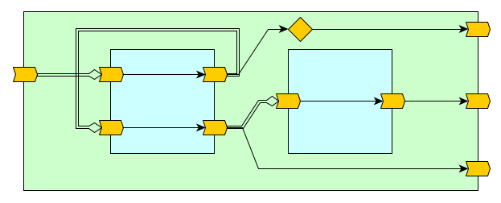
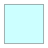
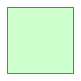
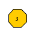
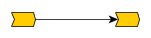
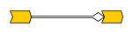

[](){#connectivity}
# Dataflow Ports & Connectivity




 <div style="page-break-after: always;"></div>
## Legend

| Shape                                                        | Meaning                                                      |
| ------------------------------------------------------------ | ------------------------------------------------------------ |
| or  | A dataflow design                                            |
|  | A dataflow port. <br />Arrow enters a dataflow design shape = INPUT port<br />Arrow exists a dataflow design shape = OUTPUT port |
|  | A dataflow variable (mutable)                                |
|  | A constant (immutable literal). <br />In this case, the value is 5. |
|  | A dataflow join calculation junction (immutable). <br />In this case, the calculation is the addition `+` arithmetic operation. |
|  | A dataflow state element, via `.prev(rank)` (immutable).<br />In this case, the rank is 3. |
|  | A single-line arrow indicates a dataflow dependency<br />**assignment** from a producer (arrow tail) to a <br />consumer (arrow head) |
|  | A double-line <u>diamond</u> arrow indicates a dataflow dependency<br />**connection** from a producer (arrow tail) to a <br />consumer (arrow head) **and** an initial conditions dependency |
|  | A double-line arrow indicates a dataflow dependency<br />**reference** from a producer (arrow tail) to a <br />consumer (arrow head) **and** an initial conditions dependency |

 <div style="page-break-after: always;"></div>
##Table of Contents

[TOC]

 <div style="page-break-after: always;"></div>
## Key Differences Between `<>` and `:=`

| Criteria                            | `<>` Connection                                              | `:=` Assignment                                              |
| ----------------------------------- | :----------------------------------------------------------- | :----------------------------------------------------------- |
| Code                                |                           |                           |
| Functional<br />Diagram             |  <br />We use a double line arrow to indicate a dataflow dependency **with** an initial condition dependency. | <br />We use a single line arrow to indicate a dataflow dependency **without** affecting initial conditions of the consumer. |
| Directionality &<br />Commutativity | The operator is commutative, meaning `a <> b` is equivalent to b `b <> a`.  One argument is the *producer*, while the other *consumer*. The dataflow direction is sensitive to the context in which the operator is applied. | The operator is non-commutative, meaning `a := b` determines that `b` is the *producer*, transferring data to the *consumer* `a`. |
| Initialization                      | Initialization is transferred to the consumer.               | The consumer initialization is **not** affected.             |
| Mutation                            | A consumer can only be connected once.                       | Consumer assignments are unlimited.                          |
| Statement Order                     | Connections statements can be placed in any order.           | Assignment statements                                        |
|                                     |                                                              | &nbsp;&nbsp;&nbsp;&nbsp;&nbsp;&nbsp;&nbsp;&nbsp;&nbsp;&nbsp;&nbsp;&nbsp;&nbsp;&nbsp;&nbsp;&nbsp;&nbsp;&nbsp;&nbsp;&nbsp;&nbsp;&nbsp;&nbsp;&nbsp;&nbsp;&nbsp;&nbsp;&nbsp;&nbsp;&nbsp;&nbsp;&nbsp;&nbsp;&nbsp;&nbsp;&nbsp;&nbsp;&nbsp;&nbsp;&nbsp;&nbsp;&nbsp;&nbsp;&nbsp;&nbsp;&nbsp;&nbsp;&nbsp;&nbsp;&nbsp;&nbsp;&nbsp;&nbsp;&nbsp;&nbsp;&nbsp;&nbsp;&nbsp;&nbsp;&nbsp;&nbsp;&nbsp;&nbsp;&nbsp;&nbsp;&nbsp;&nbsp;&nbsp;&nbsp;&nbsp;&nbsp;&nbsp;&nbsp; |

 <div style="page-break-after: always;"></div>
##Connection `<>` Rules

###Dataflow Port Connections

Connections annotation is generally used to connect parent designs to their child designs (components) and connect between sibling designs (children of the same parent). Opposed to VHDL/Verilog, there is no need to go through 'signals' to connect sibling design ports, e.g.:

```scala
trait IODesign extends DFDesign {
  val i = DFUInt(8) <> IN
  val o = DFUInt(8) <> OUT
  o <> i
}
trait Container2 extends DFDesign {
  val i = DFUInt(8) <> IN
  val o = DFUInt(8) <> OUT
  val io1 = new IODesign {}
  val io2 = new IODesign {}
  i     <> io1.i //Connecting between owner input and child input
  io1.o <> io2.i //Connecting between siblings (output <> input)
  io2.o <> o     //Connecting between child output and owner output
}
```


###Dataflow Value Connections

At least one of the connected sides must be a dataflow port (cannot connect two dataflow values together), e.g.:

```scala
trait Conn1 {
  val port = DFUInt(8) <> OUT
  val temp1 = DFUInt(8)
  val temp2 = DFUInt(8)
  port <> temp1 //OK!
  temp1 <> temp2 //Bad connection! At least one connection side must be a port
}
```


### Dataflow Input Port Assignment `:=` Rule

An input port cannot be assigned to. A connection must be used to transfer data to an input port, e.g.:

```scala
trait IO extends DFDesign {
  val in  = DFUInt(8) <> IN
  val out = DFUInt(8) <> OUT
  out := in //OK! Can assign internally to an output port
}
trait Assign1 extends DFDesign {
  val io = new IO{}
  io.in := 1 //Bad assignment! Must use a connection annotation
  io.in <> 1 //OK!
  io.out := 1 //Bad assignment! Output ports can only be assigned internally
}
```


###Immutable Value Connections

When connecting a port to an immutable value, the port must be a consumer, meaning the connection is done internally to an output port or externally to an input port, e.g.:

```scala
trait IO extends DFDesign {
  val i = DFUInt(8) <> IN
  val o = DFUInt(8) <> OUT
  //For brevity, we consider every connection/assignment in this example separately.
  //We ignore multiple connection issues that should arise.
  o <> 1 //OK!
  i <> 1 //Bad connection! 1 is immutable (constant)
  i <> o.prev //Bad connection! o.prev is immutable
  i.prev <> o //OK!
}
trait IOUser extends DFDesign {
  val io = new IO {}
  io.i <> 1 //OK!
  io.o <> 1 //Bad connection! 1 is immutable
}
```

 <div style="page-break-after: always;"></div>
### Different Type Connections

Connecting between different types is possible, but depends on the specific type: if it enables automatic conversion for the connection to succeed. Different port widths are considered different types and casting is required. An alias/casted/converted dataflow value is considered immutable for the connection (see above). Here are some examples:

```scala
trait DifferentTypesConn extends DFDesign {
  val i = DFUInt(8) <> IN
  val o = DFUInt(8) <> OUT
  val ob9 = DFBits(9) <> OUT
  
  val u7 = DFUInt(7)
  val u9 = DFUInt(9)
  val b8 = DFBits(8)
  
  //For brevity, we consider every connection/assignment in this example separately.
  //We ignore multiple connection issues that should arise.
  u7 <> o //OK! u7 is automatically extended to connect to 
  u7 <> i //Bad connection! u7 is considered immutable when extended to 8 bits
  o <> b8 //Bad connection! There is not automatic casting between bits and uint
  o <> b8.uint //OK!
  o.bits <> b8 //Bad connection! An alias of output port cannot be connected to
               //This may change in the future.
  o.bits := b8 //OK!
  u9 <> i //OK! In this example u9 is the consumer
  ob9 <> b8 //Bad connection! Bit vectors are NOT automatically extended.
  ob9 := b8 //Bad assignment! Bit vectors are NOT automatically extended.
}
```

 <div style="page-break-after: always;"></div>
### Multiple Connections

Two or more dataflow producers cannot be connected to the same consumer (a single producer can be connected to more than one consumer), e.g.:

```scala
trait Gen extends DFDesign {
  val out1 = DFUInt(8) <> OUT init 1
  val out2 = DFUInt(8) <> OUT init 2
}
trait Conn2 extends DFDesign {
  val in1 = DFUInt(8) <> IN
  val in2 = DFUInt(8) <> IN
  val out = DFUInt(8) <> OUT
  val temp1 = DFUInt(8)
  temp1 <> in1 //OK!
  out   <> in1 //Also OK! (Same producer can connect to more than one cosumer)
  temp1 <> in2 //Bad connection! Second producer connection to temp1
  
  val gen = new Gen {}
  val temp2 = DFUInt(8)
  val temp3 = DFUInt(8)
  gen.out1 <> temp2 //OK!
  gen.out1 <> temp3 //Also OK! (Same producer can connect to more than one cosumer)
  gen.out2 <> temp2 //Bad connection! Second producer connection to temp2
} 
```


###Mixing Assignments and Connections 

The same consumer cannot be both assigned to and connected to as the consumer, e.g.:

```scala
trait Conn3 extends DFDesign {
  val out1 = DFUInt(8) <> OUT
  val out2 = DFUInt(8) <> OUT
  val out3 = DFUInt(8) <> OUT
  out1 <> 1 //OK!
  out1 := 1 //Bad assignment! Cannot assign to a connected dataflow variable

  out2 := 2 //OK!
  out2 <> 2 //Bad connection! Cannot connect to an assigned dataflow variable

  out3 := 1 //OK!
  out3 := 2 //Also OK! (Multiple assignments are accepted)
}
```


### Connection Statement Order

The connection `<>` statement ordering does not matter.

 <div style="page-break-after: always;"></div>
### Connection and Initial Conditions

A connection `<>` transfers initial conditions to the consumer, but if the consumer is already initialized then the consumer keeps its existing initial conditions. Here is an example:

```scala
trait IOInit extends DFDesign {
  val i = DFUInt(8)        //init = (11, 12) Overriden from TopInit connection
  val o = DFUInt(8) init 5 //init = (5)      Not overridden due to assignment
  val ip = i.prev          //init = (12)     Prev moves down the init queue
  o := ip 
}
trait TopInit extends DFDesign {
  val i = DFUInt(8) <> IN.init(1, 2)  //init = (1, 2)   The top-level initial conditions
  val o = DFUInt(8) <> OUT init 1     //init = (1)      Keeps its initializaion
  val iPlus10 = in + 10               //init = (11, 12) Arithmetics affect init
  val io = new IOInit {}
  io.i <> inPlus10  										
  o <> io.o											
}
```


We learn from the above that port initial conditions are often overridden due to connections. So why should we apply initial conditions to a port? Answer: If we want to define what happens when a port is open (unconnected). Read the next two sections for more information.

 <div style="page-break-after: always;"></div>
###Open (Unconnected) Ports

Ports have two connection sides: a consumer side and a producer side. Typically ports have both sides connected, except for top-level ports. When either port side is unconnected, we refer to it as *open*, and expect the following behavior:

* When the port consumer side is open, the port produces tokens according to its initial condition. Uninitialized open-consumer ports generate bubble tokens.

* When the port producer side is open (unless it is a top-level output port), the port is considered as not used, and is pruned during compilation. All dataflow streams that are only used by this port will be pruned as well.

**Note**: the current compiler implementation does not warn of open ports.  

Example:

```scala
trait IOInit2 extends DFDesign {
  val i1 = DFUInt(8) <> IN init 5
  val o1 = DFUInt(8) <> OUT
  val i2 = DFUInt(8) <> IN
  val o2 = DFUInt(8) <> OUT init 2
  o1 <> i1 
}
trait TopIO2 extends DFDesign {
  val i = DFUInt(8) <> IN  
  val o = DFUInt(8) <> OUT //Will generate infinite tokens of 2, due to io.o2 init
  val io = new IO5 {}
  o <> io.o2
  i <> io.i1
  io.i2 <> 5
}
```


 <div style="page-break-after: always;"></div>
### Initial Condition Cyclic Loop Errors

Connections enable dataflow feedbacks and even dataflow dependency loops. There is no problem in dependency loops, other than pipelining limitations (see chapter TBD for more information). However, if we only apply connections and references that transfer initial conditions, we end up with a cyclic dependency for initial condition which is illegal. Therefore to enable dependency loops, at least one link in the loop must be an assignment, which has an implicit state and does not affect initial conditions. Consider the following examples:

```scala
trait IO1 extends DFDesign {
  val i = DFUInt(8) <> IN
  val o = DFUInt(8) <> OUT
  o <> i //Connection transfers initial conditions from i to o
}
trait BadConnLoop1 extends DFDesign {
  val o = DFUInt(8) <> OUT
  val io = new IO1 {}
  io.i <> io.o //Bad connection! An initial conditions cyclic loop
  o  <> io.o
}
trait IO2 extends DFDesign {
  val i = DFUInt(8) <> IN
  val o = DFUInt(8) <> OUT
  o <> i.prev //prev transfers initial conditions
}
trait BadConnLoop2 extends DFDesign {
  val o = DFUInt(8) <> OUT
  val io = new IO2 {}
  io.i <> io.o //Bad connection! An initial conditions cyclic loop
  o  <> io.o
}
trait IO3 extends DFDesign {
  val i = DFUInt(8) <> IN
  val o = DFUInt(8) <> OUT
  o := i //Assignment does not affect initial conditions and therefore breaks the loop
}
trait OKConnLoop extends DFDesign {
  val o = DFUInt(8) <> OUT
  val io = new IO3 {}
  io.i <> io.o //OK!
  o  <> io.o
}
```


**Note**: when following the drawing convention within this document, we want to avoid a double-lined loop in order to avoid a cyclic initial conditions dependency.

 <div style="page-break-after: always;"></div>
##Valid Connection and Assignment Examples

```scala
trait IODesign extends DFDesign {
  val i = DFUInt(8) <> IN
  val o = DFUInt(8) <> OUT
  o <> i
}
```


---

```scala
trait IODesign1 extends DFDesign {
  val i = DFUInt(8) <> IN
  val o = DFUInt(8) <> OUT
  val tmp = DFUInt(8)
  tmp <> i
  o <> tmp
}
```


---

```scala
trait IODesign2 extends DFDesign {
  val i1 = DFUInt(8) <> IN
  val o1 = DFUInt(8) <> OUT
  val i2 = DFUInt(8) <> IN
  val o2 = DFUInt(8) <> OUT
  o1 <> i1
  o2 <> i2
}
```


---

```scala
trait Container extends DFDesign {
  val i = DFUInt(8) <> IN
  val o = DFUInt(8) <> OUT
  val io = new IODesign {}
  i    <> io.i //Connecting between owner input and child input
  io.o <> o    //Connecting between child output and owner output
}
```


---

```scala
trait Container2 extends DFDesign {
  val i = DFUInt(8) <> IN
  val o = DFUInt(8) <> OUT
  val io1 = new IODesign {}
  val io2 = new IODesign {}
  i     <> io1.i //Connecting between owner input and child input
  io1.o <> io2.i //Connecting between siblings (output <> input)
  io2.o <> o     //Connecting between child output and owner output
}
```


---

```scala
trait Container3 extends DFDesign {
  val i = DFUInt(8) <> IN
  val o = DFUInt(8) <> OUT
  val io = new IODesign2 {}
  i <> io.i1 //Connecting between owner input and child input
  i <> io.i2 //Connecting between owner input and child input
  o <> (io.o1 + io.o2)
}
```


---

```scala
trait Container4 extends DFDesign {
  val i = DFUInt(8) <> IN
  val o = DFUInt(8) <> OUT
  val io = new IODesign2 {}
  i     <> io.i1 //Connecting between owner input and child input
  io.i2 <> 5     //Connecting between constant value and child input
  o     <> io.o2
}
```


---

```scala
trait Blank2 extends DFDesign {
  val i1 = DFUInt(8) <> IN
  val o1 = DFUInt(8) <> OUT
  val i2 = DFUInt(8) <> IN
  val o2 = DFUInt(8) <> OUT    
}
trait Container5 extends DFDesign {
  val i = DFUInt(8) <> IN
  val o = DFUInt(8) <> OUT
  val io = new Blank2 {
    o1 <> i1 //Assignment
    o2 <> i2 //Internal connection   
  }
  i     <> io.i1 //Connecting between owner input and child input
  io.i2 <> io.o1 //External connection between child input/output creates a feeback
  o     <> io.o2
}
```


Note: although there is a feedback in this design, there is no circular initial conditions dependency.

---

## Via Connections


## Future Work

* In the future `<>` will be used to connect multi-port interfaces.
* We will add support to treat an alias of a port as a port when connection `<>` rules are enforced.
* Connecting between any ancestor which is not a parent and child. Currently not supported fully.