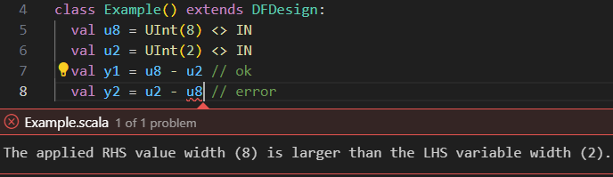
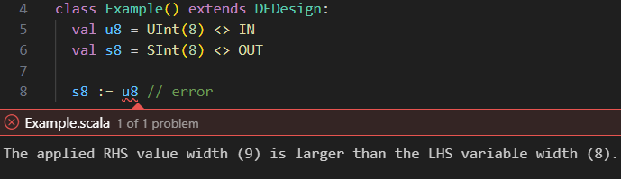

[](){#user-guide}
# Type System

DFHDL is a Scala library and thus inherently supports type-safe and modern language constructs. This chapter covers the rules and API of this type system. 

/// details | Check out the benefits of the DFHDL type system
    type: info

<div class="grid cards" markdown>

- :mechanical_arm:{ .lg .middle } __Strongly-typed__

    ---

    Most type checking is done statically and enforces strict rules that prevent ambiguity.

    ```scala linenums="0"
    //8-bit unsigned input
    val u8 = UInt(8) <> IN 
    //2-bit unsigned input
    val u2 = UInt(2) <> IN 
    val y1 = u8 - u2 //ok
    // Error prevents ambiguous behavior 
    // when a wider num is subtracted from 
    // a narrow num.
    val y2 = u2 - u8 //error
    ```
    


-   :material-bullseye-arrow:{ .lg .middle } __Bit-accurate__

    ---

    Each DFHDL value has known bit-width, which is used to enforce various rules to prevent data loss.

    ```scala linenums="0"
    //8-bit unsigned input
    val u8 = UInt(8) <> IN  
    //8-bit signed output
    val s8 = SInt(8) <> OUT 
    // Error prevents data loss when u8 is 
    // converted to a 9-bit signed to be 
    // assigned to s8, which is only 8-bits 
    // wide.
    s8 := u8 //error
    ```
    

-   :simple-googlecloudcomposer:{ .lg .middle } __Composable__

    ---

    Types can be composed through [structs](#DFStruct) or [tuples](#DFTuple) to form new types.

    ```scala linenums="0"
    //new Pixel type as a structure
    //of two unsigned 8-bit numbers
    case class Pixel(
      x: UInt[8] <> VAL,
      y: UInt[8] <> VAL
    ) extends Struct

    val pixel = Pixel <> VAR
    //select and assign fields
    pixel.x := pixel.y
    ```

-   :material-expand-all:{ .lg .middle } __Expandable__

    ---

    New types can be defined, and methods can be added for new or existing types.

    ```scala linenums="0"
    //new AESByte type of unsigned 8-bit num
    case class AESByte() 
      extends Opaque(UInt(8))
    //define addition between two AESByte
    //values as a xor operation
    extension (lhs: AESByte <> VAL)
      def +(rhs: AESByte <> VAL): AESByte <> DFRET =
        (lhs.actual ^ rhs.actual).as(AESByte)
    val x, y = AESByte <> VAR
    val z = x + y //actually XOR
    ```

  </div>
///

/// admonition | DFHDL Values
    type: abstract
Each DFHDL value is simply a Scala object that has two critical fields:

<div class="grid cards" markdown>

-   :material-shape-plus:{ .lg .middle } __(Shape) Type, aka DFType__

    ---
    Determines the bit-width and bit-structure of the value. Currently the supported types are: 

    * [DFHDL Bit/Boolean: `Bit`/`Boolean`][DFBitOrBool] 
    * [DFHDL Bit Vector: `Bits`][DFBits]
    * [DFHDL Integer: `UInt`/`SInt`/`Int`][DFDecimal]
    * > DFHDL Fix-Point (future work)
    * > DFHDL Flt-Point (future work)
    * > DFHDL String (future work)
    * [DFHDL Enumeration: `... extends Encoding`][DFEnum]
    * [DFHDL Vector: `_CellType_ X _Dim_`][DFVector]
    * [DFHDL Structure: `... extends Struct`][DFStruct]
    * [DFHDL Tuple: `(T1, T2, ..., Tn)`][DFTuple]
    * [DFHDL Opaque: `... extends Opaque`][DFOpaque]
    * [DFHDL Unit (Void): `Unit`][DFUnit]

-   :simple-openaccess:{ .lg .middle } __(Access) Modifier__

    ---

    Determines what kind of access the user has on the value. User explicit modifiers:
    
    * [Variable: `VAR[.REG][.SHARED]`][Dcl]
    * [Port: `IN`/`OUT[.REG]`/`INOUT`][Dcl]
    * [Constant: `CONST`][DFConst]
    * [Struct Field: `VAL`][DFStruct]
    * [Method Param: `VAL`][DesignDef]
    * [Method Return: `DFRET`/`RTRET`/`EDRET`][DesignDef]

    Although this mechanism can be quite complex under the hood, the explicit modifiers available to the user are straightforward.
    
</div>
///

/// details | Internal Type-System Hierarchy (For Advanced Users)
    type: dfhdl
DFHDL brings type-driven development concepts to hardware design, by creating an extensible type class hierarchy. Any DFHDL value is a Scala object instance of the class `DFVal[T <: DFTypeAny, M <: ModifierAny]`, where `T` is the type (shape) of value and `M` is a modifier that sets additional characteristics of the DFHDL value, like if its assignable, connectable, initializable, etc. 


For example, the Scala value `x` which references a port declared like `#!scala val x = Boolean <> IN` has the type `DFVal[DFBool, Modifier.Dcl]`.
///

## Variable and Port Declarations {#Dcl}
Ports are DFHDL values that define the inputs and outputs of a design. Variables are DFHDL values that represent internal design wiring, logic, or state.

### Syntax {#dcl-syntax}

```scala linenums="0" title="Port/Variable declaration syntax"
val _name_ = _dftype_ <> _modifier_ [init _const_]
```

* __`_name_`__ is the Scala value name reference for the DFHDL port/variable you constructed. The DFHDL compiler preserves this name and uses it in error messages and the final generated artifacts (e.g., Verilog module or VHDL entity port names). More information is available under the [naming][naming] section.
* __`_dftype_`__ is set according to the shape type (DFType) of the DFHDL value. Each of the supported DFTypes have their own constructors. See relevant sections for the DFHDL DFType you wish to construct.
* __`<>`__ is the operator applied between a `_dftype_` and a `_modifier_` to construct the Scala value that represents a DFHDL variable or port accordingly. Note: the same `<>` operator is used as a language construct for declaring [connections][connection]. Thanks to Scala method overloading, `<>` can be shared for both use-cases with no issues (due to the Scala argument type difference). 
* __`_modifier_`__ is set with one of the following: 
    * `VAR` - to construct a variable
    * `IN` - to construct an input port
    * `OUT` - to construct an output port
    * `INOUT` - to construct a bidirectional input-output port
    * `VAR.REG` / `OUT.REG` - to construct a registered variable or output port (available only in RT domains) 
    * `VAR.SHARED` - to construct a shared variable that can be assigned in more than one domain (this feature is to be used scarcely, to model unique designs like [True Dual-Port RAM][true-dpr])
* __`init`__ is an optional construct to initialize the DFHDL variable/port declaration history with the applied `_const_` value.
* __`_const_`__ is the [state history][state] initialization value or sequence of initialization values as a [Scala Tuple](https://docs.scala-lang.org/tour/tuples.html){target="_blank"}. This value must be a [constant][DFConst] that is supported by the DFType `_dftype_`.

```scala title="Port/Variable declaration examples"
class Foo extends DFDesign:
  //8-bit unsigned integer input port named 'i', 
  //initialized with the value 27.
  val i = UInt(8)     <> IN  init 27

  //single bit output port named 'o' 
  //with a sequence history (0, 1, 0) init
  val o = Bit         <> OUT init (0, 1, 0)

  //5 element vector of 8-bit vector cells 
  //variable named 'v' with no init
  val v = Bits(8) X 5 <> VAR
```
### Rules {#dcl-rules}

#### Scope 
* Variables can be declared in any DFHDL scope, except global scope, meaning within DFHDL designs, domains, interfaces, methods, processes, and conditional blocks.
```scala
//error: Port/Variable declarations cannot be global
val x = Bit <> VAR 
class Foo extends DFDesign:
  val o = Bit <> OUT
```

* Ports can only be declared at the scopes of DFHDL designs, domains, and interfaces. Other scopes are not allowed.
```scala
class Foo extends DFDesign:
  val i = Boolean <> IN
  if (i)
    //error: Ports can only be directly owned by a design, a domain or an interface.
    val o = Bit <> OUT 
    o := 0
```

#### Naming
Ports and variables must always be named, and cannot be anonymous. 

```scala
class Foo extends DFDesign:
  //error: constructed an anonymous 
  //output port
  Bit <> OUT 
```

As you'll read later on, constants and other values can be anonymous.

#### Connectable
Ports and variables are connectable, meaning they can be the receiving (drain/consumer) end of a [connection][connection] `<>` operation. 
For input ports this occurs outside their design scope, while connecting to an external value. 
For output ports and variables this occurs only within their design scope, while connecting to an internal value.
```scala
class ID extends DFDesign:
  val x = Bit <> IN
  val y = Bit <> OUT
  y <> x //connecting x to y
```

#### Assignable (Mutable)
Output ports, input-output ports, and variables are assignable (mutable), when they can be the receiving (drain/consumer) end of an [assignment][assignment] `:=`/`:==` operation, which occurs only within their design scope. Input ports can never be assigned (are immutable). Registered ports and variables are assignable only when referencing their registers' input via `.din` selection (referencing a register without `.din` is always considered to be its output, which is immutable). 

Assignment semantics are a key difference between the different design domains DFHDL has to offer. Here are some basic examples:
```scala
class Foo1 extends DFDesign:
  val x = Bit <> IN
  val y = Bit <> OUT
  //dataflow assignment of x to y
  y := x

class Foo2 extends RTDesign:
  val x  = Bit <> IN
  val y1 = Bit <> OUT
  val y2 = Bit <> OUT.REG
  //wire assignment of x to y1
  y1     := x 
  //registered assignment of x to y2
  y2.din := x 

class Foo3 extends EDDesign:
  val clk = Bit <> IN
  val x   = Bit <> IN
  val y1  = Bit <> OUT
  val y2  = Bit <> OUT
  process(all):
    //blocking assignment of x to y1
    y1 := x 
  process(clk):
    if (clk.rising)
      //non-blocking assignment of x to y2
      y2 :== x 

class Errors1 extends RTDesign:
  val x  = Bit <> IN
  val y1 = Bit <> OUT.REG
  val y2 = Bit <> OUT
  //error: Cannot assign to an immutable value.
  x  := 1
  //error: Cannot assign to a register output; it is immutable.
  //To assign to the register's input, apply `.din` on the LHS argument of the assignment.
  y1 := x
  //error: Non-blocking assignments `:==` are allowed only inside an event-driven (ED) domain.
  //Change the assignment to a regular assignment `:=` or the logic domain to ED.
  y2 :== x

class Errors2 extends EDDesign:
  val x = Bit <> IN
  val y = Bit <> OUT
  //error: Blocking assignments `:=` are only allowed inside a process under an event-driven (ED) domain.
  //Change the assignment to a connection `<>` or place it in a process.
  y := x
  //error: Non-blocking assignments `:==` are only allowed inside a process under an event-driven (ED) domain.
  //Change the assignment to a connection `<>` or place it in a process.
  y :== x
```
Be sure to read more on assignment rules and semantics in the [assignment][assignment] section.

#### Not Constant
Ports and variables are never considered to be [constant][DFConst] (even when connected/assigned only once and to a constant value) for elaboration. Later compilation stages can apply further constant propagation steps that reduce logic utilization.
```scala
class Errors extends DFDesign:
  val x  = Bit <> VAR
  x := 1
  val c: Bit <> CONST = 1
  // error: Not a constant
  val e: Bit <> CONST = x
```
#### `INOUT` Port Limitation
`INOUT` (bidirectional) ports are generally used to define IO pins of top-level device connectivity (e.g., protocols like [I<sup>2</sup>C](https://en.wikipedia.org/wiki/I%C2%B2C){target="_blank"} benefit from such ability). They are not meant for inter-device wiring reduction, and thus should be used scarcely within their intended purpose. Throughout the years they were also used to workaround HDL limitations like reading from output ports in VHDL'93, or lack of [interfaces][interfaces]. Since DFHDL has none of these limitations, we encourage you to use `INOUT` for their intended purpose only, as synthesis tools for FPGAs and even ASICs will not cooperate. Although, theoretically, in DF domain we can enable bidirectional communication that can later be compiled into two separate ports, there is no real value behind this.
```scala
class I2CCore extends EDDesign:
  val scl = Bit <> INOUT
  val sda = Bit <> INOUT
```

#### Grouping
Ports can be grouped together in dedicated [interfaces][interfaces].

### Transitioning {#Dcl-transitioning}

/// details | Differences from Verilog
    type: rtl
* DFHDL supports more abstraction domains, and not just ED abstraction like Verilog does.
* The non-blocking assignment operator in DFHDL is `:==` instead of `<=` in Verilog.
///

/// details | Differences from VHDL
    type: rtl
TODO
///

/// details | Differences from Scala parameters/fields
    type: dfhdl
TODO: Data validity, Number of outputs
///

## Constant/Literal Values {#DFConst}

In DFHDL there are three methods to construct constant DFHDL values:

1. __Literal value generators:__ These language constructs directly generate constant DFHDL values. Currently, these are:
    * [Binary `Bits` string interpolator][b-interp]
    * [Hexadecimal `Bits` string interpolator][h-interp]
    * [Decimal string interpolator][d-interp]
    * [Signed Decimal string interpolator][sd-interp]
2. __Constant candidates:__ Various Scala values can become DFHDL values, as.
```scala linenums="0" title="Constant declaration syntax"
val _name_: _dftype_ <> CONST = _value_
```
3. __Constant value propagation:__ Cleaners

### Syntax {#const-syntax}

### Rules {#const-rules}

#### Unconnectable
Constant values are not connectable, and can never be the receiving (drain/consumer) end of a [connection][connection] `<>` operation.

#### Unassignable (Immutable)
Constant values are immutable and cannot be assigned, meaning they can never be the receiving (drain/consumer) end of an [assignment][assignment] `:=`/`:==` operation.

## DFHDL Value Statement Order & Referencing
Any DFHDL value must be declared before it can be referenced in code. Other than this (pretty intuitive) limitation, no other limitations exists and ports, variables, constants, and other values may be freely distributed within their approved scope space. During the [compilation process][compilation], you can notice that the compiler reorders the port declarations so that they always come second to [constant declarations][DFConst], and variables right after.

## DFHDL Value Connections {#connection}
After ([or during][via-connections]) a design instantiation, its ports need to be connected to other ports or values of the same DFType by applying the `<>` operator. Variables can also be connected and used as intermediate wiring between ports. Output ports can be directly referenced (read) without being connected to an intermediate variable. For more rules about design and port connectivity, see the [relevant section][connectivity].
```scala title="Successful port/variable connection example"
class ID extends DFDesign:
  val x = UInt(8) <> IN
  val y = UInt(8) <> OUT
  //internal connection between ports
  y <> x 

class IDTop extends DFDesign:
  val x  = UInt(8) <> IN
  val y  = UInt(8) <> OUT
  val yv = UInt(8) <> VAR
  val id = ID()
  //direct connection between
  //parent and child design ports
  id.x <> x 
  //connecting through an intermediate 
  //variable
  id.y <> yv
  y <> yv
```

```scala title="Failed port/variable connection example"
class Foo extends DFDesign:
  val x  = UInt(8) <> IN
  val y1 = Bit     <> OUT
  val y2 = UInt(8) <> OUT
  y1 <> x //DFType mismatch error
  y2 <> x
  //connection error (cannot connect 
  //to the same port more than once)
  y2 <> x 
```

## DFHDL Value Assignment (Mutation) {#assignment}
Both output ports and variables are [mutable][mutability] and can be assigned with values of the same DFType and only within the scope of the design they belong to. Input ports cannot be directly assigned, and require an intermediate variable connected to them to modify their value. Generally assignments to DFHDL values are applied through the `:=` operator. In [processes][processes] under ED domains there are two kind of assignments: blocking assignments via `:=`, and non-blocking assignments via `:==`. Other domains support only blocking assignments via `:=`. Read more on domain semantics in the [next section][domain-semantics].
See the [connectivity section][connectivity] for more rules about mixing connections and assignments.

```scala title="Successful port/variable connection example"
class Shift extends DFDesign:
  val x = Bits(8) <> IN
  val y = Bits(8) <> OUT
  //assigning `x` left-shifted by 1 
  //to `y`
  y := x << 1

class IDTop extends DFDesign:
  val x  = UInt(8) <> IN
  val y  = UInt(8) <> OUT
  val yv = UInt(8) <> VAR
  val id = ID()
  //direct connection between
  //parent and child design ports
  id.x <> x 
  //connecting through an intermediate 
  //variable
  id.y <> yv
  y <> yv
```

## DFHDL Value Mutation {#mutability}

DFiant supports dataflow variables mutability via the `:=` operator. Do not confuse with Scala-level mutability which is enabled by using `#!scala var` instead of `#!scala val`. Each dataflow class has two variations: an immutable class, which inherits from `DFAny.Val` and a mutable class, which inherits from `DFAny.Var` and accepts `:=`. The difference between the types enforces an immutable right-hand-side (RHS), where required, and a mutable variable creation. 

Consider, for instance, the DFiant implementation of `g` in Table \ref`tbl:StateExDefImpl`: `a` is immutable because it is a RHS addition between the dataflow variable `i` and a literal value `5`. Contrarily, `c` is mutable, since it is a dataflow variable constructor (`.init` constructs a new initialized variable, while preserving the mutability trait). 

Fig. 1 demonstrates a dual class definition for every type  (immutable and mutable). The naming convention helps to reason about the mutability. For example, `DFBits` and `DFBits.Var` are immutable and mutable classes, respectively. Constructing a new variable via `DFBits` (e.g, `#!scala val a = DFBits[5]`) returns the mutable `DFBits.Var[5]`. Usually, we either receive or return an immutable type, hence we do not require annotating a type with its mutable variation. In cases where we want to return a mutable type, we annotate it as an output port (see Section~\ref`sec:io_ports`).

/// admonition | Don't use `var` with DFHDL values/variables
    type: warning
	Because the semantics may get confusing, we enforced a compiler error if a dataflow variable is constructed and fed into a Scala `#!scala var` reference. For example `#!scala var a = DFUInt(8)` will generate a Scala compiler error. 
///

## Bit-Accurate Operations, Type Inference, and Data Structures

All DFiant's dataflow types are bit-accurate and structurally static, with their bit-width set upon construction (e.g., `DFBits[5]` is a 5-bit vector). Operations between dataflow variables produce a bit-accurate result with the proper type inference. For example, an addition between an unsigned 5-bit variable (`DFUInt[5]`) and a signed 10-bit variable (`DFSInt[10]`) produces an adder that can be implicitly converted to a 10-bit signed variable, if carry is not required, or an 11-bit signed variable by explicitly invoking `.wc` from the addition.

DFiant also allows operations between dataflow types and their corresponding Scala numeric types, by treating the Scala numeric types as constants (e.g., addition between `DFSInt` and `Integer` variables). A constant in the dataflow graph is a node that can produce infinite tokens of the same value.   

## Bit Aliasing and Casting

Aliasing in DFiant enables referencing a part of a dataflow variable, by invoking `.bits(hiIdx, loIdx)`, which creates a bits vector alias that references the original variable at the given index parameters. Every change of a dataflow variable affects its alias and vice versa (similar to VHDL's signal aliasing). Since this function also casts the variable as `DFBits`, this feature is used as a raw-data cast between different dataflow types. Aliasing of an alias is also possible, while maintaining relative bits indexing. Aliasing preserves the mutability trait: an alias of an immutable value is immutable, while an alias of a mutable variable is mutable. 

Fig.~\ref`fig:Aliasing` demonstrates aliasing code and its effect on the contents of a dataflow variable (`bits128`). Each line code does as follows:


  1. Constructs a new 128-bit vector, `bits128`, and clears it.
  2. Creates a new alias, `alias64`, which references the most significant 64 bits of `bits128`. Since `bits128` is a `DFBits` variable, there is no need to invoke `.bits()`, and we can apply the required indexes directly.
  3. Creates a new alias, `alias32`, which references the least significant 32 bits of `alias64`, which reference bits 64 to 95 of `bits128`.
  4. Constructs a new double precision floating point dataflow variable, `dbl`, and initialize its value as `1.0` (hexadecimal value of `0x3FF00...0`).
  5. Modifies the least significant byte of `dbl`.
  6. Sets the most significant bit of `bits128`.
  7. Assigns `dbl` to the least significant 64 bits of `bits128` through casting. All the bits of `dbl` are selected because `.bits()` is invoked without index parameters.
  8. Modifies a byte of `bits128`.

## Bubble Values {#bubble}

* RT and ED - Don't Care / Unknown
* DF - Stall


## DFHDL Value Candidates
TODO: requires explanation
The candidate produces a constant DFHDL value if the candidate argument is a constant.

/// admonition | Operation supported values for an argument of DFType `T`
    type: info
```d2 pad="10" 
direction: right
classes: {
  is!: {
    label: ". is! ."
    style: {
      fill: black
      font-color:white
      bold: true
    }
  }
  is?: {
    label: ". is? ."
    style: {
      fill: black
      font-color:white
      bold: true
    }
  }
}
TCand -> TVal: {class: is!}
Any -> TCand: {class: is?} 
TCand -> OpCand: {class: is?} 
OpCand -> TVal: {class: is!}
Any -> OpCand: {class: is?} 
Any: {
  label: Any\nValue
}
TCand: {
  label: `T`\nCandidate
}
OpCand: {
  label: `T`\nOperation\nCandidate
}
TVal: {
  label: `T`\nValue
}
```
///

```scala title="Bits assignment and concatenation operation candidates example"
val b8 = Bits(8) <> VAR //8-bits variable
val b9 = Bits(9) <> VAR //9-bits variable

//Assignment operations to b8 accept either
//Bits candidates that are 8-bit wide or
//a same-element-vector (SEV) of 
//0/1/true/false, via `all(elem)`.
b8 := h"FF"  //ok: 8-bits constant
b8 := all(0) //ok: SEV of 0
b8 := 5      //fails `Bits` candidate
b8 := b9     //fails `:=` candidate

//Bits `++` concatenation operation with b8
//only accepts Bits candidate, while SEV
//is not a Bits candidate.
val x = b8 ++ h"FF"  //ok
val y = b8 ++ all(0) //error
```

## `Bit`/`Boolean` DFHDL Values {#DFBitOrBool}

`Bit` DFHDL values represent binary `1` or `0` values, whereas `Boolean` DFHDL values represent `true` or `false` values, respectively. The `Bit` and `Boolean` DFHDL values are generally interchangeable, and automatically converted between one and the other. 

/// admonition | Should I use `Bit` or `Boolean` DFTypes?
    type: info
Although they are interchangeable, it's generally recommended to use `Boolean` DFHDL values with conditional `if` statements, guards, or expressions, and `Bit` DFHDL values for everything else. There could be constant parameters that are better defined as a `true` or `false` `Boolean` values rather than `0` or `1` `Bit` values.
///

/// details | Why have both `Bit` and `Boolean` DFTypes?
    type: note    
The main reason to differentiate between `Bit` and `Boolean` is that VHDL has both `std_logic` and `boolean` types, respectively. Verilog has only a single `logic` or `wire` to represent both. Indeed VHDL'2008 has relaxed some of the type constraints, but not enough. And nevertheless, DFHDL aims to support various HDL dialects, and thus enables simple implicit or explicit conversion between these two DFType values.
///

### DFType Constructors

Use the `Bit` or `Boolean` objects/types to construct `Bit` or `Boolean` DFHDL values, respectively.

```scala
val bit   = Bit     <> VAR
val bool  = Boolean <> VAR
val c_bit:  Bit     <> CONST = 1
val c_bool: Boolean <> CONST = false
```

### Candidates

  * DFHDL `Bit` values.
  * DFHDL `Boolean` values. 
  * Scala `1` or `0` literal values. A regular Scala `Int` is not accepted. This candidate always produces a constant DFHDL value.
  * Scala `Boolean` values. This candidate always produces a constant DFHDL value.

```scala
val bit  = Bit     <> VAR
val bool = Boolean <> VAR
//`bool` is implicitly converted to a 
//Bit DFHDL value.
bit := bool 
//`1` is implicitly converted to a DFHDL
//Bit constant value.
bit := 1
//`false` is implicitly converted to a 
//DFHDL Boolean constant, and then
//converted to a Bit constant value.
bit := false
val one: Int = 1
//error (only 1/0 literals are ok)
bit := one 
//`bit` is implicitly converted to a
//DFHDL Boolean
bool := bit 
//`true` is implicitly converted to a 
//DFHDL Boolean constant value.
bool := true
//`0` is implicitly converted to a 
//DFHDL Bit constant, and then
//converted to a Boolean constant value.
bool := 0
val TrueVal: Boolean = 1
//`TrueVal` is implicitly converted to
//a DFHDL Boolean value.
bool := TrueVal 
```

### Operations

#### Explicit Casting Operations

These operations propagate constant modifiers, meaning that if the casted argument is a constant, the returned value is also a constant.

/// html | div.operations
| Operation   | Description                     | LHS Constraints       | Returns               |
| ----------- | --------------------------------|-----------------------|-----------------------|
| `lhs.bool`  | Cast to a DFHDL `Boolean` value | `Bit` DFHDL value     | `Boolean` DFHDL value |
| `lhs.bit`   | Cast to a DFHDL `Bit` value     | `Boolean` DFHDL value | `Bit` DFHDL value     |
///

```scala
val bt1 = Bit <> VAR
val bl1 = bt1.bool
val bl2 = Boolean <> VAR
val bt2 = bl2.bit
val bt3: Bit     <> CONST = 0
val bl3: Boolean <> CONST = bt3.bool
val bl4: Boolean <> CONST = true
val bt4: Bit     <> CONST = bt4.bit
// error: bt1 is not a constant
val err: Bit     <> CONST = bt1
```

#### Bit History Operations

Currently these operations are only supported under ED domains. However, in upcoming DFHDL updates, support will be added across all domain abstractions.

/// html | div.operations
| Operation    | Description                     | LHS Constraints       | Returns               |
| ------------ | --------------------------------|-----------------------|-----------------------|
| `lhs.rising` | True when a value changes from `0` to `1` | `Bit` DFHDL value     | `Boolean` DFHDL value |
| `lhs.falling` | True when a value changes from `1` to `0` | `Bit` DFHDL value     | `Boolean` DFHDL value |
///

```scala
class Foo extends EDDesign:
  val clk  = Bit <> IN

  /* VHDL-style */
  process(clk):
    if (clk.rising) 
      //some sequential logic

  /* Verilog-style */
  process(clk.rising):
    //some sequential logic
```

/// details | Transitioning from Verilog
    type: rtl
Under the ED domain, the `x.rising` and `x.falling` operations are equivalent to the Verilog `posedge x` and `negedge x`, respectively. 
In future releases these operations will have an expanded functionality under the other design domains.
///

/// details | Transitioning from VHDL
    type: rtl
Under the ED domain, the `x.rising` and `x.falling` operations are equivalent to the VHDL `rising_edge(x)` and `falling_edge(x)`, respectively.
In future releases these operations will have an expanded functionality under the other design domains.
///

For more information see either the [design domains][design-domains] or [processes][processes] sections.

#### Logical Operations

Logical operations' return type always match the LHS argument's type.
These operations propagate constant modifiers, meaning that if all arguments are constant, the returned value is also a constant.

/// html | div.operations
| Operation    | Description | LHS/RHS Constraints | Returns |
| ------------ | ----------- | ------------------- | ------- |
| `lhs && rhs` | Logical AND | The LHS argument must be a `Bit`/`Boolean` DFHDL value. The RHS must be a `Bit`/`Boolean` candidate. | LHS-Type DFHDL value |
| `lhs || rhs` | Logical OR  | The LHS argument must be a `Bit`/`Boolean` DFHDL value. The RHS must be a `Bit`/`Boolean` candidate. | LHS-Type DFHDL value |
| `lhs ^ rhs`  | Logical XOR | The LHS argument must be a `Bit`/`Boolean` DFHDL value. The RHS must be a `Bit`/`Boolean` candidate. | LHS-Type DFHDL value |
| `!lhs`       | Logical NOT | The argument must be a `Bit`/`Boolean` DFHDL value. | LHS-Type DFHDL value |
///

```scala
val bt = Bit     <> VAR
val bl = Boolean <> VAR
val t1 = bt && bl    //result type: Bit
val t2 = bt ^ 1      //result type: Bit
val t3 = bl || false //result type: Boolean
val t4 = bt && true  //result type: Bit
val t5 = bl || bt    //result type: Boolean
val t6 = bl ^ 0 || !bt
//`t7` after the candidate implicit
//conversions, looks like so:
//(bl && bt.bool) ^ (!(bt || bl.bit)).bool
val t7 = (bl && bt) ^ !(bt || bl)
//error: swap argument positions to have
//the DFHDL value on the LHS.
val e1 = 0 ^ bt      
//error: swap argument positions to have
//the DFHDL value on the LHS.
val e2 = false ^ bt
//not supported since both arguments
//are just candidates
val e3 = 0 ^ true
//This just yields a Scala Boolean, 
//as a basic operation between Scala
//Boolean values.
val sc: Boolean = true && true
```

/// details | Transitioning from Verilog
    type: rtl
Under the ED domain, the following operations are equivalent:

| DFHDL Operation | Verilog Operation |
|-----------------|-------------------|
| `lhs && rhs`    | `lhs & rhs`       |
| `lhs || rhs`    | `lhs | rhs`       |
| `lhs ^ rhs`     | `lhs ^ rhs`       |
| `!lhs`          | `!lhs`            |
///

/// details | Transitioning from VHDL
    type: rtl
Under the ED domain, the following operations are equivalent:

| DFHDL Operation | VHDL Operation    |
|-----------------|-------------------|
| `lhs && rhs`    | `lhs and rhs`     |
| `lhs || rhs`    | `lhs or rhs`      |
| `lhs ^ rhs`     | `lhs xor rhs`     |
| `!lhs`          | `not lhs`         |
///

#### Constant Meta Operations

These operations are activated during the [elaboration stage][elaboration] of the DFHDL compilation, and are only available for constant `Bit`/`Boolean` DFHDL values. 
Their use case is for meta-programming purposes, to control the generated code without the knowledge of the DFHDL compiler (could be considered as pre-processing steps).

/// html | div.operations
| Operation    | Description | LHS Constraints | Returns |
| ------------ | ----------- | ------------------- | ------- |
| `lhs.toScalaBitNum` | Extracts the known elaboration Scala `BitNum`(`1 | 0`) value from a constant DFHDL `Bit`/`Boolean` value | Constant `Bit`/`Boolean` DFHDL value | Scala `BitNum` value |
| `lhs.toScalaBoolean` | Extracts the known elaboration Scala `Boolean` value from a constant DFHDL `Bit`/`Boolean` value | Constant `Bit`/`Boolean` DFHDL value | Scala `Boolean` value |
///

The following runnable example demonstrates how such meta operation affect the elaborated design. 
The `Boolean` argument `arg` of a design `Foo` is used twice within the design: 
first, in an `if` condition directly; and second, in an `if` condition after a Scala value extraction. 
When referenced directly, the `if` is elaborated as-is, but when the `if` is applied on the extracted Scala value, 
the `if` is completely removed and either the block inside the `if` is elaborated when the argument is true or completely removed if false.

=== "`Foo`"

    ```scala
    class Foo(
        val arg: Boolean <> CONST
    ) extends DFDesign:
      val o = Bit <> OUT
      if (!arg) o := 1 
      if (arg.toScalaBoolean) o := 0
    ```

=== "`Foo(true)`"

    ```scala
    class Foo(
        val arg: Boolean <> CONST
    ) extends DFDesign:
      val o = Bit <> OUT
      if (!arg) o := 1 
      o := 0
    ```

=== "`Foo(false)`"

    ```scala
    class Foo(
        val arg: Boolean <> CONST
    ) extends DFDesign:
      val o = Bit <> OUT
      if (!arg) o := 1 
    ```

/// details | Runnable example
    type: dfhdl
```scastie
import dfhdl.*

@top(false) class Foo(
    val arg: Boolean <> CONST
) extends DFDesign:
  val o = Bit <> OUT
  if (!arg) o := 1 
  if (arg.toScalaBoolean) o := 0

@main def main = 
  println("Foo(true) Elaboration:")
  Foo(true).printCodeString
  println("Foo(false) Elaboration:")
  Foo(false).printCodeString
```
///

## `Bits` DFHDL Values {#DFBits}

`Bits` DFHDL values represent vectors of DFHDL `Bit` values as elements. 
The vector bits width (length) is a positive constant number (nilable [zero-width] vectors will be supported in the future).

/// admonition | Differences between DFHDL `Bits` and DFHDL Vector of `Bit`
    type: note
In addition to `Bits`, DFHDL also supports [generic vectors of any DFHDL values][DFVector]. 
One could therefore construct a generic vector with `Bit` as the element DFType. 
This vector has a different type than `Bits`, since `Bits` is a special case, both internally 
in their implementations and externally in their API. Where applicable, both `Bits` and generic
vector of `Bits` have overlapping equivalent APIs. 
///

### DFType Constructors

/// html | div.operations
| Constructor  | Description | Arg Constraints     | Returns |
| ------------ | ----------- | ------------------- | ------- |
| `Bits(width)`| Construct a `Bits` DFType with the given `width` as number of bits. | `width` is a positive Scala `Int` or constant DFHDL `Int` value. | `Bits[width.type]` DFType  |
| `Bits.until(sup)`| Construct a `Bits` DFType with the given `sup` supremum number the vector is expected to reach. The number of bits is set as `clog2(sup)`. | `sup` is a Scala `Int` or constant DFHDL `Int` value larger than 1. | `Bits[CLog2[width.type]]` DFType  |
| `Bits.to(max)`| Construct a `Bits` DFType with the given `max` maximum number the vector is expected to reach. The number of bits is set as `clog2(max+1)`. | `max` is a positive Scala `Int` or constant DFHDL `Int` value. | `Bits[CLog2[width.type+1]]` DFType  |
| `Bits[W]`    | Construct a `Bits` DFType with the given `W` width as Scala type argument (for advanced users). | `width` is a positive Scala `Int` or constant DFHDL `Int` Singleton type. | `Bits[W]` DFType  |
///


```scala
val b8 = Bits(8)       <> VAR
val b3 = Bits.until(8) <> VAR
val b4 = Bits.to(8)    <> VAR
val b9 = Bits[9]       <> VAR
val w: Int <> CONST = 7
val b7 = Bits(w)       <> VAR
val b6: Bits[6] <> CONST = all(0)
```

/// details | Transitioning from Verilog
    type: rtl
* __Specifying a width instead of an index range:__ In Verilog bit vectors are declared with an index range that enables outliers like non-zero index start, negative indexing or changing bit order. These use-cases are rare and they are better covered using different language constructs. Therefore, DFHDL simplifies things by only requiring a single width/length argument which yields a `[width-1:0]` sized vector (for [generic vectors][DFVector] the element order the opposite).
* __Additional constructors:__ DFHDL provides additional constructs to simplify some common Verilog bit vector declaration. For example, instead of declaring `reg [$clog2(DEPTH)-1:0] addr` in Verilog, in DFHDL simply declare `val addr = Bits.until(DEPTH) <> VAR`.
///

/// details | Transitioning from VHDL
    type: rtl
* __Specifying a width instead of an index range:__ In VHDL bit vectors are declared with an index range that enables outliers like non-zero index start, negative indexing or changing bit order. These use-cases are rare and they are better covered using different language constructs. Therefore, DFHDL simplifies things by only requiring a single width/length argument which yields a `(width-1 downto 0)` sized vector (for [generic vectors][DFVector] the element order the opposite).
* __Additional constructors:__ DFHDL provides additional constructs to simplify some common VHDL bit vector declaration. For example, instead of declaring `signal addr: std_logic_vector(clog2(DEPTH)-1 downto 0)` in VHDL, in DFHDL simply declare `val addr = Bits.until(DEPTH) <> VAR`.
///

### Literal (Constant) Value Generation

Literal (constant) DFHDL `Bits` value generation is carried out through [binary][b-interp] and [hexadecimal][h-interp] string interpolation, a core [Scala feature](https://docs.scala-lang.org/scala3/book/string-interpolation.html){target="_blank"} that was customized for DFHDL's exact use-case. There are also bit-accurate [decimal][d-interp] and [signed decimal][sd-interp] interpolations available that produce `UInt` and `SInt` DFHDL values. If needed, those values can be cast to `Bits`. No octal interpolation is currently available or planned.

#### Binary Bits String-Interpolator {#b-interp}

```scala linenums="0" title="Binary Bits string-interpolation syntax"
b"width'bin"
```

- __bin__ is a sequence of `0`, `1`, and `?` characters, each representing a single bit.  `?` indicates a bit [bubble][bubble]. 
  The leftest (first) character is the most-significant bit (MSB), and the rightest (last) character is 
  the least-significant bit (LSB). 
- Separators `' '` (space) or `_` (underscore) within `bin` are ignored.
- `bin` can also contain interpolated Scala `String` arguments through `${arg}`.
- __width__, followed by a __`'`__ (apostrophe), is optional and specifies the bit vector's width. If
  omitted, the minimal width is inferred from the sequence length. If specified, leading zeros
  are added at the left of the sequence or the sequence is truncated based on the `width`. 
  Truncation only occurs if the MSBits being removed are zeros; otherwise, it triggers a
  compilation error.
- `width` can be an interpolated argument of either Scala `Int` or a [Constant DFHDL `Int`][DFDecimal] value.
- Returns: A constant DFHDL `Bits` value with the inferred or set width.

```scala title="Binary Bits string-interpolation examples"
b"1"        // Value = 1
b"1000"     // Value = 1000
b"8'1000"   // Value = 00001000
b"3'0100"   // Value = 100
b"3'1100"   // Compilation error
b"1?11"     // Value = 1?11 (? indicates a bit bubble)
b"11_00"    // Value = 1100
val value = "100"
val width = 10
b"$width'1${value}1" //Value = 0000011001
val p: Int <> CONST = 10
b"$p'0" // Value = 0....0 (p-bits wide)
```

/// details | Transitioning from Verilog
    type: rtl
This interpolation covers the Verilog binary literal use-cases, but also adds the ability for parametric `width` to be set. The high impedance (high-Z) use-cases will be supported in the future, likely using a different language construct.
///

/// details | Transitioning from VHDL
    type: rtl
This interpolation covers the VHDL binary literal use-cases, but also adds the ability for parametric `width` to be set. The high impedance (high-Z) use-cases will be supported in the future, likely using a different language construct.
///

#### Hexadecimal Bits String-Interpolator {#h-interp}

```scala linenums="0" title="Hexadecimal Bits string-interpolation syntax"
h"width'hex"
```

- __hex__ is a sequence of hexadecimal characters (`0`-`9`, `A`-`F`, `a`-`f`, and `?`)
  where `?` indicates a 4-bit [bubble][bubble]. Each character represents a 4-bit nibble, 
  encoded such that the leftest bit is the most-significant bit.   
  The leftest (first) character is the most-significant nibble, and the rightest (last) character is 
  the least-significant nibble. 
- Separators `' '` (space) or `_` (underscore) within `hex` are ignored.
- `hex` can also contain interpolated Scala `String` arguments through `${arg}`.
- Binary sequences can be embedded within `{bin}` tags, allowing integration of [binary
  bit sequences][b-interp] of any length, not necessarily divisible by 4, between hex nibbles.
- __width__, followed by a __`'`__, is optional and specifies the bit vector's width. If
  omitted, the minimal width is inferred from the sequence length. If specified, leading zeros
  are added or the sequence is truncated based on the `width`. Truncation only occurs if
  the most significant bits being removed are zeros or bubbles; otherwise, it triggers a
  compilation error.
- `width` can be an interpolated argument of either Scala `Int` or a [Constant DFHDL `Int`][DFDecimal] value.
- Returns: A constant DFHDL `Bits` value with the inferred or set width.

```scala title="Hexadecimal Bits string-interpolation examples"
h"1"        // Value = 0001
h"27"       // Value = 00100111
h"6'27"     // Value = 100111
h"5'27"     // Compilation error
h"2?"       // Value = 0010????
h"F{00}F"   // Value = 1111001111
h"3_3"      // Value = 00110011
val value = "FF"
val width = 10
h"$width'${value}" //Value = 0011111111
```

/// details | Transitioning from Verilog
    type: rtl
This interpolation covers the Verilog hexadecimal literal use-cases, but also adds the ability for parametric `width` to be set. The high impedance (high-Z) use-cases will be supported in the future, likely using a different language construct.
///

/// details | Transitioning from VHDL
    type: rtl
This interpolation covers the VHDL hexadecimal literal use-cases, but also adds the ability for parametric `width` to be set. The high impedance (high-Z) use-cases will be supported in the future, likely using a different language construct.
///

### Candidates
  * DFHDL `Bits` values
  * DFHDL `Bit` or `Boolean` values. This candidate produces a single bit `Bits[1]` vector. 
  * DFHDL `UInt` values
  * Scala `Tuple` combination of any DFHDL values and `1`/`0` literal values. This candidate performs bit concatenation of all values, according their order in the tuple, encoded from the most-significant value position down to the least-significant value position.
  * Application-only candidate - Same-Element Vector (`all(elem)`).  

```scala
val b8   = Bits(8) <> VAR
val b1   = Bits(1) <> VAR
//`bit` is implicitly converted to a 
//Bits[1] DFHDL value.
val bit  = Bit     <> VAR
b1 := bit
//`bool` is implicitly converted to a 
//Bits[1] DFHDL value.
val bool = Boolean <> VAR
bool := bit
//`u8` is implicitly converted to a 
//Bits[8] DFHDL value.
val u8   = UInt(8) <> VAR
b8 := u8
val s4   = SInt(4) <> VAR
//the tuple is implicitly converted
//to a Bits[8] DFHDL value.
b8 := (1, s4, b1, b"10")
```

### Concatenated Assignment
DFHDL supports a special-case assignment of concatenated DFHDL Bits variables, using a Scala `Tuple` syntax on LHS of the assignment operator. Both LHS and RHS bits width must be the same. This assignment is just syntactic sugar for multiple separate assignments and carried out during the design [elaboration][elaboration]. The assignment ordering is from the first value at most-significant position down to the last value at least-significant position.

=== "`Foo Declaration`"

    ```scala
    class Foo extends DFDesign:
      val i4 = Bits(4) <> IN
      val b2 = Bits(2) <> OUT
      val b3 = Bits(3) <> OUT
      val b5 = Bits(5) <> OUT
      (b2, b5, b3) := (b"101", i4, b"111")
    ```

=== "`Foo Elaboration`"

    ```scala
    class Foo extends DFDesign:
      val i4 = Bits(4) <> IN
      val b2 = Bits(2) <> OUT
      val b3 = Bits(3) <> OUT
      val b5 = Bits(5) <> OUT
      b2 := b"10"
      b5 := (b"1", i4).toBits
      b3 := b"111"
    ```

/// details | Runnable example
    type: dfhdl
```scastie
import dfhdl.*

//print the code after elaboration
given options.ElaborationOptions.PrintDFHDLCode = true
//set mode to elaborate only
given options.AppOptions.DefaultMode = options.AppOptions.DefaultMode.elaborate

@top class Foo extends DFDesign:
  val i4 = Bits(4) <> IN
  val b2 = Bits(2) <> OUT
  val b3 = Bits(3) <> OUT
  val b5 = Bits(5) <> OUT
  (b2, b5, b3) := (b"101", i4, b"111")
```
///

## `UInt`/`SInt`/`Int` DFHDL Values {#DFDecimal}

### Constant Generation

#### Decimal String-Interpolator {#d-interp}

#### Signed Decimal String-Interpolator {#sd-interp}

## Enumeration DFHDL Values {#DFEnum}

## Vector DFHDL Values {#DFVector}

## Struct DFHDL Values {#DFStruct}

## Tuple DFHDL Values {#DFTuple}

## Opaque DFHDL Values {#DFOpaque}

## Unit (Void) DFHDL Values {#DFUnit}
