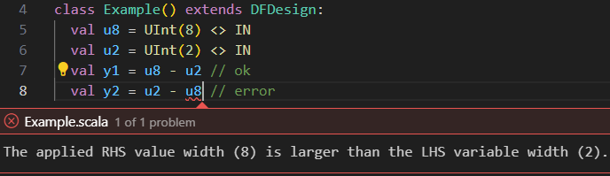
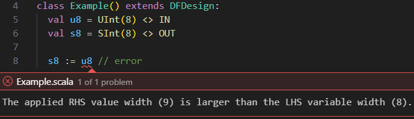

[](){#user-guide}
# Type System

DFHDL is a Scala library and thus inherently supports type-safe and modern language constructs. This chapter covers the rules and API of this type system. 

/// details | Check out the benefits of the DFHDL type system
    type: info

<div class="grid cards" markdown>

- :mechanical_arm:{ .lg .middle } __Strongly-typed__

    ---

    Most type checks are performed statically, enforcing strict rules that help avoid ambiguity.

    ```scala linenums="0"
    //8-bit unsigned input
    val u8 = UInt(8) <> IN 
    //2-bit unsigned input
    val u2 = UInt(2) <> IN 
    val y1 = u8 - u2 //ok
    // Error prevents ambiguous behavior 
    // when a wider num is subtracted from 
    // a narrow num.
    val y2 = u2 - u8 //error
    ```
    


-   :material-bullseye-arrow:{ .lg .middle } __Bit-accurate__

    ---

    Each DFHDL value has a defined bit-width, which is used to enforce rules that prevent data loss.

    ```scala linenums="0"
    //8-bit unsigned input
    val u8 = UInt(8) <> IN  
    //8-bit signed output
    val s8 = SInt(8) <> OUT 
    // Error prevents data loss when u8 is 
    // converted to a 9-bit signed to be 
    // assigned to s8, which is only 8-bits 
    // wide.
    s8 := u8 //error
    ```
    

-   :simple-googlecloudcomposer:{ .lg .middle } __Composable__

    ---

    Types can be composed through [structs](#DFStruct) or [tuples](#DFTuple) to form new, combined types.

    ```scala linenums="0"
    //new Pixel type as a structure
    //of two unsigned 8-bit numbers
    case class Pixel(
      x: UInt[8] <> VAL,
      y: UInt[8] <> VAL
    ) extends Struct

    val pixel = Pixel <> VAR
    //select and assign fields
    pixel.x := pixel.y
    ```

-   :material-expand-all:{ .lg .middle } __Expandable__

    ---

    New types can be defined, and methods can be added for entirely new or existing types.

    ```scala linenums="0"
    //new AESByte type of unsigned 8-bit num
    case class AESByte() 
      extends Opaque(UInt(8))
    //define addition between two AESByte
    //values as a xor operation
    extension (lhs: AESByte <> VAL)
      def +(rhs: AESByte <> VAL): AESByte <> DFRET =
        (lhs.actual ^ rhs.actual).as(AESByte)
    val x, y = AESByte <> VAR
    val z = x + y //actually XOR
    ```

  </div>
///

/// admonition | DFHDL Values
    type: abstract
Each DFHDL value is simply a Scala object that has two critical fields:

<div class="grid cards" markdown>

-   :material-shape-plus:{ .lg .middle } __(Shape) Type, aka DFType__

    ---
    Determines the bit-width and bit-structure of the value. Currently the supported types are: 

    * [DFHDL Bit/Boolean: `Bit`/`Boolean`][DFBitOrBool] 
    * [DFHDL Bit Vector: `Bits`][DFBits]
    * [DFHDL Integer: `UInt`/`SInt`/`Int`][DFDecimal]
    * > DFHDL Fix-Point (future work)
    * > DFHDL Flt-Point (future work)
    * > DFHDL String (future work)
    * [DFHDL Enumeration: `enum ... extends Encoded`][DFEnum]
    * [DFHDL Vector: `_CellType_ X _Dim_`][DFVector]
    * [DFHDL Structure: `... extends Struct`][DFStruct]
    * [DFHDL Tuple: `(T1, T2, ..., Tn)`][DFTuple]
    * [DFHDL Opaque: `... extends Opaque`][DFOpaque]
    * [DFHDL Double: `Double`][DFDouble]
    * [DFHDL Time/Freq: `Time`/`Freq`][DFPhysical]
    * [DFHDL Unit (Void): `Unit`][DFUnit]

-   :simple-openaccess:{ .lg .middle } __(Access) Modifier__

    ---

    Determines what kind of access the user has on the value. User explicit modifiers:
    
    * [Variable: `VAR[.REG][.SHARED]`][Dcl]
    * [Port: `IN`/`OUT[.REG]`/`INOUT`][Dcl]
    * [Constant: `CONST`][DFConst]
    * [Struct Field: `VAL`][DFStruct]
    * [Method Param: `VAL`][DesignDef]
    * [Method Return: `DFRET`/`RTRET`/`EDRET`][DesignDef]

    Although this mechanism can be quite complex under the hood, the explicit modifiers available to the user are straightforward.
    
</div>
///

/// details | Internal Type-System Hierarchy (For Advanced Users)
    type: dfhdl
DFHDL brings type-driven development concepts to hardware design, by creating an extensible type class hierarchy. Any DFHDL value is a Scala object instance of the class `DFVal[T <: DFTypeAny, M <: ModifierAny]`, where `T` is the type (shape) of value and `M` is a modifier that sets additional characteristics of the DFHDL value, like if it's assignable, connectable, initializable, etc. 


For example, the Scala value `x` which references a port declared like `#!scala val x = Boolean <> IN` has the type `DFVal[DFBool, Modifier.Dcl]`.
///

## Variable and Port Declarations {#Dcl}
Ports are DFHDL values that define the inputs and outputs of a design. Variables are DFHDL values that represent internal design wiring, logic, or state.

### Syntax {#dcl-syntax}

```scala linenums="0" title="Port/Variable declaration syntax"
val _name_ = _dftype_ <> _modifier_ [init _const_]
```

* __`_name_`__ is the Scala value name reference for the DFHDL port/variable you constructed. The DFHDL compiler preserves this name and uses it in error messages and the final generated artifacts (e.g., Verilog module or VHDL entity port names). `_name_` can also be a series of names separated by commas to declare several equivalent ports/variables. More information is available under the [naming][naming] section.
* __`_dftype_`__ is set according to the shape type (DFType) of the DFHDL value. Each of the supported DFTypes have their own constructors. See relevant sections for the DFHDL DFType you wish to construct.
* __`<>`__ is the operator applied between a `_dftype_` and a `_modifier_` to construct the Scala value that represents a DFHDL variable or port accordingly. Note: the same `<>` operator is used as a language construct for declaring [connections][connection]. Thanks to Scala method overloading, `<>` can be shared for both use-cases with no issues (due to the Scala argument type difference). 
* __`_modifier_`__ is set with one of the following: 
    * `VAR` - to construct a variable
    * `IN` - to construct an input port
    * `OUT` - to construct an output port
    * `INOUT` - to construct a bidirectional input-output port
    * `VAR.REG` / `OUT.REG` - to construct a registered variable or output port (available only in RT domains) 
    * `VAR.SHARED` - to construct a shared variable that can be assigned in more than one domain (this feature is to be used scarcely, to model unique designs like [True Dual-Port RAM][true-dpr])
* __`init`__ is an optional construct to initialize the DFHDL variable/port declaration history with the applied `_const_` value.
* __`_const_`__ is the [state history][state] initialization value which must be a [constant][DFConst] that is supported by the DFType `_dftype_`. Under DF domain only, `_const_` can also be represented by a [Scala Tuple](https://docs.scala-lang.org/tour/tuples.html){target="_blank"} sequence of [constant][DFConst] initialization values that are supported by the DFType `_dftype_`.

```scala title="Port/Variable declaration examples"
class Foo extends DFDesign:
  //8-bit unsigned integer input port named 'i', 
  //initialized with the value 27
  val i = UInt(8)    <> IN  init 27

  //single bit output port named 'o' 
  //with a sequence history (0, 1, 0) init
  //(possible under DF domain only)
  val o = Bit        <> OUT init (0, 1, 0)

  //5 element vector of 8-bit vector cells 
  //variable named 'v' with no init
  val v = Bits(8) X 5 <> VAR

  //multiple equivalent single bit input port 
  //declarations named 'a', 'b', and 'c'
  val a, b, c = Bit   <> IN
```

/// details | Transitioning from Verilog
    type: verilog
TODO
///

/// details | Transitioning from VHDL
    type: vhdl
TODO
///


### Rules {#dcl-rules}

#### Scope {#dcl-scope}
* Variables can be declared in any DFHDL scope, except global scope, meaning within DFHDL designs, domains, interfaces, methods, processes, and conditional blocks.
```scala
//error: Port/Variable declarations cannot be global
val x = Bit <> VAR 
class Foo extends DFDesign:
  val o = Bit <> OUT
```

* Ports can only be declared at the scopes of DFHDL designs, domains, and interfaces. Other scopes are not allowed.
```scala
class Foo extends DFDesign:
  val i = Boolean <> IN
  if (i)
    //error: Ports can only be directly owned by a design, a domain or an interface.
    val o = Bit <> OUT 
    o := 0
```

#### Naming {#dcl-naming}
Ports and variables must always be named, and cannot be anonymous. 

```scala title="Anonymous declaration elaboration error example"
class Foo extends DFDesign:
  //elaboration error: Unable to determine names for the members declared at the following positions
  Bit <> OUT 
```

As you'll read later on, constants and other values can be anonymous.

#### Connectable {#dcl-connectable}
Ports and variables are connectable, meaning they can be the receiving (drain/consumer) end of a [connection][connection] `<>` operation. 
For input ports this occurs outside their design scope, while connecting to an external value. 
For output ports and variables this occurs only within their design scope, while connecting to an internal value.
```scala
class ID extends DFDesign:
  val x = Bit <> IN
  val y = Bit <> OUT
  y <> x //connecting x to y
```

#### Assignable (Mutable) {#dcl-assignable}
Output ports, input-output ports, and variables are assignable (mutable), when they can be the receiving (drain/consumer) end of an [assignment][assignment] `:=`/`:==` operation, which occurs only within their design scope. Input ports can never be assigned (are immutable). Registered ports and variables are assignable only when referencing their registers' input via `.din` selection (referencing a register without `.din` is always considered to be its output, which is immutable). 

Assignment semantics are a key difference between the different design domains DFHDL has to offer. Here are some basic examples:
```scala
class Foo1 extends DFDesign:
  val x = Bit <> IN
  val y = Bit <> OUT
  //dataflow assignment of x to y
  y := x

class Foo2 extends RTDesign:
  val x  = Bit <> IN
  val y1 = Bit <> OUT
  val y2 = Bit <> OUT.REG
  //wire assignment of x to y1
  y1     := x 
  //registered assignment of x to y2
  y2.din := x 

class Foo3 extends EDDesign:
  val clk = Bit <> IN
  val x   = Bit <> IN
  val y1  = Bit <> OUT
  val y2  = Bit <> OUT
  process(all):
    //blocking assignment of x to y1
    y1 := x 
  process(clk):
    if (clk.rising)
      //non-blocking assignment of x to y2
      y2 :== x 

class Errors1 extends RTDesign:
  val x  = Bit <> IN
  val y1 = Bit <> OUT.REG
  val y2 = Bit <> OUT
  //error: Cannot assign to an immutable value.
  x  := 1
  //error: Cannot assign to a register output; it is immutable.
  //To assign to the register's input, apply `.din` on the LHS argument of the assignment.
  y1 := x
  //error: Non-blocking assignments `:==` are allowed only inside an event-driven (ED) domain.
  //Change the assignment to a regular assignment `:=` or the logic domain to ED.
  y2 :== x

class Errors2 extends EDDesign:
  val x = Bit <> IN
  val y = Bit <> OUT
  //error: Blocking assignments `:=` are only allowed inside a process under an event-driven (ED) domain.
  //Change the assignment to a connection `<>` or place it in a process.
  y := x
  //error: Non-blocking assignments `:==` are only allowed inside a process under an event-driven (ED) domain.
  //Change the assignment to a connection `<>` or place it in a process.
  y :== x
```
Be sure to read more on assignment rules and semantics in the [assignment][assignment] section.

#### Variability (Not Constant) {#dcl-variability}
DFHDL ports and variables are never considered to be [constant][DFConst] (even when connected/assigned only once and to a constant value) for elaboration. Later compilation stages can apply further constant propagation steps that reduce logic utilization.
```scala
class Errors extends DFDesign:
  val x  = Bit <> VAR
  x := 1
  val c: Bit <> CONST = 1
  // error: Not a constant
  val e: Bit <> CONST = x
```
#### `INOUT` Port Limitation
`INOUT` (bidirectional) ports are generally used to define IO pins of top-level device connectivity (e.g., protocols like [I<sup>2</sup>C](https://en.wikipedia.org/wiki/I%C2%B2C){target="_blank"} benefit from such ability). They are not meant for inter-device wiring reduction, and thus should be used scarcely within their intended purpose. Throughout the years they were also used to workaround HDL limitations like reading from output ports in VHDL'93, or lack of [interfaces][interfaces]. Since DFHDL has none of these limitations, we encourage you to use `INOUT` for their intended purpose only, as synthesis tools for FPGAs and even ASICs will not cooperate. Although, theoretically, in DF domain we can enable bidirectional communication that can later be compiled into two separate ports, there is no real value behind this.
```scala
class I2CCore extends EDDesign:
  val scl = Bit <> INOUT
  val sda = Bit <> INOUT
```

#### Grouping {#dcl-variability}
Ports can be grouped together in dedicated [interfaces][interfaces].

### Transitioning {#dcl-transitioning}

/// details | Transitioning from Verilog
    type: verilog
TODO
///

/// details | Transitioning from VHDL
    type: vhdl
TODO
///

/// details | Differences from Scala parameters/fields
    type: dfhdl
TODO: Data validity, Number of outputs
///

## Constant/Literal Values {#DFConst}

In DFHDL there are three methods to construct constant DFHDL values:

1. __Literal value generators:__ These language constructs directly generate constant DFHDL values. Currently, these are:
    * [Binary `Bits` string interpolator][b-interp]
    * [Hexadecimal `Bits` string interpolator][h-interp]
    * [Decimal string interpolator][d-interp]
    * [Signed Decimal string interpolator][sd-interp]
2. __Constant candidates:__ Various Scala values can become DFHDL values, as.
```scala linenums="0" title="Constant declaration syntax"
val _name_: _dftype_ <> CONST = _value_
```
3. __Constant value propagation:__ Cleaners

### Syntax {#const-syntax}

### Rules {#const-rules}

#### Unconnectable
Constant values are not connectable, meaning they can never be the receiving (drain/consumer) end of a [connection][connection] `<>` operation.

#### Unassignable (Immutable)
Constant values are immutable and cannot be assigned, meaning they can never be the receiving (drain/consumer) end of an [assignment][assignment] `:=`/`:==` operation.

## DFHDL Value Statement Order & Referencing
Any DFHDL value must be declared before it can be referenced in code. Other than this (pretty intuitive) limitation, no other limitations exist and ports, variables, constants, and other values may be freely distributed within their approved scope space. During the [compilation process][compilation], you can notice that the compiler reorders the port declarations so that they always come second to [constant declarations][DFConst], and variables right after.

## DFHDL Value Connections {#connection}
After ([or during][via-connections]) a design instantiation, its ports need to be connected to other ports or values of the same DFType by applying the `<>` operator. Variables can also be connected and used as intermediate wiring between ports. Output ports can be directly referenced (read) without being connected to an intermediate variable. For more rules about design and port connectivity, see the [relevant section][connectivity].
```scala title="Successful port/variable connection example"
class ID extends DFDesign:
  val x = UInt(8) <> IN
  val y = UInt(8) <> OUT
  //internal connection between ports
  y <> x 

class IDTop extends DFDesign:
  val x  = UInt(8) <> IN
  val y  = UInt(8) <> OUT
  val yv = UInt(8) <> VAR
  val id = ID()
  //direct connection between
  //parent and child design ports
  id.x <> x 
  //connecting through an intermediate 
  //variable
  id.y <> yv
  y <> yv
```

```scala title="Failed port/variable connection example"
class Foo extends DFDesign:
  val x  = UInt(8) <> IN
  val y1 = Bit     <> OUT
  val y2 = UInt(8) <> OUT
  y1 <> x //DFType mismatch error
  y2 <> x
  //connection error (cannot connect 
  //to the same port more than once)
  y2 <> x 
```

## DFHDL Value Assignment (Mutation) {#assignment}
Both output ports and variables are [mutable][mutability] and can be assigned with values of the same DFType and only within the scope of the design they belong to. Input ports cannot be directly assigned, and require an intermediate variable connected to them to modify their value. Generally assignments to DFHDL values are applied through the `:=` operator. In [processes][processes] under ED domains there are two kind of assignments: blocking assignments via `:=`, and non-blocking assignments via `:==`. Other domains support only blocking assignments via `:=`. Read more on domain semantics in the [next section][domain-semantics].
See the [connectivity section][connectivity] for more rules about mixing connections and assignments.

```scala title="Successful port/variable connection example"
class Shift extends DFDesign:
  val x = Bits(8) <> IN
  val y = Bits(8) <> OUT
  //assigning `x` left-shifted by 1 
  //to `y`
  y := x << 1

class IDTop extends DFDesign:
  val x  = UInt(8) <> IN
  val y  = UInt(8) <> OUT
  val yv = UInt(8) <> VAR
  val id = ID()
  //direct connection between
  //parent and child design ports
  id.x <> x 
  //connecting through an intermediate 
  //variable
  id.y <> yv
  y <> yv
```

/// admonition | Don't use `var` with DFHDL values/designs
    type: warning
Because the semantics may get confusing, we enforced a compiler warning if a DFHDL value/design is constructed and fed into a Scala `#!scala var` reference. You can apply a Scala `@nowarn` annotation to suppress this warning.

```scala title="Warning when using a Scala `var` and suppression example"
import scala.annotation.nowarn
class Foo extends DFDesign:
  //warning: 
  //Scala `var` modifier for DFHDL 
  //values/designs is highly discouraged!
  //Consider changing to `val`.   
  var a = UInt(8) <> IN
  //this specific warning is suppressed
  @nowarn("msg=Scala `var` modifier for DFHDL")
  var ok = UInt(8) <> IN 
```
///


## Bubble Values {#bubble}

* RT and ED - Don't Care / Unknown
* DF - Stall


## DFHDL Value Candidates
TODO: requires explanation
The candidate produces a constant DFHDL value if the candidate argument is a constant.

/// admonition | Operation supported values for an argument of DFType `T`
    type: info
```d2 pad="10" 
direction: right
classes: {
  is!: {
    label: ". is! ."
    style: {
      fill: black
      font-color:white
      bold: true
    }
  }
  is?: {
    label: ". is? ."
    style: {
      fill: black
      font-color:white
      bold: true
    }
  }
}
TCand -> TVal: {class: is!}
Any -> TCand: {class: is?} 
TCand -> OpCand: {class: is?} 
OpCand -> TVal: {class: is!}
Any -> OpCand: {class: is?} 
Any: {
  label: Any\nValue
}
TCand: {
  label: `T`\nCandidate
}
OpCand: {
  label: `T`\nOperation\nCandidate
}
TVal: {
  label: `T`\nValue
}
```
///

```scala title="Bits assignment and concatenation operation candidates example"
val b8 = Bits(8) <> VAR //8-bits variable
val b9 = Bits(9) <> VAR //9-bits variable

//Assignment operations to b8 accept either
//Bits candidates that are 8-bit wide or
//a same-element-vector (SEV) of 
//0/1/true/false, via `all(elem)`.
b8 := h"FF"  //ok: 8-bits constant
b8 := all(0) //ok: SEV of 0
b8 := 5      //fails `Bits` candidate
b8 := b9     //fails `:=` candidate

//Bits `++` concatenation operation with b8
//only accepts Bits candidate, while SEV
//is not a Bits candidate.
val x = b8 ++ h"FF"  //ok
val y = b8 ++ all(0) //error
```

## Type Signatures and Parameterization {#type-sigs}

Every DFHDL value has a type of the form `T <> M`, where `T` is the DFHDL type (shape) and `M` is the modifier that determines how the value can be used.

### Modifier Categories

Modifiers fall into two groups:

**Declaration modifiers** — used in `val` declarations with the `<>` operator:

- `VAR`, `VAR.REG`, `VAR.SHARED` — variables
- `IN`, `OUT`, `OUT.REG`, `INOUT` — ports

**Type signature modifiers** — used in type annotations for parameters, struct fields, and method signatures:

- `CONST` — compile-time or elaboration-time constant parameter
- `VAL` — read-only value (struct fields, method parameters)
- `DFRET` / `RTRET` / `EDRET` — method return types (DF, RT, or ED domain)

### Design Parameters

Design classes accept parameters as constructor arguments using `<> CONST`:

```scala
class Counter(val width: Int <> CONST = 8) extends RTDesign:
  val cnt = UInt(width) <> OUT.REG init 0
```

- `Int <> CONST` for integer parameters (used for widths, lengths, counts). Accepts any Scala `Int` value (-2^31^ to 2^31^-1).
- Typed constants like `Bits[8] <> CONST` and `UInt[8] <> CONST` are also possible
- Default values are optional

### `VAL` Modifier

`VAL` marks a read-only value. It is used for:

- **Struct field declarations:**
  ```scala
  case class Point(x: UInt[8] <> VAL, y: UInt[8] <> VAL) extends Struct
  ```
- **Method/design-def parameters:**
  ```scala
  def increment(x: UInt[8] <> VAL): UInt[8] <> DFRET = x + 1
  ```

`VAL` values cannot be assigned or connected — they are inputs to the computation.

### Design Defs and `DFRET`

Design defs are functional helpers. Arguments use `<> VAL`, return types use `<> DFRET` (or `RTRET`/`EDRET` for domain-specific defs):

```scala
// DF domain design def
def double(value: Bits[Int] <> VAL): Bits[Int] <> DFRET = (value, value)

// Opaque type extension method
extension (c: Counter <> VAL)
  def increment: Counter <> DFRET = (c.actual + 1).as(Counter)
```

### Bounded and Unbounded Types {#bounded-unbounded}

DFHDL types carry their size (width or length) as a Scala type parameter. There are three levels of size specificity:

**Bounded** — the size is a literal singleton known at compile time. All type checks happen statically:

```scala
val a: UInt[8] <> CONST = d"255"
val b: Bits[4] <> CONST = h"A"
val v: Bits[8] X 4 <> CONST = all(all(0))
```

**Parameterized bounded** — the size is the singleton type of a named parameter. The compiler can track the relationship, even though the concrete value isn't known until instantiation:

```scala
class Foo(val w: Int <> CONST) extends RTDesign:
  val x: Bits[w.type] <> CONST = all(0)     // width tied to parameter w
  val y = UInt[w.type] <> VAR init 0         // same
  val v: UInt[4] X w.type <> CONST = all(0)  // vector length tied to w
```

**Unbounded** — the size is bare `Int`, with no compile-time size information. Used when the type is too complex to express at the Scala type level (e.g., results of operations on parameterized types). The DFHDL compiler still has the required size information available during elaboration, where it is checked:

```scala
val cu: UInt[Int] <> VAL = 1
val cs: SInt[Int] <> VAL = -1
val bv: Bits[8] X Int <> CONST = Vector(h"12", h"34")
def twice(value: Bits[Int] <> VAL): Bits[Int] <> DFRET = (value, value)
```

/// admonition | Struct fields must be bounded
    type: warning
Struct field types cannot be unbounded. Each field must have a concrete or parameterized-bounded type:
```scala
// CORRECT: bounded fields
case class Pkt(header: Bits[8] <> VAL, data: UInt[32] <> VAL) extends Struct

// ERROR: unbounded fields are not allowed
// case class Bad(data: Bits[Int] <> VAL) extends Struct
```
///

## DFHDL Value Types

### `Bit`/`Boolean` {#DFBitOrBool}

`Bit` DFHDL values represent binary `1` or `0` values, whereas `Boolean` DFHDL values represent `true` or `false` values, respectively. The `Bit` and `Boolean` DFHDL values are generally interchangeable, and automatically converted between one and the other. 

/// admonition | Should I use `Bit` or `Boolean` DFTypes?
    type: info
Although they are interchangeable, it's generally recommended to use `Boolean` DFHDL values with conditional `if` statements, guards, or expressions, and `Bit` DFHDL values for everything else. There could be constant parameters that are better defined as a `true` or `false` `Boolean` values rather than `0` or `1` `Bit` values.
///

/// details | Why have both `Bit` and `Boolean` DFTypes?
    type: note
The main reason to differentiate between `Bit` and `Boolean` is that VHDL has both `std_logic` and `boolean` types, respectively. Verilog has only a single `logic` or `wire` to represent both. Indeed VHDL'2008 has relaxed some of the type constraints, but not enough. And nevertheless, DFHDL aims to support various HDL dialects, and thus enables simple implicit or explicit conversion between these two DFType values.
///

#### DFType Constructors

Use the `Bit` or `Boolean` objects/types to construct `Bit` or `Boolean` DFHDL values, respectively.

```scala
val bit   = Bit     <> VAR
val bool  = Boolean <> VAR
val c_bit:  Bit     <> CONST = 1
val c_bool: Boolean <> CONST = false
```

#### Type Signatures
`Bit` and `Boolean` have no size parameter. Type signatures: `Bit <> CONST`, `Bit <> VAL`, `Boolean <> VAL`, etc.

#### Candidates

  * DFHDL `Bit` values.
  * DFHDL `Boolean` values. 
  * Scala `1` or `0` literal values. A regular Scala `Int` is not accepted. This candidate always produces a constant DFHDL value.
  * Scala `Boolean` values. This candidate always produces a constant DFHDL value.

```scala
val bit  = Bit     <> VAR
val bool = Boolean <> VAR
//`bool` is implicitly converted to a 
//Bit DFHDL value.
bit := bool 
//`1` is implicitly converted to a DFHDL
//Bit constant value.
bit := 1
//`false` is implicitly converted to a 
//DFHDL Boolean constant, and then
//converted to a Bit constant value.
bit := false
val one: Int = 1
//error (only 1/0 literals are ok)
bit := one 
//`bit` is implicitly converted to a
//DFHDL Boolean
bool := bit 
//`true` is implicitly converted to a 
//DFHDL Boolean constant value.
bool := true
//`0` is implicitly converted to a 
//DFHDL Bit constant, and then
//converted to a Boolean constant value.
bool := 0
val TrueVal: Boolean = 1
//`TrueVal` is implicitly converted to
//a DFHDL Boolean value.
bool := TrueVal 
```

/// admonition | `Bit` variables accept `Boolean` comparison values as condidates
    type: note
All comparison operators (`==`, `!=`, `<`, `>`, `<=`, `>=`) return `Boolean`, and can be directly assigned to `Bit` variables:
```scala
class Foo extends RTDesign:
  val limit   = UInt(8) <> IN
  val counter = UInt(8) <> VAR.REG init 0
  val tick    = Bit     <> OUT
  tick := counter == limit  // Implicit Boolean -> Bit conversion
```
///

/// admonition | `if` and `while` conditionals accept both `Boolean` and `Bit` values
    type: note
`if` and `while` conditional expression and statements accept both `Boolean` and `Bit` values (no conversion is taking place). In stricter backends like `vhdl.v93`, an automatic conversion is applied `Boolean` where needed.
```scala
class Foo extends RTDesign:
  val tick = Bit <> IN
  if (tick) // if condition accepts both Bit and Boolean values
    //do something
  end if
```
///

### `Bits` {#DFBits}

`Bits` DFHDL values represent vectors of DFHDL `Bit` values as elements. 
The vector bits width (length) is a positive constant number (nilable [zero-width] vectors will be supported in the future).

/// admonition | Differences between DFHDL `Bits` and DFHDL Vector of `Bit`
    type: note
In addition to `Bits`, DFHDL also supports [generic vectors of any DFHDL values][DFVector]. 
One could therefore construct a generic vector with `Bit` as the element DFType. 
This vector has a different type than `Bits`, since `Bits` is a special case, both internally 
in their implementations and externally in their API. Where applicable, both `Bits` and generic
vector of `Bits` have overlapping equivalent APIs. 
///

#### DFType Constructors

/// html | div.operations
| Constructor  | Description | Arg Constraints     | Returns |
| ------------ | ----------- | ------------------- | ------- |
| `Bits(width)`| Construct a `Bits` DFType with the given `width` as number of bits. | `width` is a positive Scala `Int` or constant DFHDL `Int` value. | `Bits[width.type]` DFType  |
| `Bits.until(sup)`| Construct a `Bits` DFType with the given `sup` supremum number the vector is expected to reach. The number of bits is set as `clog2(sup)`. | `sup` is a Scala `Int` or constant DFHDL `Int` value larger than 1. | `Bits[CLog2[width.type]]` DFType  |
| `Bits.to(max)`| Construct a `Bits` DFType with the given `max` maximum number the vector is expected to reach. The number of bits is set as `clog2(max+1)`. | `max` is a positive Scala `Int` or constant DFHDL `Int` value. | `Bits[CLog2[width.type+1]]` DFType  |
| `Bits[W]`    | Construct a `Bits` DFType with the given `W` width as Scala type argument (for advanced users). | `width` is a positive Scala `Int` or constant DFHDL `Int` Singleton type. | `Bits[W]` DFType  |
///


```scala
val b8 = Bits(8)       <> VAR
val b3 = Bits.until(8) <> VAR
val b4 = Bits.to(8)    <> VAR
val b9 = Bits[9]       <> VAR
val w: Int <> CONST = 7
val b7 = Bits(w)       <> VAR
val b6: Bits[6] <> CONST = all(0)
```

/// details | Transitioning from Verilog
    type: verilog
* __Specifying a width instead of an index range:__ In Verilog bit vectors are declared with an index range that enables outliers like non-zero index start, negative indexing or changing bit order. These use-cases are rare and they are better covered using different language constructs. Therefore, DFHDL simplifies things by only requiring a single width/length argument which yields a `[width-1:0]` sized vector (for [generic vectors][DFVector] the element order the opposite).
* __Additional constructors:__ DFHDL provides additional constructs to simplify some common Verilog bit vector declaration. For example, instead of declaring `reg [$clog2(DEPTH)-1:0] addr` in Verilog, in DFHDL simply declare `val addr = Bits.until(DEPTH) <> VAR`.
///

/// details | Transitioning from VHDL
    type: vhdl
* __Specifying a width instead of an index range:__ In VHDL bit vectors are declared with an index range that enables outliers like non-zero index start, negative indexing or changing bit order. These use-cases are rare and they are better covered using different language constructs. Therefore, DFHDL simplifies things by only requiring a single width/length argument which yields a `(width-1 downto 0)` sized vector (for [generic vectors][DFVector] the element order the opposite).
* __Additional constructors:__ DFHDL provides additional constructs to simplify some common VHDL bit vector declaration. For example, instead of declaring `signal addr: std_logic_vector(clog2(DEPTH)-1 downto 0)` in VHDL, in DFHDL simply declare `val addr = Bits.until(DEPTH) <> VAR`.
///

#### Type Signatures
- Bounded: `Bits[8]`, `Bits[4]`
- Parameterized bounded: `Bits[w.type]` (where `w: Int <> CONST`)
- Unbounded: `Bits[Int]`

#### Literal (Constant) Value Generation

Literal (constant) DFHDL `Bits` value generation is carried out through [binary][b-interp] and [hexadecimal][h-interp] string interpolation, a core [Scala feature](https://docs.scala-lang.org/scala3/book/string-interpolation.html){target="_blank"} that was customized for DFHDL's exact use-case. There are also bit-accurate [decimal][d-interp] and [signed decimal][sd-interp] interpolations available that produce `UInt` and `SInt` DFHDL values. If needed, those values can be cast to `Bits`. No octal interpolation is currently available or planned.

##### Binary Bits String-Interpolator {#b-interp}

```scala linenums="0" title="Binary Bits string-interpolation syntax"
b"width'bin"
```

- __bin__ is a sequence of `0`, `1`, and `?` characters, each representing a single bit.  `?` indicates a bit [bubble][bubble]. 
  The leftest (first) character is the most-significant bit (MSB), and the rightest (last) character is 
  the least-significant bit (LSB). 
- Separators `' '` (space) or `_` (underscore) within `bin` are ignored.
- `bin` can also contain interpolated Scala `String` arguments through `${arg}`.
- __width__, followed by a __`'`__ (apostrophe), is optional and specifies the bit vector's width. If
  omitted, the minimal width is inferred from the sequence length. If specified, leading zeros
  are added at the left of the sequence or the sequence is truncated based on the `width`. 
  Truncation only occurs if the MSBits being removed are zeros; otherwise, it triggers a
  compilation error.
- `width` can be an interpolated argument of either Scala `Int` or a [Constant DFHDL `Int`][DFDecimal] value.
- Returns: A constant DFHDL `Bits` value with the inferred or set width.

```scala title="Binary Bits string-interpolation examples"
b"1"        // Value = 1
b"1000"     // Value = 1000
b"8'1000"   // Value = 00001000
b"3'0100"   // Value = 100
b"3'1100"   // Compilation error
b"1?11"     // Value = 1?11 (? indicates a bit bubble)
b"11_00"    // Value = 1100
val value = "100"
val width = 10
b"$width'1${value}1" //Value = 0000011001
val p: Int <> CONST = 10
b"$p'0" // Value = 0....0 (p-bits wide)
```

/// details | Transitioning from Verilog
    type: verilog
This interpolation covers the Verilog binary literal use-cases, but also adds the ability for parametric `width` to be set. The high impedance (high-Z) use-cases will be supported in the future, likely using a different language construct.
///

/// details | Transitioning from VHDL
    type: vhdl
This interpolation covers the VHDL binary literal use-cases, but also adds the ability for parametric `width` to be set. The high impedance (high-Z) use-cases will be supported in the future, likely using a different language construct.
///

##### Hexadecimal Bits String-Interpolator {#h-interp}

```scala linenums="0" title="Hexadecimal Bits string-interpolation syntax"
h"width'hex"
```

- __hex__ is a sequence of hexadecimal characters (`0`-`9`, `A`-`F`, `a`-`f`, and `?`)
  where `?` indicates a 4-bit [bubble][bubble]. Each character represents a 4-bit nibble, 
  encoded such that the leftest bit is the most-significant bit.   
  The leftest (first) character is the most-significant nibble, and the rightest (last) character is 
  the least-significant nibble. 
- Separators `' '` (space) or `_` (underscore) within `hex` are ignored.
- `hex` can also contain interpolated Scala `String` arguments through `${arg}`.
- Binary sequences can be embedded within `{bin}` tags, allowing integration of [binary
  bit sequences][b-interp] of any length, not necessarily divisible by 4, between hex nibbles.
- __width__, followed by a __`'`__, is optional and specifies the bit vector's width. If
  omitted, the minimal width is inferred from the sequence length. If specified, leading zeros
  are added or the sequence is truncated based on the `width`. Truncation only occurs if
  the most significant bits being removed are zeros or bubbles; otherwise, it triggers a
  compilation error.
- `width` can be an interpolated argument of either Scala `Int` or a [Constant DFHDL `Int`][DFDecimal] value.
- Returns: A constant DFHDL `Bits` value with the inferred or set width.

```scala title="Hexadecimal Bits string-interpolation examples"
h"1"        // Value = 0001
h"27"       // Value = 00100111
h"6'27"     // Value = 100111
h"5'27"     // Compilation error
h"2?"       // Value = 0010????
h"F{00}F"   // Value = 1111001111
h"3_3"      // Value = 00110011
val value = "FF"
val width = 10
h"$width'${value}" //Value = 0011111111
```

/// details | Transitioning from Verilog
    type: verilog
This interpolation covers the Verilog hexadecimal literal use-cases, but also adds the ability for parametric `width` to be set. The high impedance (high-Z) use-cases will be supported in the future, likely using a different language construct.
///

/// details | Transitioning from VHDL
    type: vhdl
This interpolation covers the VHDL hexadecimal literal use-cases, but also adds the ability for parametric `width` to be set. The high impedance (high-Z) use-cases will be supported in the future, likely using a different language construct.
///

#### Candidates
  * DFHDL `Bits` values
  * DFHDL `Bit` or `Boolean` values. This candidate produces a single bit `Bits[1]` vector. 
  * DFHDL `UInt` values
  * Scala `Tuple` combination of any DFHDL values and `1`/`0` literal values. This candidate performs bit concatenation of all values, according their order in the tuple, encoded from the most-significant value position down to the least-significant value position.
  * Application-only candidate - Same-Element Vector (`all(elem)`).

```scala
val b8   = Bits(8) <> VAR
val b1   = Bits(1) <> VAR
//`bit` is implicitly converted to a 
//Bits[1] DFHDL value.
val bit  = Bit     <> VAR
b1 := bit
//`bool` is implicitly converted to a 
//Bits[1] DFHDL value.
val bool = Boolean <> VAR
bool := bit
//`u8` is implicitly converted to a 
//Bits[8] DFHDL value.
val u8   = UInt(8) <> VAR
b8 := u8
val s4   = SInt(4) <> VAR
//the tuple is implicitly converted
//to a Bits[8] DFHDL value.
b8 := (1, s4, b1, b"10")
```

/// admonition | `Bits` does not accept plain integer candidates
    type: note
Unlike `UInt`/`SInt`, `Bits` values **cannot** be initialized or assigned with plain integers. Use `all(0)` for zero initialization, or a sized literal:
```scala
// CORRECT
val b8  = Bits(8) <> VAR init all(0)    // zero via all(0)
val b4  = Bits(4) <> VAR init b"4'0"    // zero via binary literal
val b6  = Bits(6) <> VAR init h"6'00"   // zero via hex literal

// error: An integer value cannot be a candidate for a Bits type.
// Try explicitly using a decimal constant via the `d"<width>'<number>"` string interpolation.
val b16 = Bits(16) <> VAR init 0        // compile error
```
///

#### Concatenated Assignment
DFHDL supports a special-case assignment of concatenated DFHDL Bits variables, using a Scala `Tuple` syntax on LHS of the assignment operator. Both LHS and RHS bits width must be the same. This assignment is just syntactic sugar for multiple separate assignments and carried out during the design [elaboration][elaboration]. The assignment ordering is from the first value at most-significant position down to the last value at least-significant position.

/// tab | `Foo Declaration`
```scala
class Foo extends DFDesign:
  val i4 = Bits(4) <> IN
  val b2 = Bits(2) <> OUT
  val b3 = Bits(3) <> OUT
  val b5 = Bits(5) <> OUT
  (b2, b5, b3) := (b"101", i4, b"111")
```
///

/// tab | `Foo Elaboration`
```scala
class Foo extends DFDesign:
  val i4 = Bits(4) <> IN
  val b2 = Bits(2) <> OUT
  val b3 = Bits(3) <> OUT
  val b5 = Bits(5) <> OUT
  b2 := b"10"
  b5 := (b"1", i4).toBits
  b3 := b"111"
```
///

/// details | Runnable example
    type: dfhdl
```scastie
import dfhdl.*

//print the code after elaboration
given options.ElaborationOptions.PrintDFHDLCode = true
//set mode to elaborate only
given options.AppOptions.AppMode = options.AppOptions.AppMode.elaborate

@top class Foo extends DFDesign:
  val i4 = Bits(4) <> IN
  val b2 = Bits(2) <> OUT
  val b3 = Bits(3) <> OUT
  val b5 = Bits(5) <> OUT
  (b2, b5, b3) := (b"101", i4, b"111")
```
///

### `UInt`/`SInt`/`Int` {#DFDecimal}

DFHDL provides three decimal numeric types:

- `UInt` - Unsigned bit-accurate integer values
- `SInt` - Signed bit-accurate integer values  
- `Int` - 32-bit integer values (used mainly for parameters). In operations with `UInt` or `SInt`, both Scala `Int` and DFHDL `Int` act as [wildcards][wildcard-ops] that adapt to the bit-accurate value's sign and width.

#### DFType Constructors

/// html | div.operations
| Constructor  | Description | Arg Constraints     | Returns |
| ------------ | ----------- | ------------------- | ------- |
| `UInt(width)`| Construct an unsigned integer DFType with the given `width` as number of bits. | `width` is a positive Scala `Int` or constant DFHDL `Int` value. | `UInt[width.type]` DFType  |
| `UInt.until(sup)`| Construct an unsigned integer DFType with the given `sup` supremum number the value is expected to reach. The number of bits is set as `clog2(sup)`. | `sup` is a Scala `Int` or constant DFHDL `Int` value **larger than 1**. `UInt.until(1)` is invalid (would produce 0-bit width). | `UInt[CLog2[width.type]]` DFType  |
| `UInt.to(max)`| Construct an unsigned integer DFType with the given `max` maximum number the value is expected to reach. The number of bits is set as `clog2(max+1)`. | `max` is a positive Scala `Int` or constant DFHDL `Int` value. `UInt.to(1)` is valid (produces 1-bit width). | `UInt[CLog2[width.type+1]]` DFType  |
| `SInt(width)`| Construct a signed integer DFType with the given `width` as number of bits. | `width` is a positive Scala `Int` or constant DFHDL `Int` value. | `SInt[width.type]` DFType  |
| `Int`| Construct a constant integer DFType. Used mainly for parameters. | None | `Int` DFType |
///

#### Type Signatures
- Bounded: `UInt[8]`, `SInt[16]`
- Parameterized bounded: `UInt[w.type]`, `SInt[w.type]` (where `w: Int <> CONST`)
- Unbounded: `UInt[Int]`, `SInt[Int]`
- `Int` has no size parameter: `Int <> CONST`, `Int <> VAL`

#### Candidates
  * DFHDL decimal values of the same type
  * DFHDL `Bits` values (via `.uint` or `.sint` casting)
  * Scala numeric values (Int, Long, etc.) for constant values
  * Decimal literals (string interpolation values) 

#### Constant Generation

##### Unsigned Decimal String-Interpolator {#d-interp}

The unsigned decimal string interpolator `d` creates unsigned integer constants (`UInt`) from decimal values. For negative values, use the [signed decimal string-interpolator][sd-interp].

```scala linenums="0" title="Unsigned decimal string-interpolation syntax"
d"width'dec"
```

- __dec__ is a sequence of decimal characters ('0'-'9'). Negative values are not allowed.
- __width__ followed by a `'` is optional and specifies the exact width of the integer's bit representation
- Separators `_` (underscore) and `,` (comma) within `dec` are ignored
- If width is omitted, it is inferred from the value's size
- If specified, the output is padded with zeros
- Returns `UInt[W]`, where `W` is the width in bits
- An error occurs if the specified width is less than required to represent the value
- When used with a DFHDL `Int` parameter, the interpolation binds it as unsigned

```scala
d"0"           // UInt[1], value = 0
d"255"         // UInt[8], value = 255
d"8'42"        // UInt[8], value = 42
d"1,023"       // UInt[10], value = 1023
d"1_000"       // UInt[10], value = 1000
d"$param"      // UInt[Int], unsigned binding of Int parameter
d"8'$param"    // UInt[8], unsigned binding with explicit width
d"${w}'$param" // UInt[w.type], unsigned binding with parametric width
```

##### Signed Decimal String-Interpolator {#sd-interp}

The signed decimal string interpolator `sd` creates signed integer constants (`SInt`) from decimal values.

```scala linenums="0" title="Signed decimal string-interpolation syntax"
sd"width'dec"
```

- __dec__ is a sequence of decimal characters ('0'-'9') with an optional prefix `-` for negative values
- __width__ followed by a `'` is optional and specifies the exact width of the integer's bit representation
- Separators `_` (underscore) and `,` (comma) within `dec` are ignored
- Output is always a signed integer type `SInt[W]`, regardless of whether the value is negative or natural
- Width is always at least 2 bits to accommodate the sign bit
- An error occurs if the specified width is less than required to represent the value including the sign bit
- When used with a DFHDL `Int` parameter, the interpolation binds it as signed

```scala
sd"0"           // SInt[2], value = 0 (natural number represented as signed)
sd"-1"          // SInt[2], value = -1
sd"255"         // SInt[9], value = 255 (natural number represented as signed)
sd"8'42"        // SInt[8], value = 42
sd"8'255"       // Error: width too small to represent value with sign bit
sd"$param"      // SInt[Int], signed binding of Int parameter
sd"8'$param"    // SInt[8], signed binding with explicit width
sd"${w}'$param" // SInt[w.type], signed binding with parametric width
```

#### Examples

```scala
// Basic declarations
val u8 = UInt(8) <> VAR      // 8-bit unsigned
val s8 = SInt(8) <> VAR      // 8-bit signed
val param: Int <> CONST = -3  // Constant parameter

// Arithmetic
val sum = u8 + s8.uint       // Addition with casting
val diff = s8 - 5            // Subtraction with constant
val prod = u8 * u8           // Multiplication

// Comparisons
val lt = u8 < 100
val eq = s8 == sd"8'0"

// Initialization
val u4 = UInt(4) <> VAR init d"4'10"
val s4 = SInt(4) <> VAR init sd"4'-2"
```

### Enumeration {#DFEnum}

DFHDL supports enumerated types through Scala's enum feature with special encoding traits. Enums provide a type-safe way to represent a fixed set of values.

#### Enum Type Definition

```scala
enum MyEnum extends Encoded:
  case A, B, C, D
```

#### Type Signatures
`MyEnum <> VAL`, `MyEnum <> CONST`. The enum name itself is the type — no size parameter.

#### Encoding Types

DFHDL supports several encoding schemes for enums:

1. **Binary Encoded** (default)
```scala
enum MyEnum extends Encoded:
  case A, B, C, D  // Encoded as 00,01,10,11
```

2. **One-Hot Encoded**
```scala
enum MyEnum extends Encoded.OneHot:
  case A, B, C  // Encoded as 001,010,100
```

3. **Gray Encoded**
```scala
enum MyEnum extends Encoded.Gray:
  case A, B, C  // Encoded as 00,01,11
```

4. **Custom Start Value**
```scala
enum MyEnum extends Encoded.StartAt(4):
  case A, B, C  // Encoded as 100,101,110
```

5. **Manual Encoding**
```scala
enum MyEnum(val value: UInt[8] <> CONST) extends Encoded.Manual(8):
  case A extends MyEnum(200)
  case B extends MyEnum(100)
  case C extends MyEnum(50)
```

    Note: the Manual encoding enum class **must** declare a constructor parameter `(val value: UInt[N] <> CONST)` and the bit width `N` must match the argument to `Encoded.Manual(N)`. Each `case` must explicitly extend the enum class and pass a constant value. Omitting the constructor parameter will cause a compile error.

#### Pattern Matching

Enums can be used in pattern matching expressions:

```scala
val state = MyEnum <> VAR

state match
  case MyEnum.A => // handle A
  case MyEnum.B => // handle B
  case MyEnum.C => // handle C
```

#### Examples

```scala
// State machine enum
enum State extends Encoded.OneHot:
  case Idle, Fetch, Execute, Store

class CPU extends RTDesign:
  val state = State <> VAR.REG init State.Idle
  
  state match
    case State.Idle => 
      // Idle state logic
    case State.Fetch =>
      // Fetch state logic
    case State.Execute =>
      // Execute state logic
    case State.Store =>
      // Store state logic
```

### Vector {#DFVector}

DFHDL vectors allow creating arrays of any DFHDL type. Unlike `Bits` which is specialized for bit vectors, generic vectors can hold any DFHDL type and support multi-dimensional arrays.

#### Vector Type Construction

The vector type is constructed using the `X` operator between a base type and dimension:

```scala
val vec = BaseType X Dimension <> Modifier
```

Examples:
```scala
val vec1 = UInt(8) X 4 <> VAR        // 1D vector of 4 8-bit unsigned ints
val vec2 = Bit X 8 X 8 <> VAR        // 2D 8x8 vector of bits
val vec3 = MyEnum X 16 <> VAR        // Vector of 16 enum values
```

#### Type Signatures
- Bounded: `UInt[8] X 4`, `Bits[8] X 4 X 4`
- Parameterized bounded: `UInt[4] X len.type` (where `len: Int <> CONST`)
- Unbounded: `Bits[8] X Int`
- Both element type and dimensions can be parameterized independently

#### Initialization

Vectors can be initialized in several ways:

```scala
// Initialize all elements to same value
val vec1 = UInt(8) X 4 <> VAR init all(0)

// Initialize with specific values
val vec2 = UInt(8) X 4 <> VAR init Vector(1, 2, 3, 4)

// Initialize from file
val mem = UInt(32) X 1024 <> VAR initFile "mem.hex"
```

#### Multi-dimensional Vectors

Multi-dimensional vectors are created by chaining `X` operators:

```scala
// 2D 4x4 matrix of 8-bit values
val matrix = UInt(8) X 4 X 4 <> VAR

// Access elements
val elem = matrix(row)(col)
matrix(1)(2) := 42

// Initialize 2D array
matrix := all(all(0))  // All elements to 0
```

#### Memory/RAM Implementation

Vectors are commonly used to implement memories and RAMs:

```scala
class RAM extends RTDesign:
  val addr = UInt(10) <> IN           // 10-bit address
  val data = UInt(32) <> INOUT        // 32-bit data
  val we   = Bit <> IN               // Write enable
  
  val mem = UInt(32) X 1024 <> VAR.SHARED  // 1K x 32-bit memory
  
  if (we) mem(addr) := data          // Write
  data := mem(addr)                  // Read
```

#### File Initialization

Vectors support initialization from files in various formats:

```scala
// Initialize from hex file
val rom = UInt(8) X 256 <> VAR initFile("rom.hex", InitFileFormat.VerilogHex)

// Initialize from binary file
val ram = UInt(32) X 1024 <> VAR initFile "ram.bin"
```

### Struct {#DFStruct}

DFHDL structures allow creating composite types by combining multiple DFHDL values into a single type. Structs are defined using Scala case classes that extend the `Struct` trait.

#### Struct Type Definition

```scala
case class MyStruct(
  field1: UInt[8] <> VAL,
  field2: Bits[4] <> VAL,
  field3: Boolean <> VAL
) extends Struct
```

#### Type Signatures
`MyStruct <> VAL`, `MyStruct <> CONST`. The struct name is the type. Struct fields must use bounded types (no `UInt[Int]` in fields).

#### Field Access and Assignment

Fields are accessed using dot notation and can be assigned individually:

```scala
val s = MyStruct <> VAR
s.field1 := 42          // Assign to individual field
s.field2 := b"1010"     // Assign bits
s := MyStruct(1, b"0101", true)  // Assign whole struct
```

#### Nested Structs

Structs can be nested to create more complex data structures:

```scala
case class Point(x: UInt[8] <> VAL, y: UInt[8] <> VAL) extends Struct
case class Rectangle(topLeft: Point <> VAL, bottomRight: Point <> VAL) extends Struct

val rect = Rectangle <> VAR
rect.topLeft.x := 0
rect.bottomRight.y := 100
```

#### Pattern Matching

Structs support pattern matching for field extraction:

```scala
val point = Point <> VAR
point match
  case Point(x, y) if x > 10 => // Use x and y
  case Point(0, _) => // Match x=0, any y
```

#### Examples

```scala
// AXI-like interface struct
case class AXILite(
  addr: UInt[32] <> VAL,
  data: Bits[64] <> VAL,
  valid: Bit <> VAL,
  ready: Bit <> VAL
) extends Struct

class MyDesign extends RTDesign:
  val axi = AXILite <> OUT.REG
  
  // Initialize struct
  axi := AXILite(0, all(0), 0, 1)
  
  // Access individual fields
  axi.valid := 1
  axi.data := h"DEADBEEF"
```

### Tuple {#DFTuple}

DFHDL tuples provide a way to group multiple DFHDL values together without defining a named structure. They are similar to Scala tuples but operate on DFHDL values.

#### Tuple Type Construction

```scala
val tuple = (Type1, Type2, ..., TypeN) <> Modifier
```

#### Type Signatures
`(UInt[8], Bit) <> VAL`, `(Bits[Int], Bit) <> CONST`. Elements can be individually bounded or unbounded.

#### Examples

```scala
// Basic tuple declaration
val pair = (UInt(8), Bit) <> VAR

// Nested tuples
val complex = ((UInt(8), Bit), Bits(4)) <> VAR

// Assignment
pair := (42, 1)
complex := ((100, 0), b"1010")
```

#### Element Access

Tuple elements can be accessed using ._N notation or pattern matching:

```scala
val first = pair._1    // Access first element
val second = pair._2   // Access second element

// Pattern matching
val (x, y) = pair
```

### Opaque {#DFOpaque}

Opaque types allow creating new DFHDL types that wrap existing types while hiding their internal representation. This is useful for creating abstraction layers and type-safe interfaces.

#### Opaque Type Definition

```scala
// Define opaque type wrapping UInt(8)
case class MyOpaque() extends Opaque(UInt(8))

// Define opaque type with custom operations
case class Counter() extends Opaque(UInt(32)):
  extension (c: Counter <> VAL)
    def increment: Counter <> DFRET = 
      (c.actual + 1).as(Counter)
```

#### Type Signatures
`MyOpaque <> VAL`, `MyOpaque <> CONST`. The opaque name is the type.

#### Usage

```scala
val op = MyOpaque <> VAR
val wrapped: UInt[8] <> VAL = op.actual  // Access wrapped value
op := 42.as(MyOpaque)  // Assign using .as conversion
```

#### Examples

```scala
// AES byte type with custom operations
case class AESByte() extends Opaque(UInt(8)):
  extension (lhs: AESByte <> VAL)
    def +(rhs: AESByte <> VAL): AESByte <> DFRET =
      (lhs.actual ^ rhs.actual).as(AESByte)

class AESCircuit extends DFDesign:
  val in1 = AESByte <> IN
  val in2 = AESByte <> IN
  val out = AESByte <> OUT
  
  out := in1 + in2  // Uses custom + operation
```

### Double {#DFDouble}

DFHDL Double values represent IEEE-754 double-precision floating-point numbers.

#### Type Construction

```scala
val d = Double <> Modifier
```

#### Type Signatures
`Double <> VAL`, `Double <> CONST`. No size parameter (always 64 bits).

### Time/Freq {#DFPhysical}

DFHDL provides special types for representing time and frequency values in hardware designs through physical units. These types help ensure correct timing specifications and frequency calculations.

#### Time Values

Time values can be created using various unit suffixes:

```scala
// Time unit constructors
val t1 = 1.fs     // Femtoseconds
val t2 = 1.ps     // Picoseconds
val t3 = 1.ns     // Nanoseconds
val t4 = 1.us     // Microseconds
val t5 = 1.ms     // Milliseconds
val t6 = 1.sec    // Seconds
val t7 = 1.mn     // Minutes
val t8 = 1.hr     // Hours
```

Both integer and floating-point values can be used with time units:
```scala
val t9 = 1.5.ns   // 1.5 nanoseconds
val t10 = 10.ms   // 10 milliseconds
```

#### Frequency Values

Frequency values can be specified using standard frequency units:

```scala
// Frequency unit constructors
val f1 = 1.Hz     // Hertz
val f2 = 1.KHz    // Kilohertz
val f3 = 1.MHz    // Megahertz
val f4 = 1.GHz    // Gigahertz
```

Like time values, both integer and floating-point values are supported:
```scala
val f5 = 100.MHz  // 100 megahertz
val f6 = 2.5.GHz  // 2.5 gigahertz
```

#### Usage in RT Domains

Physical values are particularly useful when configuring RT domains and specifying clock frequencies:

```scala
class TimingExample extends RTDesign:
  // Clock configuration with 100MHz frequency
  val clkCfg = ClkCfg(
    edge = ClkCfg.Edge.Rising,
    rate = 100.MHz,
    portName = "clk"
  )
  
  // Timing calculations
  val period = 10.ns      // Clock period
  val setupTime = 1.ns    // Setup time requirement
  val clockFreq = 1.GHz   // Clock frequency
```

#### Cycles in RT Domain

In RT domains, you can also specify cycle counts using the `.cy` unit:

```scala
class RTExample extends RTDesign:
  val delay = 5.cy    // 5 clock cycles delay
```

Note: The `.cy` unit is only available within register-transfer (RT) domains.

### Unit (Void) {#DFUnit}

The Unit type in DFHDL represents a void or no-value type, similar to Scala's Unit type. It's typically used when an operation doesn't need to return a meaningful value.

#### Usage

```scala
// Method returning Unit
def doSomething: Unit <> DFRET =
  // Perform operations without returning value
  ()

// Assignment that produces no value
val x = Bit <> VAR
val y: Unit <> VAL = x := 1
```

#### Common Use Cases

1. Side-effect operations
2. Void method returns
3. Assignment results
4. Process bodies in event-driven designs

```scala
class Example extends EDDesign:
  val clk = Bit <> IN
  
  process(clk.rising):
    // Process body returns Unit
    doSomething
```
## Operations

### Constant Propagation

When all operands of an expression are constants (`CONST`), the result is also a constant. This includes Scala `Int` literals, DFHDL `Int` parameters, and bit-accurate constants created with `d""` or `sd""`.

```scala
val param: Int <> CONST = 10
val c1: UInt[8] <> CONST = d"8'5" + 3       // constant + literal = constant
val c2: UInt[8] <> CONST = d"8'5" + param   // constant + param = constant

val u8 = UInt(8) <> VAR
val v1 = u8 + 3        // VAR + literal = not constant
val v2 = u8 + param    // VAR + param = not constant
```

### Conversions and Casts {#type-conversion}
The diagram below shows the conversion/cast paths between DFHDL types. Solid arrows are simple casts that preserve width; dashed arrows involve width changes.

{ width="70%" }
{ width="70%" }

/// html | div.conversion
| From | To | Method | From | To | Method |
|------|-----|--------|------|-----|--------|
| `T` | `Bits` | `.bits` | `Bit` | `Boolean` | `.bool` |
| `Bits` | `T` | `.as(T)` | `Boolean` | `Bit` | `.bit` |
| `Bits(w)` | `UInt(w)` | `.uint` | `Bit`/`Boolean` | `Bits(1)` | `.bits` |
| `Bits(w)` | `SInt(w)` | `.sint` | `Bit`/`Boolean` | `Bits(w)` | `.toBits(w)` |
| `UInt(w)` | `SInt(w+1)` | `.signed` | `Bit`/`Boolean` | `UInt(w)` | `.toUInt(w)` |
| `UInt`/`SInt` | `Int` | `.ToInt` | `Bit`/`Boolean` | `SInt(w)` | `.toSInt(w)` |
///

#### Any Type to/from `Bits`: `.bits` and `.as(T)` {#bits-cast}

Every DFHDL type can be converted to its raw bit representation with `.bits`. The inverse operation, `.as(T)`, reinterprets a `Bits` value as a target type `T`, provided the bit widths match exactly:

```scala
val u8 = UInt(8) <> VAR
val b8 = u8.bits          // UInt(8) -> Bits(8)
val back = b8.as(UInt(8)) // Bits(8) -> UInt(8)
```

This also works with composite types such as enums, structs, and opaques:

```scala
val e = MyEnum <> VAR
val eBits = e.bits           // Enum -> Bits
val eBack = eBits.as(MyEnum) // Bits -> Enum
```

#### `Bits` to `UInt`/`SInt`: `.uint` and `.sint` {#uint-sint-cast}

These are shorthand conversions from `Bits` that preserve width. The same bits are simply reinterpreted as unsigned or signed:

```scala
val b8 = Bits(8) <> VAR
val u8 = b8.uint  // Bits(8) -> UInt(8), same bit pattern
val s8 = b8.sint  // Bits(8) -> SInt(8), same bit pattern
```

#### `UInt` to `SInt`: `.signed` {#signed-cast}

Converting an unsigned value to signed requires an extra bit for the sign, so `.signed` widens the result by one bit:

```scala
val u8 = UInt(8) <> VAR
val s9 = u8.signed  // UInt(8) -> SInt(9)
```

To get an `SInt` with the **same** width (reinterpreting the bit pattern without expanding), go through `Bits`:

```scala
val s8 = u8.bits.sint  // UInt(8) -> Bits(8) -> SInt(8)
```

#### `Bit` and `Boolean` Conversions {#bit-bool-cast}

`Bit` is the hardware single-bit type and `Boolean` is the logical type. They are convertible to each other with `.bit` and `.bool`:

```scala
val myBit  = Bit <> VAR
val myBool = myBit.bool  // Bit -> Boolean
val back   = myBool.bit  // Boolean -> Bit
```

Both `Bit` and `Boolean` can be widened (zero-extended) into `Bits`, `UInt`, or `SInt` with an explicit target width:

```scala
val flag = Bit <> VAR
val b4 = flag.toBits(4)  // Bit -> Bits(4)
val u4 = flag.toUInt(4)  // Bit -> UInt(4)
val s4 = flag.toSInt(4)  // Bit -> SInt(4)
```

When the value is `1`, these produce the value `1` at the given width (not sign-extended). The single-bit `.bits` conversion is also available, returning `Bits(1)`.

#### Enum to `UInt`: `.uint` {#enum-uint-cast}

Enum values can be converted to their underlying unsigned integer representation:

```scala
val e = MyEnum <> VAR
val u = e.uint  // Enum -> UInt (encoding-dependent width)
```

### Bit Selection and Slicing {#common-bit-vector-ops}

Applies to: `Bits`, `UInt`, `SInt`

- **Range slice**: `value(hi, lo)` extracts bits `hi` down to `lo`, returning a narrower value of the **same type** (`Bits` → `Bits`, `UInt` → `UInt`, `SInt` → `SInt`).
- **Single-bit access**: `value(idx)` returns the bit at position `idx` (as `Bit`). The index can be a static integer or a dynamic `UInt` variable.

```scala
val b8 = Bits(8) <> VAR
val u8 = UInt(8) <> VAR
val s8 = SInt(8) <> VAR

// Range slicing — preserves the original type
val b4 = b8(7, 4)    // Bits[4]: upper nibble
val u4 = u8(3, 0)    // UInt[4]: lower nibble
val s4 = s8(3, 0)    // SInt[4]: lower nibble

// Single-bit access
val msb = b8(7)       // Bit
val lsb = u8(0)       // Bit

// Dynamic bit access (index is a UInt variable)
val idx = UInt(3) <> VAR
val dynbit = b8(idx)  // Bit at position idx
```

/// admonition | Dynamic bit indexing
    type: tip
You can index into a bit-vector value using a `UInt` variable, not just integer literals. The index must be a `UInt` whose width equals `clog2(bits_width)`. For example, indexing into `Bits(8)` requires a `UInt(3)` index. If the width does not match, the compiler will report an error and suggest using `.resize` to automatically adjust the width.

Dynamic indexing works for both reads and writes:
```scala
val data = Bits(8) <> VAR init all(0)
val pos  = UInt(3) <> VAR init 0
val din  = Bit     <> IN

val bit_out = data(pos)      // dynamic read
process(clk):
  if (clk.rising)
    data(pos) :== din        // dynamic write
```

When the index variable is wider or narrower than needed, use `.resize` to automatically adjust it to the required width:
```scala
val data    = Bits(8) <> VAR init all(0)
val pos     = UInt(4) <> VAR init 0  // 4-bit, but Bits(8) needs UInt(3)
val bit_out = data(pos.resize)       // .resize adjusts to UInt(3) automatically
```
///

### Width Adjustment {#width-adjustment}

Applies to: `Bits`, `UInt`, `SInt`

- `.resize(N)` sets the width to exactly `N` bits. For `UInt` and `Bits`, widening zero-extends; for `SInt`, widening sign-extends. Narrowing truncates the most-significant bits.
- `.resize` (no argument) automatically adjusts the width to match the assignment or operation context; narrowing or widening as needed.

```scala
val b8 = Bits(8) <> VAR
val b4 = Bits(4) <> VAR
b4 := b8.resize(4)    // explicit narrow to 4 bits
b8 := b4.resize       // auto-widen to match b8's width

val u8 = UInt(8) <> VAR
val u6 = UInt(6) <> VAR
u6 := u8.resize       // auto-narrow to match u6's width
u8 := u6.resize(8)    // explicit zero-extend to 8 bits

val s8 = SInt(8) <> VAR
val s4 = SInt(4) <> VAR
s8 := s4.resize       // sign-extend to match s8's width
s4 := s8.resize(4)    // explicit narrow to 4 bits
```

### Bit Concatenation {#bit-concat}

Applies to: `Bits`, `UInt`, `SInt`

Multiple bit-vector values can be concatenated using Scala tuple syntax with `.toBits`:

```scala
val concat = (b"100", b"1", b"0", b"11").toBits  // Bits[8]
val u8 = UInt(8) <> VAR
val u4 = UInt(4) <> VAR
val wide = (u8, u4).toBits                        // Bits[12]
```

Values are concatenated from the first (most-significant) to the last (least-significant) position.

### Logical Operations {#logical-ops}

Applies to: `Bit`, `Boolean`

Logical operations' return type always matches the LHS argument's type.
These operations propagate constant modifiers, meaning that if all arguments are constant, the returned value is also a constant.

/// html | div.operations
| Operation    | Description | LHS/RHS Constraints | Returns |
| ------------ | ----------- | ------------------- | ------- |
| `lhs && rhs` | Logical AND | The LHS argument must be a `Bit`/`Boolean` DFHDL value. The RHS must be a `Bit`/`Boolean` candidate. | LHS-Type DFHDL value |
| `lhs || rhs` | Logical OR  | The LHS argument must be a `Bit`/`Boolean` DFHDL value. The RHS must be a `Bit`/`Boolean` candidate. | LHS-Type DFHDL value |
| `lhs & rhs`  | Logical AND | The LHS argument must be a `Bit`/`Boolean` DFHDL value. The RHS must be a `Bit`/`Boolean` candidate. | LHS-Type DFHDL value |
| `lhs | rhs` | Logical OR  | The LHS argument must be a `Bit`/`Boolean` DFHDL value. The RHS must be a `Bit`/`Boolean` candidate. | LHS-Type DFHDL value |
| `lhs ^ rhs`  | Logical XOR | The LHS argument must be a `Bit`/`Boolean` DFHDL value. The RHS must be a `Bit`/`Boolean` candidate. | LHS-Type DFHDL value |
| `!lhs`       | Logical NOT | The argument must be a `Bit`/`Boolean` DFHDL value. | LHS-Type DFHDL value |
///

```scala
val bt = Bit     <> VAR
val bl = Boolean <> VAR
val t1 = bt && bl    //result type: Bit
val t2 = bt ^ 1      //result type: Bit
val t3 = bl || false //result type: Boolean
val t4 = bt && true  //result type: Bit
val t5 = bl || bt    //result type: Boolean
val t6 = bl ^ 0 || !bt
//`t7` after the candidate implicit
//conversions, looks like so:
//(bl && bt.bool) ^ (!(bt || bl.bit)).bool
val t7 = (bl && bt) ^ !(bt || bl)
//error: swap argument positions to have
//the DFHDL value on the LHS.
val e1 = 0 ^ bt      
//error: swap argument positions to have
//the DFHDL value on the LHS.
val e2 = false ^ bt
//not supported since both arguments
//are just candidates
val e3 = 0 ^ true
//This just yields a Scala Boolean, 
//as a basic operation between Scala
//Boolean values.
val sc: Boolean = true && true
```

/// admonition | Logical `||`/`&&` and bitwise `|`/`&` on Bit and Boolean values
    type: tip
In DFHDL, the operators `||` and `&&` are equivalent to `|` and `&`, respectively, when applied on either DFHDL `Bit` or `Boolean` types. In Verilog, the actual operator printed depends on the LHS argument of the operation: if it's `Bit`, the operator will be `|`/`&`; if it's `Boolean`, the operator will be `||`/`&&`.
///

/// details | Transitioning from Verilog
    type: verilog
Under the ED domain, the following operations are equivalent:

| DFHDL Operation | Verilog Operation (Bit LHS) | Verilog Operation (Boolean LHS) |
|-----------------|-----------------------------|---------------------------------|
| `lhs && rhs`    | `lhs & rhs`                 | `lhs && rhs`                    |
| `lhs || rhs`    | `lhs | rhs`                 | `lhs || rhs`                    |
| `lhs & rhs`     | `lhs & rhs`                 | `lhs && rhs`                    |
| `lhs | rhs`     | `lhs | rhs`                 | `lhs || rhs`                    |
| `lhs ^ rhs`     | `lhs ^ rhs`                 | `lhs ^ rhs`                     |
| `!lhs`          | `!lhs`                      | `!lhs`                          |
///

/// details | Transitioning from VHDL
    type: vhdl
Under the ED domain, the following operations are equivalent:

| DFHDL Operation | VHDL Operation    |
|-----------------|-------------------|
| `lhs && rhs`    | `lhs and rhs`     |
| `lhs || rhs`    | `lhs or rhs`      |
| `lhs ^ rhs`     | `lhs xor rhs`     |
| `!lhs`          | `not lhs`         |
///

### Bit Reduction Operations (`.&`, `.|`, `.^`) {#reduction-ops}

Applies to: `Bits`, `UInt` (via implicit conversion to `Bits`)

Reduction operators fold all bits of a `Bits` vector into a single `Bit` value. They are the DFHDL equivalents of Verilog's unary reduction operators (`&v`, `|v`, `^v`):

/// html | div.operations
| Operation | Description | Returns |
| --------- | ----------- | ------- |
| `bits.&` | AND reduction -- `1` if all bits are `1` | `Bit` |
| `bits.|` | OR reduction -- `1` if any bit is `1` | `Bit` |
| `bits.^` | XOR reduction -- `1` if an odd number of bits are `1` (parity) | `Bit` |
///

```scala
val b8 = Bits(8) <> VAR
val allSet   = b8.&    // Bit: 1 when all bits are 1
val anySet   = b8.|    // Bit: 1 when at least one bit is 1
val parity   = b8.^    // Bit: 1 when odd number of bits are 1
```

/// details | Transitioning from Verilog
    type: verilog

| Verilog | DFHDL | Notes |
|---------|-------|-------|
| `&v` (AND reduce) | `v.&` | All bits must be `1` |
| `|v` (OR reduce) | `v.|` | At least one bit is `1` |
| `^v` (XOR reduce) | `v.^` | Parity (odd number of `1`s) |
| `~&v` (NAND reduce) | `!v.&` | Not all bits are `1` |
| `~|v` (NOR reduce) | `!v.|` | No bits are `1` |
| `~^v` (XNOR reduce) | `!v.^` | Even parity |

///

### Selection (`.sel`) {#sel-ops}

Condition: `Bit`, `Boolean`. Arguments: any DFHDL type.

The `.sel` operation is a conditional selection — equivalent to Verilog's ternary operator `cond ? onTrue : onFalse`. It selects between two values based on a `Bit` or `Boolean` condition:

/// html | div.operations
| Operation | Description | Returns |
| --------- | ----------- | ------- |
| `cond.sel(onTrue, onFalse)` | Select `onTrue` when `cond` is true/1, `onFalse` otherwise | Same type as the arguments |
///

The `onTrue` and `onFalse` arguments can be any DFHDL type — `UInt`, `SInt`, `Bits`, `Enum`, `Struct`, etc. They can also be Scala literals constant parameters. The result type is determined by whichever argument is a DFHDL value (the other is auto-converted via type conversion):

```scala
val flag = Boolean <> VAR
val u8   = UInt(8) <> VAR

// Select between two literals
val r1 = flag.sel(11, d"4'12")   // UInt[4]: 11 if true, 12 if false

// Select between DFHDL values
val r2 = flag.sel(u8, d"8'0")    // UInt[8]: u8 if true, 0 if false

// Select with Int parameters
val c1: Int <> CONST = 1
val c2: Int <> CONST = 2
val r3 = flag.sel(c1, c2)        // Int: c1 if true, c2 if false

// Select with other types
val e = flag.sel(MyEnum.A, MyEnum.B)  // MyEnum
```

/// admonition | Prefer `if`/`match` for complex conditions
    type: tip
For simple one-level selections, `.sel` is concise and maps directly to Verilog's ternary. However, nesting or chaining `.sel` operations (e.g., `a.sel(b.sel(x, y), z)`) quickly becomes unreadable. For complex conditional logic, use `if`/`else` or `match` expressions instead — they are clearer and produce equivalent hardware.
///

/// details | Transitioning from Verilog
    type: verilog
The `.sel` operation compiles to Verilog's ternary operator:

| DFHDL | Verilog |
|-------|---------|
| `cond.sel(a, b)` | `cond ? a : b` |
///

/// details | Transitioning from VHDL
    type: vhdl
VHDL has no equivalent to Verilog's ternary expression. The DFHDL-generated VHDL package includes `bool_sel` functions that implement this behavior, with dedicated overloads generated for each type as required.

| DFHDL | Generated VHDL |
|-------|----------------|
| `cond.sel(a, b)` | `bool_sel(cond, a, b)` |
///

### Arithmetic Operations (`+`, `-`, `*`, `/`, `%`) {#arithmetic-ops}

Applies to: `UInt`, `SInt`, `Bits` (via implicit conversion to `UInt`), `Int`, `Double` (`%` not available for `Double`)

/// html | div.decimal_arithmetic
| Operation    | Description    | Returns                             |
| ------------ | -------------- | ----------------------------------- |
| `lhs + rhs`  | Addition       | Commutative: widest, most signed    |
| `lhs - rhs`  | Subtraction    | Same type as LHS                    |
| `lhs * rhs`  | Multiplication | Commutative: widest, most signed    |
| `lhs / rhs`  | Division       | Same type as LHS                    |
| `lhs % rhs`  | Modulo         | Same type as LHS                    |
| `lhs max rhs` | Maximum       | Commutative: widest, most signed    |
| `lhs min rhs` | Minimum       | Commutative: widest, most signed    |
///

#### Bit-Accurate Type Constraints (`UInt`, `SInt`)

**Commutative operations** (`+`, `*`, `max`, `min`) produce a result that is **as wide and as signed as possible** given both operands. The narrower operand is resized to match. Operand order does not affect the result type.

**Non-commutative operations** (`-`, `/`, `%`) use the **LHS type** as the result. The RHS is resized to match the LHS before the operation is applied. The LHS must be at least as wide and at least as signed as the RHS.

##### Commutative result type rules (`+`, `*`, `max`, `min`)

The result is signed if either operand is signed. When mixing signed and unsigned, the unsigned operand is implicitly sign-extended by 1 bit (gaining a `0` sign bit).

/// html | div.operations
| LHS Type | RHS Type | Result Type |
| -------- | -------- | ----------- |
| `UInt[LW]` | `UInt[RW]` | `UInt[Max[LW, RW]]` |
| `SInt[LW]` | `SInt[RW]` | `SInt[Max[LW, RW]]` |
| `SInt[LW]` | `UInt[RW]` | `SInt[Max[LW, RW + 1]]` |
| `UInt[LW]` | `SInt[RW]` | `SInt[Max[LW + 1, RW]]` |
///

##### Non-commutative result type rules (`-`, `/`, `%`)

**Sign rule** -- The LHS sign must be greater than or equal to the RHS sign (`signed >= unsigned`):

/// html | div.operations
| LHS | RHS | Allowed | Note |
| --- | --- | ------- | ---- |
| `UInt[W1]` | `UInt[W2]` | Yes | W1 >= W2 |
| `SInt[W1]` | `SInt[W2]` | Yes | W1 >= W2 |
| `SInt[W1]` | `UInt[W2]` | Yes | W1 >= W2 + 1 (RHS is implicitly widened by 1 bit for the sign bit) |
| `UInt[W1]` | `SInt[W2]` | **No** | Compile error: an explicit conversion is required |
///

**Width rule** -- The LHS width must be greater than or equal to the (effective) RHS width. When applying `SInt op UInt`, the effective RHS width is `RHS width + 1` because the unsigned value gains an implicit sign bit.

### Wildcard `Int` Values {#wildcard-ops}

Both Scala `Int` values and DFHDL `Int` parameters (`Int <> CONST`) act as **wildcards** when used in operations with bit-accurate `UInt` or `SInt` values. The wildcard `Int` value adapts to the bit-accurate value's sign and width. If the wildcard `Int` value does not fit in the bit-accurate value's range or has incompatible sign, an error is generated.

```scala
val u8 = UInt(8) <> VAR
val s8 = SInt(8) <> VAR
val param: Int <> CONST = 10

// Wildcard `Int` value adapts to bit-accurate value in commutative ops
u8 + 5              // UInt[8] (5 adapts to UInt[8])
u8 + param          // UInt[8] (param adapts to UInt[8])
s8 + param          // SInt[8] (param adapts to SInt[8])
param + u8          // UInt[8] (commutative, same result)

// Wildcard `Int` value adapts to bit-accurate value in non-commutative ops
u8 - 3              // UInt[8] (3 adapts to UInt[8])
u8 / param          // UInt[8] (param adapts to UInt[8])

// Wildcard `Int` value adapts in comparisons
u8 == 200           // OK (200 fits in UInt[8])
s8 < (-5)           // OK (-5 fits in SInt[8])

// ERROR: wildcard `Int` value does not fit bit-accurate value
u8 + 1000           // ERROR: 1000 exceeds UInt[8] range (0..255)
u8 + (-1)           // ERROR: -1 is negative for unsigned bit-accurate value
s8 + 1000           // ERROR: 1000 exceeds SInt[8] range (-128..127)
```

See [Wildcard Arithmetic Value Checking][wildcard-check] for details on when these checks occur (compile-time, elaboration-time, or synthesis-time).

/// admonition | `Bits` values in arithmetic
    type: tip
`Bits` values are implicit `UInt` candidates, so they can participate in arithmetic directly. The compiler automatically inserts `.uint` conversions on the operands and `.bits` on the result:
```scala
val i = Bits(8) <> IN
val o = Bits(8) <> OUT
o := i + i
```
Elaborates to:
```scala
o := (i.uint + i.uint).bits
```
///

```scala
val u8 = UInt(8) <> VAR
val u4 = UInt(4) <> VAR
val s8 = SInt(8) <> VAR

// Commutative: result is widest, most signed
val r1 = u8 + u8          // UInt[8]  (max(8,8) = 8)
val r2 = u8 + u4          // UInt[8]  (max(8,4) = 8)
val r3 = u4 + u8          // UInt[8]  (commutative, same as above)
val r4 = s8 + u4          // SInt[8]  (max(8, 4+1) = 8, signed)
val r5 = u8 + s8          // SInt[9]  (max(8+1, 8) = 9, signed)
val r6 = u8 + 200         // UInt[8]  (literal adapts)
val r7 = (-5) + u8        // SInt[8]  (negative literal, signed result)

// Non-commutative: LHS-dominant
val r8 = 200 - u8         // UInt[8]
// error: The applied RHS value width (8) is larger than
// the LHS variable width (4).
val e1 = u4 - u8
// error: Cannot apply this operation between an unsigned
// value (LHS) and a signed value (RHS).
val e2 = u8 - s8

// Int parameter as wildcard in commutative ops
val param: Int <> CONST = 10
val r9  = u8 + param      // UInt[8]  (param adapts to UInt[8])
val r10 = param + u8      // UInt[8]  (commutative, same result)
val r11 = s8 + param      // SInt[8]  (param adapts to SInt[8])
val r12 = param * 2       // Int <> CONST = 20

// Double arithmetic
val d1 = Double <> VAR
val d2 = Double <> VAR
val r13 = d1 + d2         // Double
val r14 = d1 / d2         // Double
```

/// admonition | Overflow and automatic carry promotion
    type: warning
Standard arithmetic operations wrap on overflow. For example, `d"8'255" + d"8'1"` produces `d"8'0"`. Use the carry variants (`+^`, `-^`, `*^`) described below to get a wider result that preserves the full value.

However, when an **anonymous** arithmetic expression (`+`, `-`, `*`) is assigned or connected to a variable that is **wider** than the operation's result, the operation is **automatically promoted** to a carry operation. This matches Verilog's behavior where the assignment target width determines the operation width. The carry result is then resized to fit the target if needed.

```scala
val u8  = UInt(8) <> VAR
val u9  = UInt(9) <> VAR
val u12 = UInt(12) <> VAR
val u16 = UInt(16) <> VAR
u9  := u8 + u8   // promoted to carry addition (width 9), exact fit
u16 := u8 * u8   // promoted to carry multiplication (width 16), exact fit
u12 := u8 * u8   // promoted to carry multiplication (width 16), resized to 12

// Named expressions are NOT promoted:
val sum = u8 + u8  // UInt[8], named value
u9 := sum          // resized from 8 to 9, no carry promotion
```
///

/// admonition | Implicit Scala `Int` and Verilog-semantics mismatch
    type: warning
In Verilog, unsized integer literals are 32-bit. When such a literal appears in an expression like `(a + b + c + d) / 4`, Verilog's context-dependent width propagation widens the entire expression to 32 bits, preventing intermediate overflow.

In DFHDL, a Scala `Int` literal like `4` is implicitly converted to the minimum bit-accurate width (`UInt[3]` for value 4). Each `+` independently uses the LHS width, so intermediate additions stay at the LHS width (e.g., 8 bits) and can overflow before the `/` is applied. Similarly, the Verilog pattern of "forcing larger evaluation" by adding a zero constant (e.g., `(a + b + 0) >> 1`) does not widen the expression in DFHDL.

DFHDL issues an **elaboration warning** when it detects these patterns:

**1. Non-modular operation with implicit `Int` and overflowing chain:**
A `/` or `%` operation has an implicit Scala `Int` (or DFHDL `Int`) operand, and the other operand contains anonymous sub-32-bit `+`/`-`/`*` operations.
```scala
val a, b = UInt(8) <> VAR
val t1 = (a + b) / 4           // WARNING: a + b can overflow at 8-bit
val t2 = (a * 3 + b) % 3       // WARNING: a * 3 + b can overflow
val t3 = a / 4                  // OK: no intermediate overflow possible
```

**2. Shift with implicit `Int` inside the expression chain ("forcing larger evaluation"):**
A `>>` or `<<` operation whose LHS expression contains both an implicit `Int` operand and sub-32-bit `+`/`-`/`*` operations.
```scala
val t4 = (a + b + 0) >> 1      // WARNING: + 0 forces 32-bit in Verilog, not in DFHDL
val t5 = (a + b) >> 2          // OK: no implicit Int in the + chain, Verilog also loses carry
```

**3. Assignment to wider target with implicit `Int` in the chain:**
An anonymous expression assigned to a wider target contains both an implicit `Int` and sub-32-bit `+`/`-`/`*` operations.
```scala
val sum = UInt(10) <> VAR
sum := a + b + 1               // WARNING: + 1 widens to 32-bit in Verilog, not in DFHDL
sum := a + b + d"1"            // OK: explicit literal, no implicit Int
val cnt = UInt(8) <> VAR
cnt := cnt + 1                 // OK: same-width target, modular truncation matches
```

**No warning** is issued when:

- The expression uses carry operations (`+^`, `-^`, `*^`), which widen the result.
- The integer constant is an explicit bit-accurate literal (e.g., `d"3'4"`).
- The bit-accurate expression width is already 32 bits or wider.
- The implicit `Int` is only used in modular operations (`+`, `-`, `*`) assigned to a same-width target.

**Mitigation strategies:**
```scala
val a, b, c, d = UInt(8) <> IN
val result     = UInt(8) <> OUT

// WARNING: implicit Int with non-carry chain before division
result <> (a + b + c + d) / 4

// Fix 1: use carry addition to prevent intermediate overflow
result <> ((a +^ b +^ c +^ d) / 4).resize

// Fix 2: use an explicit bit-accurate literal to accept DFHDL
// overflow semantics and silence the warning
result <> (a + b + c + d) / d"3'4"
```
///

### Carry Arithmetic (`+^`, `-^`, `*^`) {#carry-ops}

Applies to: `UInt`, `SInt`

Carry operations widen the result to prevent overflow. Mixed signedness is allowed -- the result is signed if either operand is signed. When mixing signs, the unsigned operand is sign-extended by 1 bit.

**Carry addition and subtraction (`+^`, `-^`):**

/// html | div.operations
| LHS Type | RHS Type | Result Type |
| -------- | -------- | ----------- |
| `UInt[LW]` | `UInt[RW]` | `UInt[Max[LW, RW] + 1]` |
| `SInt[LW]` | `SInt[RW]` | `SInt[Max[LW, RW] + 1]` |
| `SInt[LW]` | `UInt[RW]` | `SInt[Max[LW, RW + 1] + 1]` |
| `UInt[LW]` | `SInt[RW]` | `SInt[Max[LW + 1, RW] + 1]` |
///

**Carry multiplication (`*^`):**

/// html | div.operations
| LHS Type | RHS Type | Result Type |
| -------- | -------- | ----------- |
| `UInt[LW]` | `UInt[RW]` | `UInt[LW + RW]` |
| `SInt[LW]` | `SInt[RW]` | `SInt[LW + RW]` |
| `SInt[LW]` | `UInt[RW]` | `SInt[LW + RW + 1]` |
| `UInt[LW]` | `SInt[RW]` | `SInt[LW + 1 + RW]` |
///

```scala
val u8 = UInt(8) <> VAR

// Carry addition: width = max(8, 8) + 1 = 9
val r1 = u8 +^ u8           // UInt[9]
// d"8'255" +^ d"8'1" == d"9'256" (no overflow)

// Carry subtraction: width = max(8, 8) + 1 = 9
val r2 = u8 -^ u8           // UInt[9]

// Carry multiplication: width = 8 + 8 = 16
val r3 = u8 *^ u8           // UInt[16]

// Scala Int literal: 100 needs 7 bits
// width = 7 + 8 = 15
val r4 = 100 *^ u8          // UInt[15]

val s8 = SInt(8) <> VAR
val r5 = s8 +^ s8           // SInt[9]
val r6 = s8 *^ s8           // SInt[16]
```


### Comparison Operations (`==`, `!=`, `<`, `>`, `<=`, `>=`) {#comparison-ops}

Applies to: `UInt`, `SInt`, `Int`, `Double` (all comparisons); `Bits`, `Enum`, `Struct`, `Tuple` (`==`/`!=` only)

#### Decimal Comparisons

Comparison operations on `UInt`/`SInt` return a `Boolean` DFHDL value and have **stricter constraints** than arithmetic:

/// html | div.operations
| Operation     | Description            | Returns  |
| ------------- | ---------------------- | -------- |
| `lhs == rhs`  | Equal                  | Boolean  |
| `lhs != rhs`  | Not equal              | Boolean  |
| `lhs < rhs`   | Less than              | Boolean  |
| `lhs > rhs`   | Greater than           | Boolean  |
| `lhs <= rhs`  | Less than or equal     | Boolean  |
| `lhs >= rhs`  | Greater than or equal  | Boolean  |
///

Unlike arithmetic operations which use relaxed rules (LHS sign >= RHS sign, LHS width >= RHS width), comparisons require **exact matching**:

- **Sign:** Must match exactly (`UInt` with `UInt`, `SInt` with `SInt`).
- **Width:** Must match exactly (both operands must have the same bit width).
- **Scala `Int` literals:** The literal's bit width (adjusted +1 if the DFHDL value is signed and the literal is positive) must fit within the DFHDL value's width.

```scala
val u8 = UInt(8) <> VAR
val u4 = UInt(4) <> VAR
val s8 = SInt(8) <> VAR

val c1 = u8 == u8           // Boolean: same sign, same width
val c2 = u8 < 200           // Boolean: 200 fits in UInt[8]
val c3 = 0 < u8             // Boolean: Scala Int on LHS
val c4 = s8 >= 1            // Boolean: 1 is promoted to SInt (width 2 fits in 8)

// error: Cannot apply this operation between an unsigned
// value (LHS) and a signed value (RHS).
// An explicit conversion must be applied.
val e1 = u8 == s8
// error: Cannot apply this operation between a value of
// 8 bits width (LHS) to a value of 4 bits width (RHS).
// An explicit conversion must be applied.
val e2 = u8 == u4
// error: Cannot compare a DFHDL value (width = 8) with a
// Scala `Int` argument that is wider (width = 10).
// An explicit conversion must be applied.
val e3 = u8 > 1000
```

/// details | Scala `Int` constants auto-lift in comparisons
    type: note
Plain Scala `Int` values can be used directly in comparisons and arithmetic with DFHDL typed variables. No explicit coercion is needed:
```scala
val LIMIT: Int <> CONST = 5208
val counter = UInt.until(LIMIT) <> VAR
if (counter == LIMIT - 1)  // Int <> CONST compared with UInt -- works directly
  counter := 0
```
///

#### Bits Comparisons

`Bits` values support `==` and `!=` with other `Bits` values of the same width, with `all(0)`, `all(1)`, or with sized literals (`d"..."`, `h"..."`, `b"..."`). Plain Scala `Int` literals cannot be compared directly with `Bits` -- use a sized literal or convert to `.uint` first:

```scala
val b8 = Bits(8) <> VAR
val isAllOnes  = b8 == all(1)      // Boolean: all bits are 1
val isAllZeros = b8 == all(0)      // Boolean: all bits are 0
val isMatch    = b8 == h"B0"       // Boolean: exact match with hex literal
val isDec      = b8 == d"8'12"     // Boolean: match with sized decimal

// ERROR: An integer value cannot be a candidate for a Bits type.
// val bad = b8 == 0
// FIX: use all(0), a sized literal, or convert to UInt first:
// b8 == all(0)  OR  b8 == d"8'0"  OR  b8.uint == 0
```

#### Enum, Struct, and Tuple Comparisons

Enums, structs, and tuples support equality comparisons (`==` and `!=`) between values of the same type:

```scala
val e1 = MyEnum <> VAR
val e2 = MyEnum <> VAR
val eq = e1 == e2   // Boolean

val s1 = MyStruct <> VAR
val s2 = MyStruct <> VAR
val eq2 = s1 == s2  // Boolean

val t1 = (UInt(8), Bit) <> VAR
val t2 = (UInt(8), Bit) <> VAR
val eq3 = t1 == t2  // Boolean
```

### Shift Operations (`<<`, `>>`) {#shift-ops}

Applies to: `Bits`, `UInt`, `SInt`

/// html | div.operations
| Operation    | Description | LHS/RHS Constraints | Returns |
| ------------ | ----------- | ------------------- | ------- |
| `lhs << rhs` | Left shift | LHS: `Bits`/`UInt`/`SInt`, RHS: unsigned or `Int` | Same type as LHS |
| `lhs >> rhs` | Right shift (logical for `Bits`/`UInt`, arithmetic for `SInt`) | LHS: `Bits`/`UInt`/`SInt`, RHS: unsigned or `Int` | Same type as LHS |
///

The `>>` operator is **type-aware**: on `UInt` and `Bits` it performs a logical (zero-filling) right shift, and on `SInt` it performs an arithmetic (sign-extending) right shift. There is no separate `>>>` operator in DFHDL -- the operand type determines the behavior.

```scala
val b = Bits(8) <> VAR
val u = UInt(8) <> VAR
val s = SInt(8) <> VAR

val b_shifted = b << 2  // logical left shift
val u_shifted = u >> 2  // logical right shift (zero-fills MSBs)
val s_shifted = s >> 2  // arithmetic right shift (sign-extends MSBs)
```

### Max/Min Operations (`max`, `min`) {#max-min-ops}

Applies to: `Int`, `Double`

/// html | div.operations
| Operation       | Description | Returns |
| --------------- | ----------- | ------- |
| `lhs max rhs`   | Maximum of two values | Same type |
| `lhs min rhs`   | Minimum of two values | Same type |
///

```scala
val param: Int <> CONST = 2
val t1 = 1 max param    // Int <> CONST = 2
val t2 = 1 min param    // Int <> CONST = 1

val d1 = Double <> VAR
val d2 = Double <> VAR
val t3 = d1 max d2      // Double
val t4 = d1 min d2      // Double
```

### Physical Arithmetic (`Time`, `Freq`) {#physical-ops}

Applies to: `Time`, `Freq`

Physical types follow dimensional analysis rules. Operations between `Time` and `Freq` produce dimensionally correct results.

/// html | div.operations
| Operation | LHS | RHS | Returns |
| --------- | --- | --- | ------- |
| `lhs + rhs` | `Time` | `Time` | `Time` |
| `lhs - rhs` | `Time` | `Time` | `Time` |
| `lhs * rhs` | `Time` | Number | `Time` |
| `lhs * rhs` | `Freq` | Number | `Freq` |
| `lhs * rhs` | `Time` | `Freq` | Number |
| `lhs * rhs` | `Freq` | `Time` | Number |
| `lhs / rhs` | `Time` | Number | `Time` |
| `lhs / rhs` | `Freq` | Number | `Freq` |
| `lhs / rhs` | `Time` | `Time` | Number |
| `lhs / rhs` | `Freq` | `Freq` | Number |
| `lhs / rhs` | Number | `Time` | `Freq` |
| `lhs / rhs` | Number | `Freq` | `Time` |
///

```scala
val period = 10.ns
val freq   = 100.MHz

// Scaling
val half_period = period / 2       // Time: 5 ns
val double_freq = freq * 2         // Freq: 200 MHz

// Dimensional conversions
val cycles = period * freq         // Number: 1.0
val calc_freq = 1 / period         // Freq: 100 MHz
val calc_period = 1 / freq         // Time: 10 ns
```

/// admonition | Cycle-based waits in RT domains
    type: tip
The `.cy` unit creates cycle-count values for use with `.wait` in register-transfer domains:
```scala
class Example extends RTDesign:
  5.cy.wait        // wait 5 clock cycles
```
///

### `Int` Parameter Operations (`**`, `clog2`) {#int-param-ops}

Applies to: `Int` (constant parameters)

These operations are available for Scala `Int` or DFHDL `Int <> CONST` values and are primarily used for compile-time calculations such as computing bit widths.

/// html | div.operations
| Operation       | Description | Returns |
| --------------- | ----------- | ------- |
| `lhs ** rhs`    | Power (exponentiation) | `Int` |
| `clog2(value)`  | Ceiling of log base 2 | `Int` |
///

```scala
val param: Int <> CONST = 2
val t1 = 3 ** param     // Int <> CONST = 9
val t2 = 2 ** param     // Int <> CONST = 4
val w  = clog2(256)     // Int = 8 (bits needed to represent 0..255)
```

/// admonition | Avoid using `clog2` directly for widths
    type: warning
A common anti-pattern is using `clog2` to declare the width of bit-accurate values:
```scala
// DON'T do this:
val addr = UInt(clog2(DEPTH)) <> VAR
val mask = Bits(clog2(SIZE)) <> VAR
```
Instead, use the `.until` or `.to` constructors which handle this automatically and are more readable:
```scala
// DO this instead:
val addr = UInt.until(DEPTH) <> VAR   // width = clog2(DEPTH)
val mask = Bits.until(SIZE) <> VAR    // width = clog2(SIZE)
```
See the [DFType Constructors][DFDecimal] and [Bits constructors][DFBits] sections for details on `.until` and `.to`.
///

/// admonition | Non-constant DFHDL `Int` values
    type: note
Non-constant DFHDL `Int` values (e.g., `Int <> VAR`) are possible and support the same arithmetic operations (`+`, `-`, `*`, `/`, `%`). However, they are discouraged for synthesizable designs because they map to a fixed 32-bit signed representation -- use `SInt[32]` instead for explicit control over the hardware. For simulation purposes, non-constant `Int` values are acceptable as long as the 32-bit width limitation is understood.
///

/// admonition | Slicing bits from a DFHDL `Int`
    type: note
To extract a partial bit range from a DFHDL `Int` value, first convert it to `Bits` using `.bits`, then apply the slice: `myInt.bits(hi, lo)`. This is a `.bits` conversion followed by `(hi, lo)` slicing. The `.bits` conversion is a DFHDL extension method available on DFHDL `Int <> CONST` values, not on plain Scala `Int`.
///

### History Operations {#history-ops}

Applies to: `Bit` (`.rising`, `.falling`)

These operations are supported under both RT and ED domains. Under RT domain, these operations are synthesizable expressions.

/// html | div.operations
| Operation    | Description                     | LHS Constraints       | Returns               |
| ------------ | --------------------------------|-----------------------|-----------------------|
| `lhs.rising` | True when a value changes from `0` to `1` | `Bit` DFHDL value     | `Boolean` DFHDL value |
| `lhs.falling` | True when a value changes from `1` to `0` | `Bit` DFHDL value     | `Boolean` DFHDL value |
///

/// tab | `ED`

```scala
class Foo extends EDDesign:
  val clk  = Bit <> IN

  /* VHDL-style */
  process(clk):
    if (clk.rising) 
      //some sequential logic

  /* Verilog-style */
  process(clk.rising):
    //some sequential logic
```
/// details | Transitioning from Verilog
    type: verilog
Under the ED domain, the `x.rising` and `x.falling` operations are equivalent to the Verilog `posedge x` and `negedge x`, respectively.
///

/// details | Transitioning from VHDL
    type: vhdl
Under the ED domain, the `x.rising` and `x.falling` operations are equivalent to the VHDL `rising_edge(x)` and `falling_edge(x)`, respectively.
///
///

/// tab | `RT`
The following `RT` domain edge detection design:
```scala
class Detector extends RTDesign:
  val i = Bit <> IN
  val o = Bit <> OUT
  o := i.rising
```
is compiled down to the following `ED` design (depending on the clock and reset configurations):
```scala
class Detector extends EDDesign:
  val clk   = Bit <> IN
  val i     = Bit <> IN
  val o     = Bit <> OUT
  val i_reg = Bit <> VAR init 1
  process(clk.rising):
    i_reg :== i
  o <> !i_reg && i
```
The initial (reset) register value is `1`/`0` for `rising`/`falling` operations, respectively. 
This inherently prevents triggering immediately after reset, without sampling at least two input clock cycles.

Both Verilog and VHDL have no equivalent synthesizable shorthand syntax.
///

For more information see either the [design domains][design-domains] or [processes][processes] sections.

### Constant Meta Operations {#const-meta-ops}

Applies to: constant `Bit`/`Boolean` values

These operations are activated during the [elaboration stage][elaboration] of the DFHDL compilation, and are only available for constant `Bit`/`Boolean` DFHDL values. 
Their use case is for meta-programming purposes, to control the generated code without the knowledge of the DFHDL compiler (could be considered as pre-processing steps).

/// html | div.operations
| Operation    | Description | LHS Constraints | Returns |
| ------------ | ----------- | ------------------- | ------- |
| `lhs.toScalaBitNum` | Extracts the known elaboration Scala `BitNum`(`1 | 0`) value from a constant DFHDL `Bit`/`Boolean` value | Constant `Bit`/`Boolean` DFHDL value | Scala `BitNum` value |
| `lhs.toScalaBoolean` | Extracts the known elaboration Scala `Boolean` value from a constant DFHDL `Bit`/`Boolean` value | Constant `Bit`/`Boolean` DFHDL value | Scala `Boolean` value |
///

The following runnable example demonstrates how such meta operation affect the elaborated design. 
The `Boolean` argument `arg` of a design `Foo` is used twice within the design: 
first, in an `if` condition directly; and second, in an `if` condition after a Scala value extraction. 
When referenced directly, the `if` is elaborated as-is, but when the `if` is applied on the extracted Scala value, 
the `if` is completely removed and either the block inside the `if` is elaborated when the argument is true or completely removed if false.

/// tab | `Foo`
```scala
class Foo(
    val arg: Boolean <> CONST
) extends DFDesign:
    val o = Bit <> OUT
    if (!arg) o := 1 
    if (arg.toScalaBoolean) o := 0
```
///


/// tab | `Foo(true)`
```scala
class Foo(
    val arg: Boolean <> CONST
) extends DFDesign:
    val o = Bit <> OUT
    if (!arg) o := 1 
    o := 0
```
///

/// tab | `Foo(false)`
```scala
class Foo(
    val arg: Boolean <> CONST
) extends DFDesign:
    val o = Bit <> OUT
    if (!arg) o := 1 
```
///

/// details | Runnable example
    type: dfhdl
```scastie
import dfhdl.*

@top(false) class Foo(
    val arg: Boolean <> CONST
) extends DFDesign:
  val o = Bit <> OUT
  if (!arg) o := 1 
  if (arg.toScalaBoolean) o := 0

@main def main = 
  println("Foo(true) Elaboration:")
  Foo(true).printCodeString
  println("Foo(false) Elaboration:")
  Foo(false).printCodeString
```
///

### Vector Element Access {#vector-ops}

Applies to: `Vector`

```scala
val elem = vec(idx)     // Read element at index
vec(idx) := newValue    // Write element at index
```

/// html | div.operations
| Operation    | Description | Returns |
| ------------ | ----------- | ------- |
| `vec(idx)` | Access element at index | Element type |
| `vec.elements` | Get all elements as Scala sequence | Seq[BaseType] |
| `vec.size` | Get vector dimension | Int |
///


