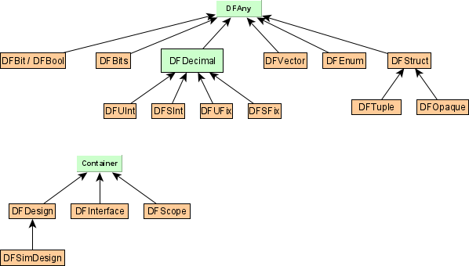

# Type System

DFiant is a Scala library, hence it inherently supports type safe and rich language constructs. DFiant brings type driven development concepts to hardware design, by creating an extensible dataflow class hierarchy, with the trait `DFAny` at its head (similar concept to Scala's Unified Types hierarchy). `DFAny` contains all fields that are common to every dataflow variable (e.g., `.width` represents the number of bits contained by the variable). Fig. 1 illustrates a simplified inheritance diagram of DFiant's dataflow types. Further explanation is given in the [next section](#mutable-dataflow-variables-and-immutable-dataflow-values). 

   
  <b>Fig. 1: DFiant dataflow types: simplified inheritance diagram</b> 

## Mutable Dataflow Variables and Immutable Dataflow Values

DFiant supports dataflow variables mutability via the `:=` operator. Do not confuse with Scala-level mutability which is enabled by using `#!scala var` instead of `#!scala val`. Each dataflow class has two variations: an immutable class, which inherits from `DFAny.Val` and a mutable class, which inherits from `DFAny.Var` and accepts `:=`. The difference between the types enforces an immutable right-hand-side (RHS), where required, and a mutable variable creation. 

Consider, for instance, the DFiant implementation of `g` in Table \ref`tbl:StateExDefImpl`: `a` is immutable because it is a RHS addition between the dataflow variable `i` and a literal value `5`. Contrarily, `c` is mutable, since it is a dataflow variable constructor (`.init` constructs a new initialized variable, while preserving the mutability trait). 

Fig. 1 demonstrates a dual class definition for every type  (immutable and mutable). The naming convention helps to reason about the mutability. For example, `DFBits` and `DFBits.Var` are immutable and mutable classes, respectively. Constructing a new variable via `DFBits` (e.g, `#!scala val a = DFBits[5]`) returns the mutable `DFBits.Var[5]`. Usually, we either receive or return an immutable type, hence we do not require annotating a type with its mutable variation. In cases where we want to return a mutable type, we annotate it as an output port (see Section~\ref`sec:io_ports`).

!!! error "Don't use `var` with dataflow values/variables"
	Because the semantics may get confusing, we enforced a compiler error if a dataflow variable is constructed and fed into a Scala `#!scala var` reference. For example `#!scala var a = DFUInt(8)` will generate a Scala compiler error. 

## Bit-Accurate Operations, Type Inference, and Data Structures

All DFiant's dataflow types are bit-accurate and structurally static, with their bit-width set upon construction (e.g., `DFBits[5]` is a 5-bit vector). Operations between dataflow variables produce a bit-accurate result with the proper type inference. For example, an addition between an unsigned 5-bit variable (`DFUInt[5]`) and a signed 10-bit variable (`DFSInt[10]`) produces an adder that can be implicitly converted to a 10-bit signed variable, if carry is not required, or an 11-bit signed variable by explicitly invoking `.wc` from the addition.

DFiant also allows operations between dataflow types and their corresponding Scala numeric types, by treating the Scala numeric types as constants (e.g., addition between `DFSInt` and `Integer` variables). A constant in the dataflow graph is a node that can produce infinite tokens of the same value.   

## Bit Aliasing and Casting

Aliasing in DFiant enables referencing a part of a dataflow variable, by invoking `.bits(hiIdx, loIdx)`, which creates a bits vector alias that references the original variable at the given index parameters. Every change of a dataflow variable affects its alias and vice versa (similar to VHDL's signal aliasing). Since this function also casts the variable as `DFBits`, this feature is used as a raw-data cast between different dataflow types. Aliasing of an alias is also possible, while maintaining relative bits indexing. Aliasing preserves the mutability trait: an alias of an immutable value is immutable, while an alias of a mutable variable is mutable. 

Fig.~\ref`fig:Aliasing` demonstrates aliasing code and its effect on the contents of a dataflow variable (`bits128`). Each line code does as follows:

  1. Constructs a new 128-bit vector, `bits128`, and clears it.
  2. Creates a new alias, `alias64`, which references the most significant 64 bits of `bits128`. Since `bits128` is a `DFBits` variable, there is no need to invoke `.bits()`, and we can apply the required indexes directly.
  3. Creates a new alias, `alias32`, which references the least significant 32 bits of `alias64`, which reference bits 64 to 95 of `bits128`.
  4. Constructs a new double precision floating point dataflow variable, `dbl`, and initialize its value as `1.0` (hexadecimal value of `0x3FF00...0`).
  5. Modifies the least significant byte of `dbl`.
  6. Sets the most significant bit of `bits128`.
  7. Assigns `dbl` to the least significant 64 bits of `bits128` through casting. All the bits of `dbl` are selected because `.bits()` is invoked without index parameters.
  8. Modifies a byte of `bits128`.

## Basic Types

DFiant pays

### DFBits

### DFBool

### DFUInt

### DFSInt

### DFEnum

